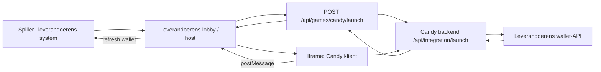

# Candy Integrasjon Mot Eksterne Bingo-Systemer

**Dato:** 11. april 2026
**Status:** Referanseimplementasjon verifisert mot `Spillorama-system`
**Maalgruppe:** interne utviklere, eksterne leverandoerteam, integrasjonsansvarlige

Dette dokumentet beskriver den faktiske modellen som naa fungerer for Candy-integrasjon med delt lommebok. Maalet er at samme modell skal kunne brukes mot andre bingo-systemer med minst mulig frem og tilbake, selv om vi ikke faar direkte tilgang til deres kildekode.

Dokumentet er skrevet som en implementasjonsguide. En ekstern leverandoer skal kunne bygge den leverandoersiden som trengs ved aa bruke dette dokumentet sammen med API-kontrakten.

Se ogsaa:

- `docs/CANDY_SPILLORAMA_API_CONTRACT.md`
- `docs/CANDY_UNITY_SHARED_WALLET_STATUS_2026-04-11.md`
- `docs/UNITY_JS_BRIDGE_CONTRACT.md`

## 1. Kort oppsummert

Candy integreres ikke som et native spill inne i leverandoerens system. Candy integreres som et eksternt spillprodukt med:

- launch fra leverandoerens system
- Candy lastet i iframe
- delt lommebok der leverandoeren fortsatt eier saldoen
- leverandoeren fortsatt ansvarlig for auth, KYC og compliance

Det viktige designprinsippet er:

- Candy eier gameplay, klient og Candy-backend
- leverandoeren eier spiller, auth, KYC, ansvarlighet og wallet
- Candy skal aldri bli direkte spillbar for anonyme brukere i integrert drift

## 2. Hva som faktisk er verifisert i referanseimplementasjonen

Folgene flyt er verifisert i `Spillorama-system`:

1. Spiller logger inn i leverandoerens Unity-lobby
2. Candy vises som egen tile i samme grid som de oevrige spillene
3. Spilleren klikker Candy
4. Leverandoeren utsteder launch mot Candy-backend
5. Candy lastes i iframe-overlay
6. Candy henter saldo via leverandoerens wallet-API
7. Innsats i Candy trekker fra samme wallet som leverandoeren viser i lobbyen
8. Oppdatert saldo er fortsatt korrekt naar spilleren gaar tilbake til lobbyen
9. Ny aapning av Candy bruker samme oppdaterte saldo

Dette er den modellen vi skal reprodusere hos andre leverandoerer.

## 3. Ansvarsdeling

| Omraade | Leverandoer-system | Candy |
|---|---|---|
| Spillerkonto | Ja | Nei |
| Innlogging | Ja | Nei |
| KYC / compliance | Ja | Nei |
| Wallet / penger | Ja | Nei |
| Spillkatalog / lobby-entry | Ja | Nei |
| Launch av Candy | Ja | Nei |
| Candy gameplay | Nei | Ja |
| Candy UI / assets | Nei | Ja |
| Candy scheduler / room-engine | Nei | Ja |
| Candy admin / demo backend | Nei | Ja |

Kort regel:

- hvis det handler om spilleridentitet, sesjon eller penger, er det leverandoerens ansvar
- hvis det handler om hvordan Candy faktisk spiller, er det Candy sitt ansvar

## 4. Minimumskrav fra leverandoeren

En ny leverandoer maa kunne levere dette:

1. En autentisert spiller i egen plattform
2. En stabil `walletId` eller tilsvarende unik konto-id som Candy kan bruke som `playerId`
3. Et backend-endepunkt som kan utstede Candy-launch
4. En server-til-server wallet-bro
5. En hostflate som kan aapne Candy i iframe
6. En mekanisme for aa oppdatere visningen av saldo naaar Candy rapporterer endringer

Hvis en leverandoer ikke kan levere dette, er Candy-integrasjon ikke ferdig spesifiserbar.

## 5. Arkitektur



## 6. Leverandoerens obligatoriske leveranse

Dette er det vi maa kunne sende til en ekstern leverandoer som konkret oppgave.

### 6.1 Backend: launch-endepunkt

Leverandoeren maa lage et endepunkt som:

- krever at spilleren allerede er autentisert
- finner spillerens `walletId`
- kaller Candy-backenden server-til-server
- returnerer `embedUrl` til frontend/host

Referanse i `Spillorama-system`:

- `backend/src/index.ts`
- route: `POST /api/games/:slug/launch`

Request fra egen host:

```http
POST /api/games/candy/launch
Authorization: Bearer {player-access-token}
Content-Type: application/json

{
  "hallId": "hall-default",
  "returnUrl": "https://provider.example.com/web/"
}
```

Server-til-server request til Candy:

```http
POST https://candy-backend.example.com/api/integration/launch
X-API-Key: {CANDY_INTEGRATION_API_KEY}
Content-Type: application/json

{
  "sessionToken": "{provider-player-access-token}",
  "playerId": "{walletId}",
  "currency": "NOK",
  "language": "nb-NO",
  "returnUrl": "https://provider.example.com/web/"
}
```

Eksempel paa respons tilbake til host:

```json
{
  "ok": true,
  "data": {
    "embedUrl": "https://candy-backend.example.com/web/?lt=abc123&embed=true",
    "expiresAt": "2026-04-11T12:05:00.000Z"
  }
}
```

### 6.2 Backend: wallet-bro

Leverandoeren maa eksponere disse server-til-server endepunktene:

- `GET /api/ext-wallet/balance`
- `POST /api/ext-wallet/debit`
- `POST /api/ext-wallet/credit`

Referanseimplementasjon:

- `backend/src/integration/externalGameWallet.ts`
- mountet fra `backend/src/index.ts`

Krav:

- all auth skjer med en separat API-noekkel, ikke spiller-token
- `playerId` maa peke til leverandoerens wallet-konto
- `transactionId` maa vaere idempotent
- wallet-responsen maa alltid returnere et endelig tall, ikke `null`, `undefined` eller tom streng

Eksempel:

```http
GET /api/ext-wallet/balance?playerId={walletId}
Authorization: Bearer {EXT_GAME_WALLET_API_KEY}
```

```json
{
  "balance": 985,
  "currency": "NOK"
}
```

Debit:

```http
POST /api/ext-wallet/debit
Authorization: Bearer {EXT_GAME_WALLET_API_KEY}
Content-Type: application/json

{
  "playerId": "wallet-id",
  "amount": 40,
  "transactionId": "2dcde7bb-bb2e-4f6d-8da8-9f9ec6204ac8",
  "roundId": "ROOM-GAMEID",
  "currency": "NOK"
}
```

```json
{
  "success": true,
  "balance": 945,
  "transactionId": "2dcde7bb-bb2e-4f6d-8da8-9f9ec6204ac8"
}
```

### 6.3 Frontend/host: iframe-overlay

Leverandoeren maa ha et host-lag som kan:

- aapne Candy i iframe
- lukke Candy uten aa miste spillerens session
- motta `postMessage`-events fra Candy
- trigge oppdatering av leverandoerens wallet-visning naaar saldo endres

Referanse i live host:

- `backend/public/web/index.html`

Minimumsfunksjoner i host:

```js
let candyPlayerToken = "";

function SetPlayerToken(token) {
  candyPlayerToken = typeof token === "string" ? token.trim() : "";
}

function ClearPlayerToken() {
  candyPlayerToken = "";
  closeGameOverlay({ notifyIframe: false });
}

function OpenUrlInSameTab(url) {
  if (isCandyRoute(url)) {
    launchCandyOverlay();
    return;
  }
  window.location.href = url;
}
```

Selve launch-flyten i hosten maa i praksis se slik ut:

```js
async function launchCandyOverlay() {
  if (!candyPlayerToken) {
    throw new Error("Missing player token");
  }

  const response = await fetch("/api/games/candy/launch", {
    method: "POST",
    headers: {
      "Content-Type": "application/json",
      "Authorization": `Bearer ${candyPlayerToken}`
    },
    body: JSON.stringify({
      hallId: "hall-default",
      returnUrl: window.location.href
    })
  });

  const body = await response.json();
  const embedUrl = body?.data?.embedUrl;
  if (!embedUrl) {
    throw new Error("Could not launch Candy");
  }

  openIframeOverlay(embedUrl);
}
```

## 7. Hvis leverandoeren bruker Unity/WebGL-host

Dette er den viktigste varianten, fordi det er slik `Spillorama-system` fungerer.

Leverandoerens Unity/WebGL-host maa ha fire tydelige innsattspunkter:

1. **Etter vellykket login**
   Spilleren sitt access token maa sendes til host-JS med `SetPlayerToken(token)`.

2. **Etter token-refresh**
   Host-JS maa oppdateres med nytt token.

3. **Ved logout eller force logout**
   Host-JS maa nullstille token med `ClearPlayerToken()`.

4. **Ved klikking paa Candy tile**
   Unity maa kalle en host-funksjon som ender i `OpenUrlInSameTab("/candy/")`.

Uten disse fire punktene er ikke Candy-launch robust nok.

## 8. Hvis leverandoeren bruker vanlig webportal og ikke Unity

Da er integrasjonen enklere.

Leverandoeren trenger fortsatt:

- `POST /api/games/candy/launch`
- wallet-broen
- iframe-overlay
- `postMessage`-haandtering

Men de slipper Unity-spesifikke token handoff-hooks. I en ren webportal holder det normalt aa:

- lese access token fra egen auth-state
- kalle launch-endepunktet
- laste `embedUrl` i modal/iframe
- oppdatere wallet UI naaar Candy sender `candy:balanceChanged`

## 9. postMessage-kontrakt mellom Candy og host

Hosten maa kunne motta minst disse hendelsene:

- `candy:ready`
- `candy:balanceChanged`
- `candy:gameStarted`
- `candy:gameEnded`
- `candy:error`
- `candy:resize`

Hosten maa minimum reagere slik:

| Event | Hva host skal gjore |
|---|---|
| `candy:ready` | markere at iframe er lastet |
| `candy:balanceChanged` | oppdatere leverandoerens wallet-visning |
| `candy:gameStarted` | valgfritt, men nyttig for analytics og UI-state |
| `candy:gameEnded` | trigge wallet-refresh |
| `candy:error` | vise feilmelding og logge hendelsen |
| `candy:resize` | justere overlay/iframe ved behov |

I `Spillorama-system` brukes disse eventene til aa trigge wallet-refresh tilbake mot Unity-host og lobby.

## 10. KYC og compliance

Dette er ikke et Candy-ansvar i integrert modus.

Regelen er:

- Candy skal ikke eie KYC
- Candy skal ikke eie hovedauth
- Candy skal ikke være direkte tilgjengelig for anonyme spillere

Derfor maa leverandoeren:

- bare vise Candy for innloggede spillere
- ha full kontroll paa hvilke spillere som er KYC-godkjente og tillatt aa spille
- kun utstede Candy-launch for spillere som faktisk skal faa tilgang

Candy tar utgangspunkt i at dette allerede er avgjort av leverandoeren.

## 11. Sikkerhetskrav

Disse kravene er ikke valgfrie:

1. `CANDY_INTEGRATION_API_KEY` skal bare brukes server-til-server
2. `EXT_GAME_WALLET_API_KEY` skal bare brukes server-til-server
3. Spillerens access token skal aldri brukes direkte som wallet-noekkel
4. Candy maa ikke aapnes uten gyldig launch
5. Direkte auth/register paa Candy-host skal vaere blokkert i integrert produksjon
6. Wallet-debit og credit maa vaere idempotente
7. Wallet API maa aldri returnere `null` som saldo

## 12. Det vi maa gi en ekstern leverandoer

Naar vi integrerer mot et nytt bingo-system, maa vi gi deres team dette:

1. Dette dokumentet
2. `docs/CANDY_SPILLORAMA_API_CONTRACT.md`
3. Candy-backend base URL
4. `CANDY_INTEGRATION_API_KEY`
5. Liste over tillatte embed-origins som skal whitelistes hos Candy
6. Liste over `postMessage`-events
7. Minimumskode for:
   - launch-endepunkt
   - wallet-endepunkter
   - host-overlay
   - token handoff
8. Testprotokollen i kapittel 15

Det reduserer frem og tilbake dramatisk, fordi leverandoerens team da vet exakt hva de maa bygge.

## 13. Det vi trenger fra den eksterne leverandoeren

Dette er minimumsinformasjonen vi maa hente inn fra dem:

1. Hvilken URL Candy skal returnere til
2. Hvordan de autentiserer spilleren
3. Hvilken stabil wallet-identifikator de kan eksponere
4. Om de har Unity/WebGL-host eller vanlig web-app
5. Hvordan de vil oppdatere saldo i sin egen UI
6. Om de trenger egen analytics/webhook for spillhendelser

Hvis de ikke kan gi oss svar paa dette tidlig, blir integrasjonen treg og uklar.

## 14. Referanseimplementasjon i dagens kode

Dette er de viktigste referansepunktene i dagens fungerende integrasjon:

### Spillorama-system

- `backend/src/index.ts`
- `backend/src/integration/externalGameWallet.ts`
- `backend/public/web/index.html`

### Candy / demo-backend

- `demo-backend/backend/src/integration/IntegrationLaunchHandler.ts`
- `demo-backend/backend/src/launch/CandyLaunchTokenStore.ts`
- `demo-backend/backend/src/index.ts`

## 15. Testprotokoll foer go-live

Ingen ny leverandoer skal gaa live uten at alle punktene under er krysset av.

### 15.1 Auth og gating

- anonym bruker ser ikke Candy eller kan ikke aapne Candy
- ikke-KYC-godkjent spiller faar ikke launch hvis leverandoeren krever KYC
- innlogget spiller ser Candy i riktig lobby

### 15.2 Launch

- klikking paa Candy gir gyldig launch
- iframe lastes uten blank skjerm
- `candy:ready` mottas av host

### 15.3 Shared wallet

Bruk en konkret testverdi. Eksempel:

1. spiller har `90 kr` i leverandoersystemet
2. Candy aapnes og viser `90 kr`
3. spiller bruker `40 kr`
4. Candy viser `50 kr`
5. spiller gaar tilbake til lobbyen
6. leverandoerlobbyen viser fortsatt `50 kr`
7. spiller aapner Candy paa nytt
8. Candy viser fortsatt `50 kr`

Dette punktet maa verifiseres manuelt og logges.

### 15.4 Feilsituasjoner

- ugyldig launch-token gir kontrollert avvisning
- wallet timeout gir kontrollert feilmelding
- duplicate debit/credit gir korrekt idempotent respons
- Candy iframe kan lukkes uten at leverandoer-sessionen oedelegges

## 16. Operativ go-live-sjekkliste

Foer produksjon:

- wallet API-noekler satt i begge systemer
- embed origins whitelistet
- direkte Candy-auth deaktivert i integrert drift
- riktig scheduler/intervall satt i Candy-backend
- testbruker med kjent saldo tilgjengelig
- logging paa launch og wallet-kall aktiv
- rollback-plan dokumentert

Etter produksjon:

- test launch i virkelig lobby
- test minst ett wallet-debit
- test at saldo holder seg korrekt etter retur til lobby
- test at Candy fortsatt er blokkert for anonyme brukere

## 17. Hva som ikke skal skje

Foelgende loesninger er feil og skal avvises:

- Candy med egen separat spillerwallet i integrert drift
- Candy med egen KYC i integrert drift
- Candy aapnet direkte uten launch-endepunkt
- leverandoer som bare sender visningssaldo, men ikke eier den faktiske debit/credit
- browser-til-browser wallet-kall uten server-til-server auth

## 18. Konklusjon

Den riktige modellen for nye leverandoerer er:

- leverandoeren eier spiller, auth, KYC og penger
- Candy eier spillproduktet
- Candy startes via launch-endepunkt
- Candy rendres i iframe
- delt lommebok gaar via server-til-server wallet-bro
- hosten mottar Candy-events og oppdaterer egen UI

Hvis en ny leverandoer bygger disse fire tingene riktig:

1. launch-endepunkt
2. wallet-endepunkter
3. iframe-host
4. token handoff

sa skal Candy kunne integreres uten at vi trenger deres fulle kildekode og uten lang iterasjon paa grunnleggende arkitektursporsmaal.
