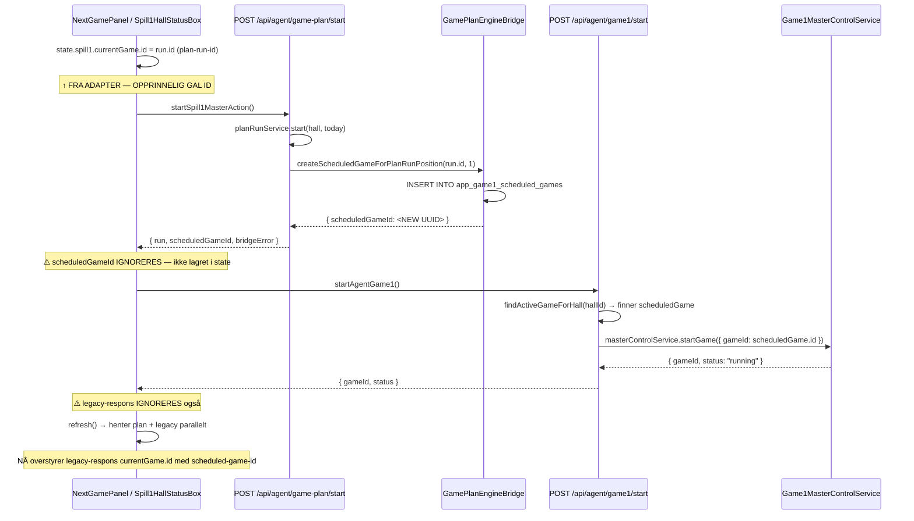
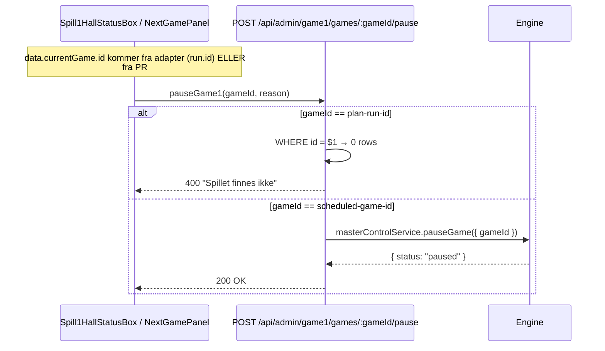
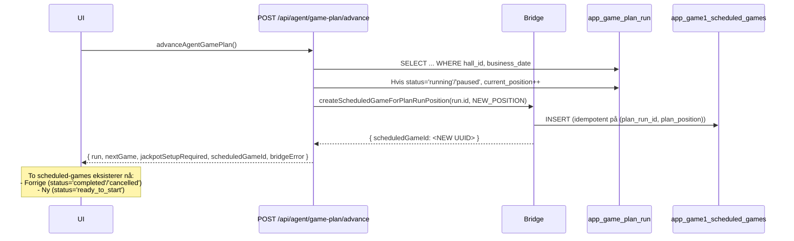
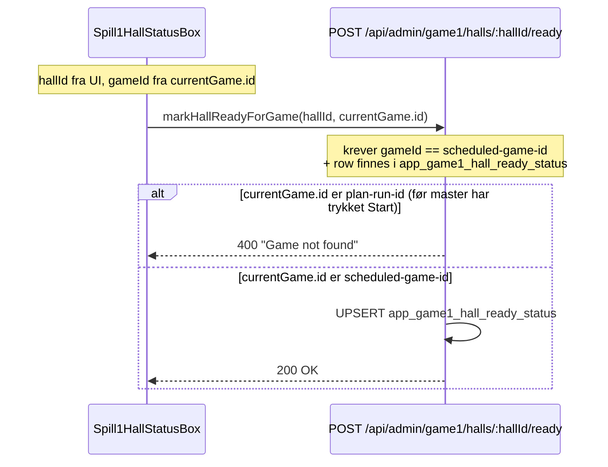
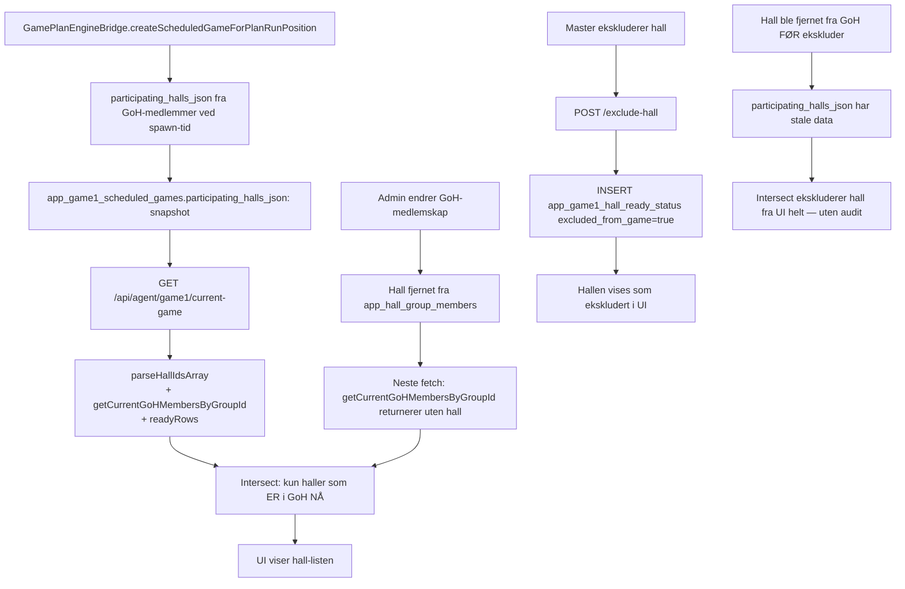

# Plan-Spill-kobling — Fundament-audit 2026-05-08

**Status:** Kartlegging og refaktor-anbefaling. READ-ONLY — ingen kode-endringer.
**Sak:** Master-konsoll viser to forskjellige Spill-ID-er på samme side; pause/resume sender feil ID; gjentatte symptom-patcher (#1041, #1035, #1030).
**Mandat fra Tobias:** "alt av kode som krangler mot hverandre må fjernes ... fundamentet legges godt nå".

---

## 1. Executive summary

**Fundamentet er broken.** Verdict: Y.

**Hovedproblem:** Det finnes to parallelle ID-rom (plan-run-id og scheduled-game-id) bundet sammen via en bridge, men UI-laget har INGEN klar grense mellom dem. Master-handlinger må gå mot scheduled-game-id, men dataen UI rendrer er plan-run-data. Dette har skapt en patch-spiral hvor nye bugs fikses ved å hente begge endpoints parallelt og overskrive id-feltet.

**Tre rot-årsaker:**

1. **Adapter lyver om ID.** `adaptGamePlanToLegacyShape` setter `currentGame.id = run.id` (plan-runtime UUID). Backend-handlinger på `/api/admin/game1/games/:gameId/...` krever `app_game1_scheduled_games.id`. Dette mismatch er roten til pause-bug og hele patch-spiralen.
2. **Dobbel datakilde for samme view.** Spill1HallStatusBox + NextGamePanel henter `fetchAgentGamePlanCurrent` OG `fetchAgentGame1CurrentGame` parallelt for å "merge" felt-for-felt. Det er to separate sannhetskilder for samme rendering — ingen single-source.
3. **Plan-runtime og scheduled-games er ikke synkroniserte i UI-state.** Plan-run kan være `running` mens scheduled-game er `cancelled`, eller plan-run er `idle` mens scheduled-game er `purchase_open` (cron promotert). UI har ingen reconcile-logikk.

**Sekundære problemer:**

- Master-konsollet `Game1MasterConsole.ts` (1424 linjer) har sin egen flyt mot scheduled-game-id direkte (uten plan), så det jobber. Men det er to separate UI-trees mot samme backend-data.
- `NextGamePanel.ts` (1445 linjer) er per i dag en hybrid mellom rom-koden (Spill 2/3) og scheduled-games (Spill 1) — to spill-paradigmer i samme komponent.
- `Game1HallReadyService` polles via tre forskjellige endpoints (`/api/agent/game1/current-game`, `/api/admin/game1/games/:id/hall-status`, `/api/admin/game1/games/:id` detail). Hver har sin egen GoH-membership-filter-logikk (kopiert kode).

**Anbefaling (kort):** Refaktor nå. Estimat 6-8 dev-dager kritisk sti, kan parallelliseres ned til ~3-4 kalenderdager med 3 agenter. Patch-and-pray vil koste mer i form av nye id-bugs og pilot-blokkere.

**Branch:** `docs/plan-spill-kobling-fundament-audit-2026-05-08`

---

## 2. Komplett fil-/modul-kart

### 2.1 Backend services (apps/backend/src/game/)

| Fil | Linjer | Ansvar | Status |
|---|---:|---|---|
| `GamePlanRunService.ts` | 864 | CRUD av `app_game_plan_run`. State-machine idle→running→paused→finished. Lazy create-for-today, advance, jackpot-override-set, pause/resume/finish. | Sunt — én ansvar |
| `GamePlanService.ts` | (ikke lest) | CRUD av `app_game_plan` + `app_game_plan_item`. Templates. | Sunt |
| `GameCatalogService.ts` | (ikke lest) | CRUD av `app_game_catalog`. `calculateActualPrize`-helper. | Sunt |
| `GamePlanEngineBridge.ts` | 1217 | **Bro: oppretter `app_game1_scheduled_games`-rad fra plan-run-posisjon.** Idempotent på (run_id, position). Bygger `ticket_config_json` + `game_config_json` fra catalog. Resolver `participating_halls_json` fra GoH-medlemmer. | Konflikt-sone — håndterer to id-rom |
| `Game1MasterControlService.ts` | 1693 | Master-actions mot scheduled_games: startGame, pauseGame, resumeGame, stopGame, excludeHall, includeHall. Kjenner KUN `scheduled_games.id`. Ingen plan-run-bevissthet. | Sunt — én ansvar |
| `Game1ScheduleTickService.ts` | 1033 | Cron — spawn legacy `scheduled_games`-rader fra `app_daily_schedules`. **Parallell flyt med GamePlanEngineBridge.** Begge skriver til samme tabell. | Dual-write konflikt |
| `Game1LobbyService.ts` | 632 | Public read-aggregat: kombinerer plan-runtime + scheduled_games for klient-shell (`/api/games/spill1/lobby?hallId=X`). Aggregerer status + neste spill. | Sunt — pure read |
| `Game1HallReadyService.ts` | 1016 | Hall-ready-status per scheduled-game. Beregner farge-koder (red/orange/green). | Sunt |
| `Game1TransferHallService.ts` | 776 | Runtime master-overføring (60s handshake). Mot scheduled-game. | Sunt |
| `Game1DrawEngineService.ts` | (ikke lest) | Faktisk trekning. Engine-state: `app_game1_game_state`. Ingen plan-run-bevissthet. | Sunt |
| `Spill1LobbyBroadcaster.ts` | (ikke lest) | Socket-broadcaster for `spill1:lobby:{hallId}`-rom. Henter via Game1LobbyService og emitter `lobby:state-update`. | Sunt |

### 2.2 Backend routes (apps/backend/src/routes/)

| Fil | Linjer | Endpoints | ID-rom |
|---|---:|---|---|
| `agentGamePlan.ts` | 789 | `GET /api/agent/game-plan/current` (lazy create), `POST /start`, `POST /advance`, `POST /jackpot-setup`, `POST /pause`, `POST /resume` | **plan-run-id**. Returnerer optional `scheduledGameId` fra bridgen i start/advance |
| `agentGame1.ts` | 855 | `GET /api/agent/game1/current-game`, `GET /hall-status`, `POST /start`, `POST /resume`, `POST /stop` | **scheduled-game-id**. Henter aktiv via hallId-lookup |
| `adminGame1Master.ts` | 977 | `GET /api/admin/game1/games/:gameId`, `POST /start`, `POST /pause`, `POST /resume`, `POST /stop`, `POST /exclude-hall`, `POST /include-hall`, `POST /reschedule` | **scheduled-game-id** (path param) |
| `adminGame1Ready.ts` | (ikke lest) | `POST /api/admin/game1/halls/:hallId/ready` (krever `gameId` i body) | **scheduled-game-id** |
| `adminGame1MasterTransfer.ts` | (ikke lest) | Transfer-handshake | **scheduled-game-id** |
| `adminGamePlans.ts` | (ikke lest) | Plan-template CRUD | plan-id |
| `adminGameCatalog.ts` | (ikke lest) | Katalog CRUD | catalog-id |
| `spill1Lobby.ts` | (ikke lest) | Public `GET /api/games/spill1/lobby` | hall-id (returnerer aggregat) |

### 2.3 Frontend admin-web (apps/admin-web/src/)

| Fil | Linjer | Ansvar | ID-rom-bruk |
|---|---:|---|---|
| `pages/agent-portal/NextGamePanel.ts` | 1445 | **Hybrid**: agent-portal "Next Game"-panel for både Spill 2/3 (rom-kode) og Spill 1 (scheduled-game). Polling 5s + socket. | Bruker `currentGame.id` fra `state.spill1` (kan være plan-run-id eller scheduled-game-id avhengig av merge-logikk) |
| `pages/agent-portal/Spill1AgentControls.ts` | 274 | Render-only komponent. Tar `Spill1CurrentGame` som prop. Knapper med `data-action`. | Render passer `currentGame.id` videre — bruker det som UI får |
| `pages/agent-portal/Spill1AgentStatus.ts` | (ikke lest) | Render hall-status pills | Read-only |
| `pages/agent-portal/JackpotSetupModal.ts` | (ikke lest) | Jackpot-popup ved start | plan-run-id (via plan-API) |
| `pages/agent-portal/Game1ScanPanel.ts` | (ikke lest) | Ticket-scan UI | scheduled-game-id |
| `pages/agent-portal/agentGame1Socket.ts` | (ikke lest) | Socket-subscription per scheduled-game | scheduled-game-id |
| `pages/agent-portal/agentHallSocket.ts` | (ikke lest) | Socket-subscription per hall (rom-kode) | rom-kode |
| `pages/cash-inout/CashInOutPage.ts` | (ikke lest) | Container for box-3 (Spill 1 status) | Mountpunkt |
| `pages/cash-inout/Spill1HallStatusBox.ts` | 762 | Polling 2s. Henter plan + legacy parallelt og merger. Render hall-status + master-knapper. | Plan-id → adapter → legacy-overstyring av `currentGame.id` (PR #1041) |
| `pages/games/master/Game1MasterConsole.ts` | 1424 | Admin master-konsoll når man navigerer fra games-listen. **Bruker IKKE plan** — bare `gameId` fra URL. | KUN scheduled-game-id |
| `pages/games/master/adminGame1Socket.ts` | (ikke lest) | Socket-subscription | scheduled-game-id |
| `api/agent-game-plan.ts` | 185 | Plan-runtime API-adapter | plan-run-id |
| `api/agent-game-plan-adapter.ts` | 145 | **Adapter som setter `currentGame.id = run.id` (plan-run-id)** | Konvertering plan→legacy-shape |
| `api/agent-game1.ts` | 206 | Legacy current-game API | scheduled-game-id |
| `api/admin-game1-master.ts` | 369 | Admin master API + transfer | scheduled-game-id |
| `api/agent-master-actions.ts` | 135 | **Wrapper: "Plan + legacy" sekvensielt for start/resume**. Pause separat (kun plan-state). | Begge id-rom — kjenner forskjellen i kommentarer men ikke håndhevet i typer |

### 2.4 Game-client (packages/game-client/src/)

| Fil | Ansvar | Hva sender den til server |
|---|---|---|
| `games/game1/Game1Controller.ts` | Pixi-runtime for Spill 1 | `socket.createRoom({ hallId, gameSlug })`. Server mapper hallId → aktiv scheduled-game. Klient kjenner ikke scheduled-game-id eller plan-run-id direkte |
| `net/SpilloramaSocket.ts` | Socket.IO-klient | Emit-er `spill1:lobby:subscribe { hallId }`, lytter på `lobby:state-update` |

### 2.5 Database (apps/backend/migrations/)

| Migration | Tabell | Relevans |
|---|---|---|
| `20261210000000_app_game_catalog_and_plan.sql` | `app_game_catalog`, `app_game_plan`, `app_game_plan_item`, `app_game_plan_run` | Plan-modell |
| `20261210010000_app_game1_scheduled_games_catalog_link.sql` | `app_game1_scheduled_games` ALTER | **Legger til `catalog_entry_id`, `plan_run_id`, `plan_position`** — bridgen-koblingen |
| `20261210010100_app_game1_scheduled_games_nullable_legacy_fks.sql` | ALTER | NULLABLE `daily_schedule_id` + `schedule_id` så bridgen kan spawne uten legacy mal |
| `20260428000000_game1_scheduled_games.sql` | `app_game1_scheduled_games` CREATE | Original tabell (fra legacy mal-modell) |

**Database-rom:**

```
app_game_plan ───── 1:N ──── app_game_plan_item
       │                            │
       │                            ▼
       └── 1:N ── app_game_plan_run    app_game_catalog
                       │                       ▲
                       │                       │
                       └── plan_run_id ───────┘
                                  │       catalog_entry_id
                                  ▼               │
                       app_game1_scheduled_games ◄┘
                                  │
                                  ├── master_hall_id ── app_halls
                                  ├── group_hall_id ─── app_hall_groups
                                  └── id ── 1:N ── app_game1_hall_ready_status
                                            ── 1:N ── app_game1_master_audit
                                            ── 1:1 ── app_game1_game_state
                                            ── 1:N ── app_game1_master_transfer_request
```

---

## 3. ID-flyt-diagrammer

### 3.1 "Master starter neste spill" (Tobias' faktiske bug-vei)



**Konflikt:** ID i UI er `run.id` (plan-run-id) helt frem til neste polling-sykle, hvor den blir overskrevet med scheduled-game-id. I mellomtiden kan agent klikke pause-knappen og treffe feil ID.

### 3.2 "Master pauser" (#1041-bugen)



**PR #1041 sin patch:** Hent legacy-current-game parallelt og overstyr `currentGame.id`. Funker så lenge legacy-callet svarer raskt nok. Race-condition gjenstår: hvis legacy-callet feiler eller returnerer null for hallen, vil pause-knappen feile.

### 3.3 "Master advance" (mellom posisjoner)



**Problem:** UI's `state.spill1.currentGame.id` peker fortsatt på FORRIGE scheduled-game (hentet via `findActiveGameForHall(hallId)` ved forrige refresh). Det vil ta 2-5 sekunder polling før UI bytter til ny rad. I mellomtiden:

- Master ser "Aktivt spill: <forrige>" og "Neste: <ny>" — men IDene er feil-mappet
- Master pause-knapp pauser FORRIGE spill (som er completed/cancelled)
- Backend kaster GAME_NOT_RUNNING

### 3.4 "Marker hall klar" (master-konsoll)



**Symptom:** "Marker Klar"-knappen er disabled hvis status='scheduled' (PR #1041 har defensiv check `hasValidGameId`).

### 3.5 "Eksklusjon av hall" (Tobias-bug "Ekskluderte haller-listen")



**Bug:** "Ekskluderte haller"-listen i `/api/agent/game1/current-game` viser haller som har ready-rader (`getReadyStatusForGame`) — også de som har blitt fjernet fra GoH etter spawn. PR #1041 og tidligere har lagt på filter etter filter for å skjule disse, men filtene er kopiert i tre forskjellige routes.

---

## 4. Dødkode-slett-liste

Sortert etter trygghet. Hvert punkt har faktiske file:line-referanser.

### 4.1 Trygt å slette

#### D1. `agent-game-plan-adapter.ts` (145 linjer)

**Fil:** `apps/admin-web/src/api/agent-game-plan-adapter.ts`

**Begrunnelse:** Hele filen er en oversetting fra ny → legacy-shape. Etter at PR #1041 patcher tilbake til scheduled-game-id i UI, er adapteren faktisk kun brukt for å sette feltene som umiddelbart blir overskrevet (id, masterHallId, groupHallId, participatingHallIds, isMasterAgent). Det som beholdes er kun `currentGame.subGameName` (= `catalog.displayName`) og `currentGame.status` (mapping plan-run-status → engine-status).

**Hva påvirkes:**
- `Spill1HallStatusBox.ts:36, 136` — slutt å importere
- `NextGamePanel.ts:60, 520` — slutt å importere
- Tester for adapter (hvis de finnes)

**Ny tilstand:** Bruk `Spill1CurrentGameResponse` direkte fra `fetchAgentGame1CurrentGame`. For å vise plan-spesifikk metadata (sub-game-name fra catalog, kommende posisjon), legg til ny endpoint eller utvid `/api/agent/game1/current-game` med plan-meta.

**Risiko:** Lav. Det fjerner aktiv "lying" om id.

#### D2. `agent-master-actions.ts` (135 linjer)

**Fil:** `apps/admin-web/src/api/agent-master-actions.ts`

**Begrunnelse:** Wrapper som kaller plan først og legacy etterpå. Begrunnelsen i filen er "vi vil starte engine også" — men det er allerede backend-jobben (bridgen kjøres fra `/api/agent/game-plan/start`-routen, som kan kalle masterControlService.startGame direkte).

**Hva påvirkes:**
- `Spill1HallStatusBox.ts:38-40, 217-231`
- `NextGamePanel.ts:62-64, 1059, 1164`

**Ny tilstand:** Backend skal eie sekvenseringen "plan → bridge → engine.startGame". Frontend kaller én endpoint og får én respons.

**Risiko:** Medium — krever backend-endepunkt-endring (men det er hele poenget).

#### D3. Plan-runtime-pause/resume routes (`agentGamePlan.ts:732-786`)

**Fil:** `apps/backend/src/routes/agentGamePlan.ts`

**Begrunnelse:** `POST /api/agent/game-plan/pause` og `/resume` er state-endrere på `app_game_plan_run`-tabellen, men bruken er KUN parity med master-UI (per kommentar 27-29). Faktisk pause skjer i engine-pathen `/api/admin/game1/games/:id/pause`. Plan-runtime-state og engine-state må uansett synkroniseres — i dag oppdateres kun plan-state av disse routene, og scheduled-game-state av master-control-service. To kilder for samme felt.

**Hva påvirkes:**
- `agent-master-actions.ts:120-135` — pauseSpill1MasterPlanState
- `Spill1HallStatusBox.ts:240` (faktisk ikke — den bruker pauseGame1 direkte)
- `NextGamePanel.ts:1188`

**Ny tilstand:** Pause/resume går KUN mot master-control-service. Plan-runtime-status reflekterer engine-status via en database-trigger eller en periodisk reconciler.

**Risiko:** Medium — krever cross-service-state-sync.

### 4.2 Usikkert — krever vurdering

#### U1. `Game1ScheduleTickService.spawnUpcomingGame1Games`

**Fil:** `apps/backend/src/game/Game1ScheduleTickService.ts:1-200+`

**Begrunnelse:** Dette er den LEGACY spawn-pathen som leser fra `app_daily_schedules`. Hele plan-redesign-prosjektet skulle erstatte den. Men dette er fortsatt aktiv — den spawner rader med `daily_schedule_id != NULL` og `catalog_entry_id == NULL`.

**Konflikt:** To paths som spawner til samme tabell. Hvis admin lager EN plan via ny modell og samtidig har EN legacy daily_schedule, vil begge spawn-loops kjøre.

**Påvirkning hvis fjernet:** Ukjent — krever full audit av om det fortsatt finnes pilot-haller på legacy daily_schedules.

**Anbefaling:** Behold men flagg som deprecated. Måle bruken via `SELECT COUNT(*) FROM app_game1_scheduled_games WHERE catalog_entry_id IS NULL AND scheduled_day > now() - 7 days`.

#### U2. `findActiveOrUpcomingGameForHall` vs `findActiveGameForHall` vs `findScheduledGameForHall`

**Fil:** `apps/backend/src/routes/agentGame1.ts:240-352`

**Begrunnelse:** Tre forskjellige queries med subtile forskjeller i status-filteret:
- `findActiveGameForHall`: status IN (purchase_open, ready_to_start, running, paused)
- `findActiveOrUpcomingGameForHall`: status IN (scheduled, purchase_open, ready_to_start, running, paused)
- `findScheduledGameForHall`: status = 'scheduled'

Brukes på forskjellige steder (current-game vs start-fail-besked vs hall-status). Logikken er "spørr 2 ganger og sammenlign".

**Anbefaling:** Konsolider til én query med `?includeStatuses=...` parameter, eller eksponer en service-funksjon `Game1LobbyQuery.findFor({ hallId, statuses })`.

**Risiko:** Lav — ren refaktor.

#### U3. Adapter-versjon i `/api/agent/game1/current-game` med GoH-membership-filter (linjer 489-536, 805-816)

**Fil:** `apps/backend/src/routes/agentGame1.ts`

**Begrunnelse:** "Soft-fail tilbake til legacy-oppførselen hvis lookup feiler" — dvs. tre-lags fallback hvor stale `participating_halls_json` brukes hvis `getCurrentGoHMembersByGroupId` ikke returnerer.

**Anbefaling:** Gjør filtering konsistent (én logikk), og gjør stale-flag eksplisitt i wire-format.

**Risiko:** Medium — endrer hva UI ser når GoH endres.

### 4.3 Risikabelt — ikke slett uten konsultasjon

#### R1. `useNewGamePlan`-flagg-fallback (mentioned in code comments)

**Fil:** `agentGamePlan.ts:42-44`

**Begrunnelse:** Kommentar sier "Frontend velger om den skal bruke `/api/agent/game1/current-game` (legacy) eller `/api/agent/game-plan/current` (ny)". Det er IKKE et faktisk runtime-flagg lengre i koden vi har lest, men kan fortsatt være referert i `localStorage.useNewGamePlan` eller config-laget.

**Anbefaling:** Verifiser at flagget er gone. Hvis det er, dokumenter det. Hvis ikke, planlegg en ren utfasing.

#### R2. `Game1MasterConsole.ts` (admin-only console, 1424 linjer)

**Fil:** `apps/admin-web/src/pages/games/master/Game1MasterConsole.ts`

**Begrunnelse:** Dette er admin-konsollet som ALDRI har gått via plan-runtime. Det jobber direkte mot scheduled-game-id. Sletting av dette ville fjerne den ene kjente arbeidende master-vies. Men: agent-portalens NextGamePanel/Spill1HallStatusBox burde bli identisk i ID-bruk.

**Anbefaling:** Behold. Bruk det som referanse-implementasjon for hvordan agent-UI skal jobbe.

---

## 5. Konflikt-liste

Hvor to ting krangler:

### C1. To services skriver til `app_game1_scheduled_games`

- **Game1ScheduleTickService** (legacy daily-schedule-spawn)
- **GamePlanEngineBridge** (ny plan-runtime-spawn)

Begge spawn rader. Forskjell: `catalog_entry_id` og `plan_run_id` er null i førstnevnte. Det finnes ingen check på at det IKKE er en aktiv plan for samme (hall, businessDate) når legacy spawner. Kan resultere i to konkurrerende scheduled-games.

**File:line:**
- `Game1ScheduleTickService.ts:64-90+` (spawnUpcomingGame1Games)
- `GamePlanEngineBridge.ts:767-1073` (createScheduledGameForPlanRunPosition)

**Beskyttelse i dag:** Bridgen er idempotent på `(plan_run_id, plan_position)` UNIQUE — men det forhindrer ikke konflikt med legacy-spawn som har `(daily_schedule_id, scheduled_day, sub_game_index)` UNIQUE. Forskjellige UNIQUE-keys ⇒ kan eksistere samtidig.

### C2. UI lytter på to forskjellige sannhetskilder for samme view

- `fetchAgentGamePlanCurrent()` returnerer plan-runtime-state (current_position, status, jackpotOverrides)
- `fetchAgentGame1CurrentGame()` returnerer scheduled-games-state (status, halls[], allReady, isMasterAgent)

Begge polles parallelt i `Spill1HallStatusBox.ts:132-143` og merges. Resultat-objektet har inkonsistent state hvis de svarer forskjellig.

**File:line:**
- `Spill1HallStatusBox.ts:115-164` (refresh)
- `NextGamePanel.ts:512-544` (refreshSpill1) — bruker BARE plan, deretter adapter

### C3. State som finnes i flere lag uten klar SoT

- `app_game_plan_run.status` ∈ {idle, running, paused, finished}
- `app_game1_scheduled_games.status` ∈ {scheduled, purchase_open, ready_to_start, running, paused, completed, cancelled}
- `app_game1_game_state.paused` (engine internal)

For en gitt (hall, businessDate) finnes alle tre samtidig. Hvilket vinner?

- Når master pauser: scheduled-game.status='paused' OG game_state.paused=true. plan-run.status forblir 'running' (med mindre noen kaller plan-pause).
- Når engine auto-pauser etter phase-won: game_state.paused=true MEN scheduled-game.status='running'.

**File:line:**
- `Game1MasterControlService.ts:1091-1240` (resumeGame med "two sidestate variants" auto-pause vs manual)

**Symptom:** Pause-knapp-state-machine i UI må kjenne til alle tre kilder.

### C4. ID-overgangen er skjult mellom plan-id og scheduled-game-id

I `agent-master-actions.ts:60-83` kalles plan-API først, returresponsen IGNORERES (selv om den inneholder `scheduledGameId`), og så kalles legacy-API som internt mapper `hallId → scheduledGame`. UI vet aldri at den skal lagre den nye scheduledGameId.

**Hva mangler:** En eksplisitt funksjon `getCurrentScheduledGameId(): { id, source: 'plan-bridge' | 'legacy-tick' }`. I dag er det implisitt: "hva enn legacy-current-game-call returnerer".

### C5. GoH-membership-filter duplisert i tre filer

- `agentGame1.ts:412-427` (getCurrentGoHMembersByGroupId)
- Tilsvarende logikk i `Game1HallReadyService.ts` (ikke verifisert)
- Tilsvarende i `GamePlanEngineBridge.ts:resolveParticipatingHallIds` + `resolveGroupHallId`

Tre kopier av filteret "kun aktive medlemmer av GoH". Ulike soft-fail-strategier (returner null, kast feil, returner snapshot).

---

## 6. Foreslått modul-arkitektur

### 6.1 Backend (en setning per modul)

```
GamePlanRunService          eier app_game_plan_run.* CRUD og state-machine (idle/running/paused/finished)
GamePlanService             eier app_game_plan + app_game_plan_item (templates, ingen runtime)
GameCatalogService          eier app_game_catalog (master-data, ingen runtime)

ScheduledGameService        eier app_game1_scheduled_games.* CRUD; ingen kunnskap om plan eller catalog
                            kun: id-lookup, status-overgang, hall-resolve, masterControlService bruker den

GamePlanEngineBridge        ren fabrikk: gitt (run_id, position) → returner scheduledGameId.
                            Idempotent. Ingen state-overgang, ingen audit.
                            Kalles AV MasterActionService, ikke direkte fra routes.

MasterActionService          NY — eier helsekjeden:
                              start: ensure run → ensure scheduled (via bridge) → engine.startGame → audit
                              advance: run.advance → ensure scheduled → engine.startGame
                              pause: engine.pauseGame + (best-effort) plan-run pause-marker
                              resume: engine.resumeGame + (best-effort) plan-run resume-marker
                              stop: engine.stopGame + plan-run finish
                            ENESTE sted som kjenner BÅDE plan-run-id og scheduled-game-id.

HallReadyService             eier app_game1_hall_ready_status. Per scheduled-game.
TransferHallService          runtime master-overføring per scheduled-game.
DrawEngineService            faktisk trekning. Ingen plan-bevissthet.
GameLobbyAggregator          NY (erstatter mye av Game1LobbyService) — leser fra alle services 
                              og bygger en KANONISK `LobbyState` for hall.
                              Eneste read-modell UI bør bruke for "hva er hallen i?"
```

### 6.2 Backend routes

```
GET  /api/agent/game1/lobby?hallId=X        → LobbyState (kanonisk, single source for UI)
                                              Inkluderer: planMeta, currentScheduledGameId,
                                              status, halls[], allReady, isMasterAgent

POST /api/agent/game1/master/start           → MasterActionService.start()
POST /api/agent/game1/master/advance         → MasterActionService.advance()  
POST /api/agent/game1/master/pause           → MasterActionService.pause()
POST /api/agent/game1/master/resume          → MasterActionService.resume()
POST /api/agent/game1/master/stop            → MasterActionService.stop()
POST /api/agent/game1/master/jackpot-setup   → MasterActionService.setJackpot()

POST /api/agent/game1/halls/me/ready         → HallReadyService.markReady (scope-låst til actor.hallId)
POST /api/agent/game1/halls/me/unready       → HallReadyService.unmarkReady
POST /api/agent/game1/halls/me/no-customers  → HallReadyService.markNoCustomers
POST /api/agent/game1/halls/me/has-customers → HallReadyService.markHasCustomers

DELETE /api/agent/game1/master/halls/:hallId  → HallReadyService.exclude (master-only, legacy alias)
PUT    /api/agent/game1/master/halls/:hallId  → HallReadyService.include
```

**Forskjell fra i dag:**
- Én lobby-endpoint i stedet for `current-game` + `game-plan/current` + `hall-status`.
- Én master-action-endpoint som tar hall+today og finner aktiv game internt — ingen `:gameId` i path.
- Hall-ready-handlinger på `/halls/me/...` — actor-scope er implisitt (ikke `hallId` i path som UI må vite).

### 6.3 Frontend admin-web

```
api/agent-game1.ts              ENESTE klient mot Spill 1
  - fetchLobbyState(hallId)     → LobbyState
  - startMaster()
  - advanceMaster()
  - pauseMaster()
  - resumeMaster()
  - stopMaster()
  - setJackpot(input)
  - markSelfReady() / unmarkSelfReady()

pages/agent-portal/Spill1Panel.ts          NY (erstatter Spill1AgentControls + 
                                            Spill1AgentStatus + delene av NextGamePanel
                                            som er Spill 1)
  - Render fra LobbyState
  - data-action knapper for master-actions
  - Lytter på `spill1:lobby:{hallId}` socket
  
pages/cash-inout/Spill1Panel.ts            Render-only komponent (kall samme klient som over)

pages/agent-portal/NextGamePanel.ts        Beholdt for Spill 2/3 (rom-kode-paradigmet)
                                            Ikke lengre Spill 1-spesifikk

pages/games/master/Game1MasterConsole.ts   Beholdt — admin direct-edit (uten plan)
                                            Bruker samme api/agent-game1.ts
```

**Forskjell fra i dag:**
- Ingen adapter, ingen merge-logikk, ingen `agent-master-actions.ts` wrapper.
- `currentScheduledGameId` er EN feltverdi, returnert av lobby-endepunktet.
- Plan-runtime er internal til backend. UI kjenner ikke run-id.

---

## 7. Refaktor-bølger

Sortert etter avhengighet og tryggleikm. Hver bølge åpnes som egen PR/issue.

### Bølge 1 — Konsolidert lobby-aggregator (backend, fundament)

**Mål:** Ett endepunkt som returnerer LobbyState. Alle eksisterende endpoints fortsetter å eksistere så UI ikke brytes.

**Tasks:**
1. Lag `GameLobbyAggregator.ts` som tar `hallId` og returnerer `LobbyState`.
   - Aggregerer plan-runtime (via planRunService) + scheduled-games (via direkte query) + hall-ready (via hallReadyService) + GoH-membership.
   - Single source of truth for UI.
2. Lag ny route `GET /api/agent/game1/lobby?hallId=X` som returnerer aggregat.
3. Skriv tester (snapshot per state-overgang).
4. Behold gamle endpoints uendret.

**Estimat:** 2-3 dev-dager.
**Tester som må skrives:** Snapshot-tester for hver state (idle, purchase_open, running, paused, finished, missing-plan).
**Tester som bryter:** Ingen.
**Linear:** Ny issue.

### Bølge 2 — MasterActionService (backend, single sekvensering)

**Mål:** ENESTE sted som vet om plan + scheduled. Driver master-actions ende-til-ende.

**Tasks:**
1. Lag `MasterActionService.ts`.
2. Implementer `start(actor)` som internt kaller:
   - planRunService.getOrCreateForToday
   - planRunService.start
   - bridge.createScheduledGameForPlanRunPosition
   - masterControlService.startGame (dvs. engine)
   - audit som "start"
3. Tilsvarende for advance, pause, resume, stop, setJackpot.
4. Lag nye routes `/api/agent/game1/master/...` som delegerer til service-en.
5. Skriv integration-tester som kjører fullt spann (mock pool + mock engine).

**Estimat:** 3 dev-dager.
**Tester som må skrives:** Hver master-action med hver pre-state.
**Tester som bryter:** Ingen — gamle routes uendret.
**Linear:** Ny issue.

### Bølge 3 — Bytt UI til ny aggregator + master-action-endpoints

**Mål:** Spill1HallStatusBox og NextGamePanel.spill1-blokken bruker KUN de nye endpointene. Adapter-en og wrapper-en slettes.

**Tasks:**
1. Lag `pages/agent-portal/Spill1Panel.ts` (eller refaktorer eksisterende) som bruker ny `fetchLobbyState`.
2. Bytt `Spill1HallStatusBox.ts` til å bruke ny endpoint (slett dual-fetch + adapter + merge).
3. Slett `agent-game-plan-adapter.ts`, `agent-master-actions.ts`.
4. Slett plan-runtime API-importer fra UI (`agent-game-plan.ts` beholdes for `JackpotSetupModal`).

**Estimat:** 2 dev-dager.
**Tester som må skrives:** UI-tester som verifiserer at currentGame.id alltid er scheduled-game-id (eller null).
**Tester som bryter:** Eksisterende tester som mocker plan-API + legacy-API parallelt — må oppdateres til ny mock.
**Linear:** Ny issue.

### Bølge 4 — Slett legacy parallel-spawn (opt-in)

**Mål:** Sikre at alle haller har plan-runtime, og slå av Game1ScheduleTickService.spawnUpcomingGame1Games for haller med plan.

**Tasks:**
1. Audit alle aktive `app_daily_schedules` mot `app_game_plan` — finnes det dupliserte konfig?
2. Hvis ja, migrer manuelt (skript som konverterer daily_schedule + sub_games → game_plan + items).
3. Endre `Game1ScheduleTickService.spawnUpcomingGame1Games` til å hoppe over haller som har en aktiv plan for samme dag.
4. Behold tick-servicen for haller uten plan.

**Estimat:** 3-5 dev-dager (avhenger av migration-data).
**Tester som må skrives:** Test som verifiserer at `Game1ScheduleTickService` ikke spawner for plan-haller.
**Tester som bryter:** Eksisterende tick-tester for daily_schedule-flow må verifiseres mot ny "skip if plan exists"-regel.
**Linear:** Ny issue.

### Bølge 5 — Konsolider GoH-membership-filter

**Mål:** Én funksjon, ett sted.

**Tasks:**
1. Lag `HallGroupMembershipQuery.getActiveMembers(groupId)` — én autoritativ implementasjon.
2. Refaktorer `agentGame1.ts:getCurrentGoHMembersByGroupId`, `GamePlanEngineBridge.resolveParticipatingHallIds`, `Game1HallReadyService` til å bruke samme.

**Estimat:** 1 dev-dag.
**Tester:** Eksisterende.
**Linear:** Ny issue.

### Bølge 6 — Konsolider scheduled-game-finder-queries

**Mål:** `findActiveOrUpcomingGameForHall`/`findActiveGameForHall`/`findScheduledGameForHall` → én helper.

**Tasks:**
1. Lag `ScheduledGameQuery.findFor(hallId, statuses)` med statuses-array.
2. Erstatt alle tre kall med passende statuses-args.

**Estimat:** 0.5 dev-dag.
**Tester:** Eksisterende.

### Sammendrag

| Bølge | Estimat (dev-dag) | Avhengig av |
|---:|---:|---|
| 1 | 2-3 | — |
| 2 | 3 | 1 |
| 3 | 2 | 1 + 2 |
| 4 | 3-5 | 3 (etter UI er på ny path) |
| 5 | 1 | — (parallell) |
| 6 | 0.5 | — (parallell) |

**Total kritisk sti (1+2+3):** 7-8 dev-dag, kan parallelliseres til ~3-4 kalenderdager med 3 agenter.
**Total med opprydning (1-6):** 11-15 dev-dag, ~6-8 kalenderdager.

---

## 8. Akutte fikser hvis fundament-refaktor må skyves

Hvis Tobias bestemmer at refaktor må vente til etter pilot, gi disse 1-2 quick-wins:

### Q1. Eksponer scheduledGameId fra plan-API og bruk det

**Fil:** `apps/admin-web/src/api/agent-master-actions.ts`

**Endring:** Returner `scheduledGameId` fra `startSpill1MasterAction` og lagre i state. Bruk DEN i pause/resume-knappene.

```typescript
// Before
async function startSpill1MasterAction(...): Promise<Spill1ActionResponse> {
  await startAgentGamePlan();
  return startAgentGame1(...);
}

// After
async function startSpill1MasterAction(...): Promise<{ scheduledGameId: string; ... }> {
  const { scheduledGameId } = await startAgentGamePlan();
  if (!scheduledGameId) throw new Error("Bridgen feilet å spawn-e scheduled-game");
  await startAgentGame1(...);
  return { scheduledGameId, ... };
}
```

Estimat: 0.5 dag. Risiko: Lav.

### Q2. Server-side: `/api/admin/game1/games/:gameId/pause` aksepterer plan-run-id som alias

**Fil:** `apps/backend/src/routes/adminGame1Master.ts`

**Endring:** I `loadMasterHallId` og resten: hvis `gameId` er plan-run-id (lookup i `app_game_plan_run`), finn aktiv scheduled-game-id via `plan_run_id` og bruk DEN. Returnér både den faktiske gameId og en `aliasResolvedFrom` i responsen.

Estimat: 0.5 dag. Risiko: Medium — endrer kontraktet for legacy-konsumenter.

**OBS:** Disse er BAND-AID. De løser ikke fundamentet og legger til kompleksitet. Anbefaling er fortsatt full refaktor.

---

## 9. Anbefaling

**Refaktor nå.** Topp 3 grunner:

1. **Patch-spiral er bevist.** PR #1041, #1035, #1030 har alle vært "fix the symptom of the underlying ID confusion". Hver patch øker mengden delt state mellom plan og scheduled, og hver gjør neste bug vanskeligere å oppdage.

2. **Pilot-blokker.** Tobias-direktiv 2026-05-08 sier eksplisitt at fundamentet må rettes. Hvis vi går live med 4 haller og master-konsoll har race-conditions, kommer vi ikke nær 99.95% oppetid (LIVE_ROOM_ROBUSTNESS_MANDATE).

3. **Test-overflate er fragmentert.** I dag er det 38+ tester (per PR #1041) som må kjøres for å verifisere én ID-bug-fix, fordi logikken er duplisert i NextGamePanel + Spill1HallStatusBox + adapter + agent-master-actions. Etter refaktor: ~10 tester for én KANONISK service.

**Estimat:**
- Kritisk sti (Bølge 1+2+3): **7-8 dev-dag, ~3-4 kalenderdager med 3 agenter**.
- Inkl. opprydning (Bølge 1-6): **11-15 dev-dag, ~6-8 kalenderdager**.
- Patch-and-pray-alternativ: ukjent — neste bug kommer om 2-7 dager basert på PR-historikken (1041, 1035, 1030 i samme uke).

**Forslag til neste steg:** Tobias godkjenner Bølge 1+2+3 som én Linear-epic. Spawn 3 agenter parallelt — én per bølge, med Bølge 2 startet etter Bølge 1's interface er definert (1 dag inn). Forbered for at all eksisterende kode i `Spill1HallStatusBox`, `NextGamePanel`, `Spill1AgentControls` blir merket som "to be replaced" — ikke slettet før ny UI er testet.

---

## 10. Vedlegg — file:line-referanser

Akutte spor til pause-bugen Tobias rapporterte:

- `apps/admin-web/src/api/agent-game-plan-adapter.ts:105`: `id: resp.run.id` — adapter setter plan-run-id som currentGame.id
- `apps/admin-web/src/pages/cash-inout/Spill1HallStatusBox.ts:144-159` (PR #1041): merge legacy-`currentGame.id` over plan-run-id
- `apps/admin-web/src/pages/cash-inout/Spill1HallStatusBox.ts:240`: `pauseGame1(gameId, reason)` — bruker `data.currentGame.id`
- `apps/admin-web/src/pages/agent-portal/NextGamePanel.ts:1188`: `pauseGame1(spill1.currentGame.id, reason)`
- `apps/admin-web/src/pages/agent-portal/NextGamePanel.ts:512-544` (refreshSpill1): bruker KUN plan-API + adapter — ingen merge med legacy → bug eksisterer fortsatt for NextGamePanel når PR #1041's fix kun er i Spill1HallStatusBox
- `apps/backend/src/routes/agentGamePlan.ts:478-509`: bridge-call returnerer `scheduledGameId` men kaller-en bruker det ikke i UI

Plan-runtime SoT-feil:

- `apps/backend/src/game/GamePlanRunService.ts:401-486` (getOrCreateForToday): lazy-create per (hall, businessDate)
- `apps/backend/src/game/GamePlanEngineBridge.ts:767-1073` (createScheduledGameForPlanRunPosition): idempotent på (run_id, position)
- `apps/backend/src/migrations/20261210010000_app_game1_scheduled_games_catalog_link.sql`: kolonnene `catalog_entry_id`, `plan_run_id`, `plan_position` er NULLABLE

Legacy parallel-spawn:

- `apps/backend/src/game/Game1ScheduleTickService.ts:1-200+`: spawn fra daily_schedules
- `apps/backend/migrations/20261210010100_app_game1_scheduled_games_nullable_legacy_fks.sql`: gjorde `daily_schedule_id` NULLABLE for å støtte bridgen

UI-konflikt-hot-spot:

- `apps/admin-web/src/pages/cash-inout/Spill1HallStatusBox.ts:132-143`: parallell fetch + merge
- `apps/admin-web/src/api/agent-master-actions.ts:60-83`: ignorert `scheduledGameId`-respons fra plan-API

Multi-source-state-konflikt:

- `apps/backend/src/game/Game1MasterControlService.ts:1091-1240` (resumeGame): "two sidestate variants" auto-pause vs manual

---

**Slutt på audit.**
