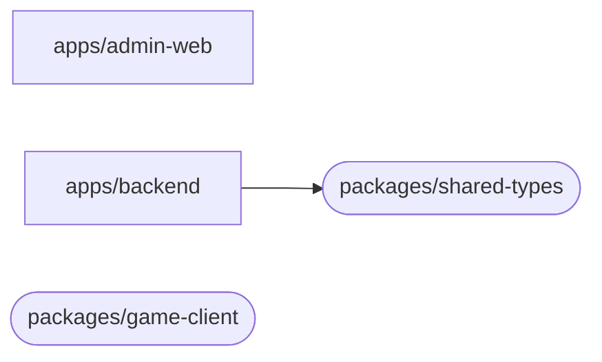
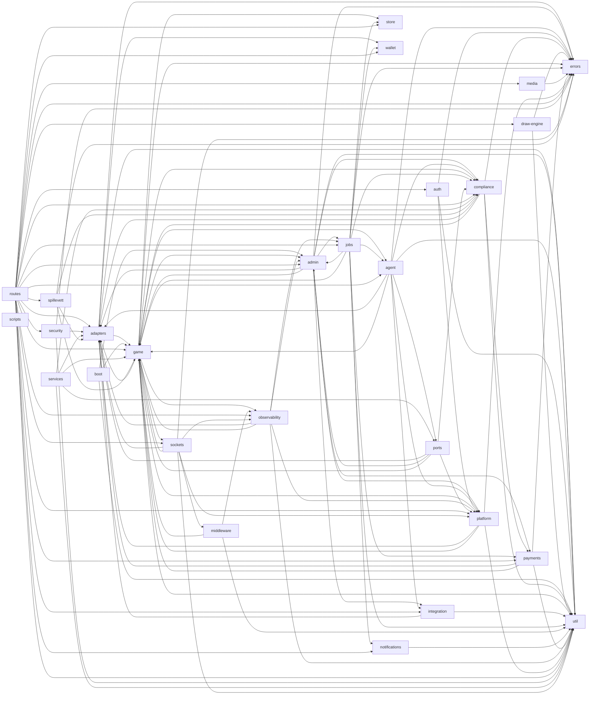

# Module dependency-graph

> **AUTO-GENERERT — IKKE REDIGER MANUELT.** Denne filen overskrives av
> `.github/workflows/auto-generate-docs.yml` på hver push til main.
>
> Generator: `scripts/generate-architecture-docs.sh`
> Sist oppdatert: 2026-05-15T19:15:47Z
> Commit: `8ad1a4ef` (branch: `main`)

Modul-graf (mermaid) avledet fra TypeScript-imports. Diagrammet viser
top-level avhengighet mellom **apps** og **packages** — det er bevisst
grovkornet for å være lesbart. For per-fil-graf, kjør
`npx depcruise --output-type mermaid apps/backend/src` lokalt.

## Apps + packages avhengighetsgraf

## Backend-domener: relativ-imports mellom domene-kataloger

Hver kant `A --> B` betyr: minst én fil i `apps/backend/src/A/`
importerer fra `apps/backend/src/B/`. Dette er en heuristikk,
ikke en formell avhengighetsanalyse.

## Notes

- Diagrammene er auto-generert fra package.json + import-statements.
- Cap på 120 backend-domene-kanter for å holde diagrammet rendable.
- For full per-fil-graf, kjør `npx depcruise --output-type mermaid apps/backend/src` lokalt.
