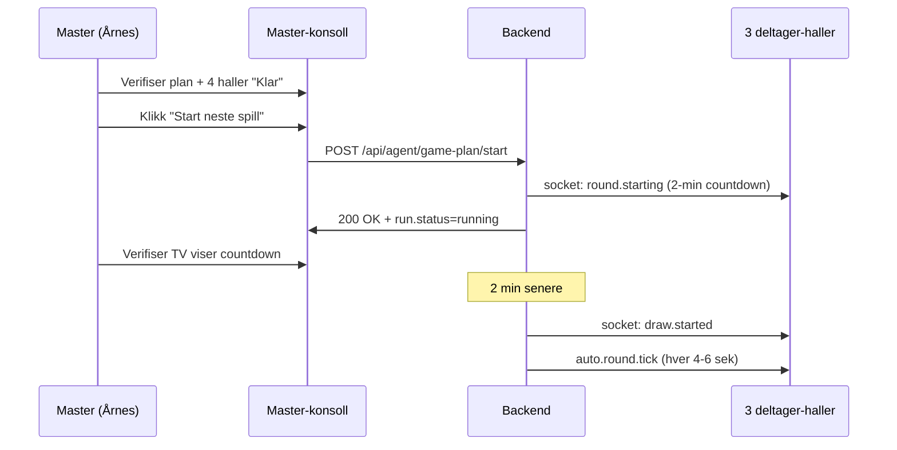

# Pilot-kveld go-live-runbook — Q3 2026

**Formål:** Steg-for-steg-prosedyrer for selve pilot-kvelden i 4-hall-pilot (Teknobingo Årnes som master + Bodø + Brumunddal + Fauske). Brukes av master-hall-agent, hall-bingoverter og on-call-rotasjon under stress.

**Målgruppe:** Master-hall-agent (Årnes), hall-bingoverter i 3 deltager-haller, L1-vakt på pilot-kvelden, L2/L3 on-call. Skal kunne følges uten teknisk lead i nærheten.

**Scope:** Spill 1 only på pilot-kvelden. Spill 2/3 kan være enabled i konfig men aktiveres ikke i spilleplan før Spill 1-piloten er stabil i 2-4 uker (se [`LIVE_ROOM_ROBUSTNESS_MANDATE_2026-05-08.md`](../architecture/LIVE_ROOM_ROBUSTNESS_MANDATE_2026-05-08.md) §6.2).

**Relatert (les i denne rekkefølgen ved tvil):**
- [`PILOT_4HALL_DEMO_RUNBOOK.md`](./PILOT_4HALL_DEMO_RUNBOOK.md) — demo-oppsett, brukes til T-24t-prøvekjøring
- [`PILOT_SMOKE_TEST_CHECKLIST_2026-04-28.md`](./PILOT_SMOKE_TEST_CHECKLIST_2026-04-28.md) — komplementær per-runde-sjekk
- [`PILOT_FLOW_TEST_CHECKLIST_2026-05-08.md`](./PILOT_FLOW_TEST_CHECKLIST_2026-05-08.md) — manuell flow-verifisering med admin-UI
- [`HALL_PILOT_RUNBOOK.md`](./HALL_PILOT_RUNBOOK.md) — generell hall-pilot-vakt + roller
- [`INCIDENT_RESPONSE_PLAN.md`](./INCIDENT_RESPONSE_PLAN.md) §1 — severity-matrise (P1/P2/P3)
- [`COMPLIANCE_INCIDENT_PROCEDURE.md`](./COMPLIANCE_INCIDENT_PROCEDURE.md) — Lotteritilsynet-meldepliktige hendelser
- [`LIVE_ROOM_DR_RUNBOOK.md`](./LIVE_ROOM_DR_RUNBOOK.md) — recovery-prosedyrer per rom
- [`ROLLBACK_RUNBOOK.md`](./ROLLBACK_RUNBOOK.md) — Render-rollback-mekanikk
- [`DATABASE_RESTORE_PROCEDURE.md`](./DATABASE_RESTORE_PROCEDURE.md) — PITR-restore
- [`docs/architecture/LIVE_ROOM_ROBUSTNESS_MANDATE_2026-05-08.md`](../architecture/LIVE_ROOM_ROBUSTNESS_MANDATE_2026-05-08.md) — R1-R12 pilot-gating

**Sist oppdatert:** 2026-05-08
**Eier:** Tobias Haugen (technical lead), L3 incident commander (TBD pre-pilot).

---

## 0. TL;DR — bare det viktigste

Hvis du må huske kun fem ting:

1. **Master-hallen er Teknobingo Årnes** (`hall-id: b18b7928-3469-4b71-a34d-3f81a1b09a88`). Master-bingovert er den eneste som kan trykke "Start Spill 1".
2. **On-call må være i `#bingo-pilot-war-room` fra T-2t** og holde mobilen på lyd til T+1t etter siste runde.
3. **Hvis noe føles feil — pause, ikke push.** Spill kan pauses mellom runder uten regulatorisk konsekvens. En tapt minutt er bedre enn en feilaktig utbetaling.
4. **Lotteritilsynet-meldepliktige hendelser har 24-timers SLA.** Datatap > 5 min, KYC-omgåelse, ledger-mismatch. Ring Tobias først.
5. **Go/no-go-beslutning tas T-30 min av L3 incident commander.** Se §8.

---

## 1. Pilot-kveld-tidslinje (oversikt)

```
T-24t   ────  Pre-flight (smoke-test, schedule, on-call rotert)
T-2t    ────  Setup-sjekk i hall (TV, terminaler, agent-portal)
T-30m   ────  Final-sjekk + go/no-go
T-0     ────  Master starter Spill 1
T+15m   ────  Første runde ferdig — compliance-check
T+1t    ────  Halvveis-sjekkpunkt (memory, latency, errors)
T+slutt ────  Post-pilot-rapport, settlement, lessons learned
T+24t   ────  Lotteritilsynet-rapport hvis SEV-1
```

Detaljer for hvert tidspunkt i §3-7. Pre-flight-sjekklister i §2.

---

## 2. Pre-flight-sjekkliste (T-24t)

**Kjøres av:** L3 incident commander (signoff) + L2 backend on-call (utførende).

**Tid:** Bør starte minst 24 timer før pilot for å gi tid til å fikse blokkere.

**Regel:** Hvis ett av punktene under er rødt, **ikke gå videre**. Alle skal være grønne, eller du må ha en eksplisitt "kjent risiko + mitigation"-note signert av Tobias.

### 2.1 Kode + deploy-state

- [ ] **Siste main er deployed til prod** og verifisert via `git log`:
  ```bash
  git fetch origin
  git log origin/main --oneline -10
  # Sammenlign med Render-dashboard "Latest deploy" på spillorama-system-service.
  # SHA må matche siste commit på origin/main.
  ```
- [ ] **Alle PR-er for pilot-blokkere er merget.** Sjekk Linear-prosjekt ["Live-rom-robusthet (R-mandat)"](https://linear.app/bingosystem/issue/BIN-810) — alle BIN-811..822 (R1-R12) som er pilot-gating skal være Done.
- [ ] **CI er grønn på `main`:**
  ```bash
  gh run list --branch main --limit 5
  # Forventet: alle "completed" og "success".
  ```
- [ ] **Branch-protection aktiv:** `compliance` + `backend` er required status checks (engangs-config — sjekk via Settings → Branches på GitHub).

### 2.2 Smoke-test mot prod

- [ ] **Kjør smoke-test mot prod-API** (PR #1090 introduserer `scripts/smoke-test-pilot.sh`; inntil mergetfall tilbake til eksisterende `apps/backend/scripts/pilot-smoke-test.sh`):
  ```bash
  # Foretrukket (når PR #1090 er merget):
  API=https://api.spillorama.no \
  ADMIN_EMAIL=tobias@nordicprofil.no \
  ADMIN_PASSWORD='<via-1Password>' \
    bash scripts/smoke-test-pilot.sh

  # Fallback (eksisterende script):
  API=https://api.spillorama.no \
  ADMIN_EMAIL=tobias@nordicprofil.no \
  ADMIN_PASSWORD='<via-1Password>' \
    bash apps/backend/scripts/pilot-smoke-test.sh
  ```
  Forventet: exit-code 0. Alle `[PASS]`-linjer grønne. Hvis exit ≠ 0 → **stopp og diagnostiser**.
- [ ] **Health-endpoints svarer:**
  ```bash
  curl -fsS https://api.spillorama.no/health | jq .
  # Forventet: {"status":"ok",...} med status 200.

  curl -fsS "https://api.spillorama.no/api/games/spill1/health?hallId=b18b7928-3469-4b71-a34d-3f81a1b09a88" | jq .
  # Forventet: status: "ok" eller "degraded". Hvis "down" → undersøk før pilot.
  ```

### 2.3 Render-infrastruktur

- [ ] **Postgres `bingo-db` plan = `pro_4gb`** (PITR aktivt, 7-dagers backup-retention).
  Verifiser via [Render dashboard → Databases → bingo-db → Settings](https://dashboard.render.com/) → "Plan: Pro 4GB".
- [ ] **Web-service plan ≠ `free`** (Free Plan har spinning down, ikke akseptabelt for pilot).
  Verifiser via dashboard. Skal være Standard eller høyere.
- [ ] **Redis er reachable:** `/health` returnerer `redisHealthy: true` (sjekk via JSON-response over).
- [ ] **Render uptime probe** har vært grønn siste 24t (dashboard → service → "Health Checks").
- [ ] **Sentry har mottatt events siste 24t** — én heartbeat eller én ekte capture er nok. Stille Sentry = misconfig.

### 2.4 Pilot-data — haller, agenter, spillere

- [ ] **4 pilot-haller seedet i `app_halls`:**
  ```sql
  -- Kjør via Render Postgres web-shell eller psql med APP_PG_CONNECTION_STRING:
  SELECT id, name, hall_number, is_active
  FROM app_halls
  WHERE id IN (
    'b18b7928-3469-4b71-a34d-3f81a1b09a88',  -- Teknobingo Årnes (master)
    'afebd2a2-52d7-4340-b5db-64453894cd8e',  -- Bodø
    '46dbd01a-4033-4d87-86ca-bf148d0359c1',  -- Brumunddal
    'ff631941-f807-4c39-8e41-83ca0b50d879'   -- Fauske
  );
  ```
  Forventet: 4 rader, alle `is_active=true`.
- [ ] **Group of Halls med `master_hall_id` satt riktig:**
  ```sql
  SELECT g.id, g.name, g.master_hall_id
  FROM app_hall_groups g
  WHERE g.master_hall_id = 'b18b7928-3469-4b71-a34d-3f81a1b09a88';
  ```
  Forventet: én rad. Master-hall-id MÅ være Årnes.
- [ ] **Alle 4 haller er medlemmer i samme GoH:**
  ```sql
  SELECT m.hall_id, h.name
  FROM app_hall_group_members m
  JOIN app_halls h ON h.id = m.hall_id
  WHERE m.group_hall_id = (
    SELECT id FROM app_hall_groups WHERE master_hall_id = 'b18b7928-3469-4b71-a34d-3f81a1b09a88'
  );
  ```
  Forventet: 4 rader (Årnes, Bodø, Brumunddal, Fauske).
- [ ] **Bingoverter har konto + agent-rolle + tildelt sin hall:**
  ```sql
  SELECT u.email, u.role, h.name AS hall, ah.is_primary
  FROM app_users u
  JOIN app_agent_hall_assignments ah ON ah.user_id = u.id
  JOIN app_halls h ON h.id = ah.hall_id
  WHERE u.role = 'AGENT'
    AND h.id IN ('b18b7928-...', 'afebd2a2-...', '46dbd01a-...', 'ff631941-...');
  ```
  Forventet: minst 1 agent per hall, alle med `is_primary=true` for sin hovedhall.
- [ ] **Pilot-spillere opprettet for hver hall:** ≥ 5 KYC-VERIFIED spillere per hall, hver med ≥ 200 kr deposit på wallet.
- [ ] **Master-hall-agent (Årnes-bingovert) har testet pålogging:**
  - URL: `https://spillorama-system.onrender.com/admin/`
  - Logger inn → blir redirected til `/agent`
  - Ser "Spill 1 master-konsoll"-knapp (kun synlig fordi hallId matcher master_hall_id)
  - Hvis ikke synlig → sjekk `app_hall_groups.master_hall_id` igjen.

### 2.5 Spilleplan

- [ ] **Spilleplan lastet for pilot-dato:**
  ```sql
  SELECT id, name, weekdays, start_time, end_time, is_active, group_of_halls_id
  FROM app_game_plan
  WHERE is_active = true
    AND group_of_halls_id = (
      SELECT id FROM app_hall_groups WHERE master_hall_id = 'b18b7928-...'
    )
    AND <pilot-ukedag> = ANY(weekdays);
  ```
  Forventet: én rad. `start_time`/`end_time` matcher planlagt pilot-vindu (eks 19:00–22:00).
- [ ] **Plan-items eksisterer:**
  ```sql
  SELECT i.position, gc.slug, gc.display_name, i.bonus_game_override
  FROM app_game_plan_items i
  JOIN app_game_catalog gc ON gc.id = i.game_catalog_id
  WHERE i.plan_id = '<plan-id-fra-over>'
  ORDER BY i.position;
  ```
  Forventet: minst 5 items (typisk 5-10 runder for én pilot-kveld). Slug-er skal være varianter av `bingo`.

### 2.6 On-call + kommunikasjon

- [ ] **On-call-rotasjon signert** (utfylt i [`HALL_PILOT_RUNBOOK.md`](./HALL_PILOT_RUNBOOK.md) §2):
  - L1 hall-vakt (Årnes): navn + telefon
  - L2 backend on-call: navn + telefon + Slack-handle
  - L2 payment on-call: navn + telefon + Slack-handle
  - L3 incident commander: navn + telefon + Slack-handle
  - L4 (Tobias): bekreftet tilgjengelig på telefon
  - Compliance-eier: navn + telefon
- [ ] **Slack-kanal `#bingo-pilot-war-room` er opprettet** og alle L1-L4 + compliance-eier er invitert.
- [ ] **Hall-eiere er informert om pilot-kveld** (e-post + telefon-bekreftelse).
- [ ] **Telefon-numre delt på papir** til master-bingovert (i tilfelle Slack/internett er nede).

### 2.7 Compliance + Lotteritilsynet

- [ ] **§71-rapport-format verifisert:** kjør tørrkjøring av daglig rapport mot prod-DB:
  ```sql
  SELECT * FROM v_daily_compliance_report WHERE business_date = CURRENT_DATE - 1;
  ```
  Forventet: ingen feil, alle felter populated. Hvis vi ser NULL i `total_stake_cents` eller `total_payout_cents` → blokker.
- [ ] **§11-prosent-sjekk:** verifiser at Spill 1 (slug `bingo`) skriver `gameType=MAIN_GAME`:
  ```sql
  SELECT game_type, COUNT(*)
  FROM app_rg_compliance_ledger
  WHERE created_at > now() - interval '7 days'
  GROUP BY game_type;
  ```
  Forventet: `MAIN_GAME` for alle bingo-rader. Hvis `DATABINGO` dukker opp for bingo-slug → blokker (compliance-bug).
- [ ] **Hash-chain audit-validering:**
  ```sql
  SELECT COUNT(*) FROM audit_log WHERE chain_valid = false;
  ```
  Forventet: 0. Hvis > 0 → eskalér til compliance-eier umiddelbart.
- [ ] **Wallet-reconciliation-status:**
  ```sql
  SELECT COUNT(*) FROM wallet_reconciliation_alerts WHERE resolved_at IS NULL;
  ```
  Forventet: 0 (eller dokumentert + signert "kjent + akseptert"-note).

### 2.8 Backup + recovery

- [ ] **Siste PITR-restore-test < 30 dager gammel.** Sjekk `dr-drill-log/` for siste DRILL_BACKUP_RESTORE-runde (PR #1092 introduserer doc).
- [ ] **Render Postgres backup-retention = 7 dager** (verifiser via dashboard).
- [ ] **`HOTFIX_PROCESS.md` er kjent for L2-vakt** (deploy uten review hvis pilot-blokker oppdages T-2t).

### 2.9 Pre-flight-signoff

Når alt over er grønt, fyll inn følgende i Slack-kanalen:

```
:white_check_mark: PRE-FLIGHT GRØNN — Pilot Q3 2026
Dato: <yyyy-mm-dd>
Pilot-vindu: <hh:mm>–<hh:mm>
Master-hall: Teknobingo Årnes
Alle 4 haller: Active ✅
Spilleplan: <plan-id> ✅
On-call rotert: ✅
Smoke-test: PASS ✅
Render: pro_4gb + Standard ✅
Compliance: hash-chain valid, recon = 0 ✅

Signed off: <L3 incident commander>
```

---

## 3. T-2t — Setup-sjekk i hall

**Kjøres av:** L1 hall-vakt på Årnes + hall-bingoverter i hver hall (parallelt).

**Tid:** 2 timer før pilot starter — 17:00 hvis pilot kl 19:00.

### 3.1 TV-skjermer per hall

I hver av de 4 hallene:

- [ ] TV-skjerm slått på, koblet til riktig URL (en hall-spesifikk URL per TV):
  - Årnes: `https://spillorama-system.onrender.com/admin/#/tv/b18b7928-3469-4b71-a34d-3f81a1b09a88/<tv-token>`
  - Bodø: `https://spillorama-system.onrender.com/admin/#/tv/afebd2a2-52d7-4340-b5db-64453894cd8e/<tv-token>`
  - Brumunddal: `https://spillorama-system.onrender.com/admin/#/tv/46dbd01a-4033-4d87-86ca-bf148d0359c1/<tv-token>`
  - Fauske: `https://spillorama-system.onrender.com/admin/#/tv/ff631941-f807-4c39-8e41-83ca0b50d879/<tv-token>`

  > TV-token er hall-spesifikk og er hentet fra `app_halls.tv_token`. L1 har den i 1Password.

- [ ] TV viser "Venter på neste spill"-skjerm med hall-navn + klokkeslett.
- [ ] **Voice-pakke valgt** (Voice 1 = norsk mann, Voice 2 = norsk kvinne, Voice 3 = engelsk):
  - L1 klikker én gang på TV-skjermen for å aktivere autoplay (Chrome krever first-user-gesture).
  - Test ved å trigge en test-ball-opplesning fra master-konsoll.
- [ ] F11 for fullskjerm-modus.

### 3.2 Agent-terminal i hver hall

- [ ] Bingovert logger inn på `https://spillorama-system.onrender.com/admin/`
- [ ] Blir redirected til `/agent`
- [ ] Ser sin hall i header (eks "Bodø Bingohall")
- [ ] Ser cash-balance, daily-balance (start: 0)
- [ ] Klikker **"Add Daily Balance"** → entrer starting cash (typisk 5000 kr)
- [ ] Verifiser i UI at `app_agent_shifts` viser `is_active=true, daily_balance=5000`

### 3.3 Spiller-registrering

- [ ] Hall-bingovert tester at en spiller kan logge inn og kjøpe bong:
  - Spiller logger inn på `https://spillorama-system.onrender.com/web/`
  - Velger sin hall i lobby
  - Sjekker at saldo vises og er > 0
  - Test-kjøper én bong (5 kr) — wallet trekker, bong vises i "Mine bonger"
- [ ] Hvis test-kjøp feiler:
  - Sjekk wallet-saldo (`/api/wallet/me`)
  - Sjekk compliance (`/api/wallet/me/compliance?hallId=...`) — `canPlay` skal være `true`
  - Hvis `canPlay=false` → spiller har trolig truffet daglig-tap-grense eller pause. Ring L2.

### 3.4 Master-konsoll-test (kun Årnes)

- [ ] Master-bingovert (Årnes) navigerer til master-konsoll:
  - URL: `https://spillorama-system.onrender.com/admin/#/agent/spill1/master`
  - Eller via sidemenyen: "Spill 1 master-konsoll"
- [ ] Ser:
  - "Gjeldende plan: <plan-navn>" (fra §2.5)
  - "Posisjon: 0 (idle)"
  - "Status: idle"
  - 4 hall-pills (Årnes, Bodø, Brumunddal, Fauske) — alle viser "Ikke klar"
- [ ] Master-bingovert MÅ IKKE trykke "Start Next Game" enda. Det skjer T-0.

`[Skjermbilde: Master-konsoll T-2t med plan vist + 4 hall-pills "Ikke klar"]`

### 3.5 Slack-status

L1 melder i `#bingo-pilot-war-room`:

```
:hourglass_flowing_sand: T-2t SETUP DONE — alle 4 haller
- TV: ✅ alle 4 (voice valgt, fullscreen)
- Agent-terminaler: ✅ shift opened i alle haller
- Master-konsoll: ✅ plan lastet, posisjon idle
- Test-spiller-kjøp: ✅
On-call står på vakt fra nå.
```

---

## 4. T-30 min — Final-sjekk + go/no-go

**Kjøres av:** L3 incident commander (signoff) + L2 backend on-call (utførende).

**Tid:** 30 minutter før første runde — eks 18:30 hvis pilot 19:00.

### 4.1 Live-state-verifisering

- [ ] **Spill 1 lobby viser scheduled-game (klar til start):**
  ```bash
  curl -fsS "https://api.spillorama.no/api/games/spill1/health?hallId=b18b7928-3469-4b71-a34d-3f81a1b09a88" | jq .
  ```
  Forventet:
  - `status: "ok"` (ikke "down")
  - `withinOpeningHours: true`
  - `dbHealthy: true, redisHealthy: true`
  - `connectedClients: > 0` (TV + agent + spillere koblet)
- [ ] **Master-konsoll viser plan + 4 haller:**
  - Master-bingovert refresher master-konsoll
  - Plan vist, posisjon = 0 eller 1, status = idle eller ready
  - 4 hall-pills synlige

### 4.2 Hver hall melder ready

- [ ] L1 ber hver hall-bingovert trykke **"Ready"** i sin agent-portal (Hall Info-popup).
- [ ] Master-konsoll skal nå vise:
  - Årnes (master): grønn pill "Klar"
  - Bodø: grønn pill "Klar"
  - Brumunddal: grønn pill "Klar"
  - Fauske: grønn pill "Klar"
- [ ] Hvis én hall er "Ikke klar":
  - Bingoverten i den hallen sjekker terminalen → restart agent-portalen om nødvendig
  - Hvis fortsatt ikke klar etter 5 min → L1 eskalér til L2

### 4.3 Ingen aktive Sentry-alerts

- [ ] Sjekk Sentry [`spillorama-backend`](https://sentry.io/organizations/spillorama/issues/?project=spillorama-backend&statsPeriod=1h):
  - Filtre: `is:unresolved` + `tag:env:production` + `statsPeriod:1h`
  - Forventet: 0 nye SEV-1/SEV-2 issues siste timen
  - Kjente issues: OK, men dokumenter i Slack
- [ ] Sjekk [`spillorama-client`](https://sentry.io/organizations/spillorama/issues/?project=spillorama-client&statsPeriod=1h) tilsvarende.

### 4.4 Wallet + compliance-baseline

- [ ] **Snapshot wallet-balanser (for post-pilot diff):**
  ```sql
  SELECT
    SUM(deposit_balance_cents) AS total_deposits,
    SUM(winnings_balance_cents) AS total_winnings,
    COUNT(*) AS account_count
  FROM app_wallet_accounts
  WHERE owner_user_id IN (
    SELECT id FROM app_users
    WHERE app_users.id IN (SELECT user_id FROM <pilot-spillere-view>)
  );
  ```
  Lagre output i Slack-tråden for senere sammenligning.
- [ ] **Snapshot compliance-ledger:**
  ```sql
  SELECT MAX(created_at) AS last_event, COUNT(*) AS event_count
  FROM app_rg_compliance_ledger;
  ```

### 4.5 Go/no-go-beslutning

L3 incident commander leser sjekklisten over og beslutter:

| Status | Handling |
|---|---|
| 🟢 Alle punkter grønne | **GO** — L3 melder i Slack: ":green_circle: GO for pilot kl <hh:mm>." |
| 🟡 1-2 mindre warnings, ingen pilot-blokker | **GO med varsel** — L3 melder warnings + mitigation. Pilot kan starte. |
| 🔴 Failed smoke-test, manglende on-call, aktive SEV-1, missing master-hall ready | **NO-GO** — L3 ringer Tobias, pilot utsettes 30 min eller avbrytes. |

Se §8 for full beslutningsmatrise.

---

## 5. T-0 — Master starter Spill 1

**Tid:** Kl 19:00 (eller hva pilot-vinduet er).

**Hovedaktør:** Master-bingovert på Årnes.

### 5.1 Master-bingovert-flyten — steg-for-steg



### 5.2 Steg-by-steg-prosedyre

1. **Master-bingovert sjekker master-konsoll:**
   - Plan: vist
   - Posisjon: 1 (eller hva startposisjon er)
   - Status: `idle`
   - 4 hall-pills: alle grønne "Klar"

   `[Skjermbilde: Master-konsoll T-0 med alle 4 haller klar + Start-knapp synlig]`

2. **Master-bingovert klikker "Start neste spill":**
   - Knapp må være enabled (gråtonet hvis en hall ikke er klar)
   - Etter klikk: confirm-popup "Er du sikker?" → "Ja, start"

3. **Hvis "ikke alle haller klare"-popup vises:**
   - Popup viser hvilke haller som ikke er klare
   - Master har 3 valg:
     - **Avbryt**: vent på treig hall, prøv igjen
     - **Force-start**: bryter regulatorisk hvis hallen har tickets, IKKE GJØR DETTE uten L3-godkjenning
     - **Hopp over hall**: kun for testing, ikke i pilot
   - **Default-handling i pilot:** Avbryt + ring L1 i den treige hallen → "Trykk Ready". Vent maks 5 min, prøv igjen.

   `[Skjermbilde: "Ikke alle haller klare"-popup med liste og 3 knapper]`

4. **Etter Start:**
   - Backend skriver `app_game_plan_run.status = 'running'`, `current_position = 1`
   - Backend emitter `socket: round.starting` til alle 4 haller med 2-min countdown
   - TV-skjerm i alle 4 haller skifter til "Spillet starter om 2 minutter"
   - Master-konsoll viser: "Status: running, posisjon: 1"

5. **Etter 2 minutter (T+2 min):**
   - Backend starter draw-engine
   - Første ball trekkes
   - TV-skjerm viser ball-animasjon + voice-opplesning
   - Spillere markerer på sine bonger (online + fysisk)

### 5.3 Hvis Start feiler

| Feil | Hva betyr det | Hva gjør master |
|---|---|---|
| Knapp er gråtonet | Én eller flere haller ikke klar | Sjekk Hall Info-popup, ring den treige hallen |
| `JACKPOT_SETUP_REQUIRED` 400-feil | Posisjonen krever jackpot-popup først | Master må fylle ut Jackpot Setup-popup → submit → prøv Start igjen |
| `BRIDGE_FAILED` i UI | Engine-bridge feilet | L2-eskalering. Master kan ikke fixe selv. |
| `HALL_NOT_IN_GROUP` | DB-konfig-feil | L2-eskalering. Pilot må pauses inntil L2 fikser |
| Timeout (> 30 sek uten respons) | Backend henger | Master refresher konsoll én gang. Hvis fortsatt timeout → L2 |

### 5.4 Slack-melding T-0

Master-bingovert eller L1 melder:

```
:rocket: T-0 PILOT STARTET
Plan: <plan-navn>, posisjon 1
Master-bingovert: <navn>
Alle 4 haller klare: Årnes, Bodø, Brumunddal, Fauske
Spillere koblet: <antall>
TV-er live: ✅ alle 4
Countdown 2 min — første ball ca <hh:mm:ss>
```

---

## 6. T+15 min — Første runde ferdig + compliance-check

**Tid:** Ca 15 min etter T-0.

**Hovedaktør:** L2 backend on-call (verifisering) + master-bingovert (advance).

### 6.1 Verifiser at runden fullførte

Når Fullt Hus er truffet i runde 1:

- [ ] TV viser vinner-animasjon ("BINGO! <Spiller-navn>")
- [ ] Master-konsoll viser: "Posisjon 1: Fullført", venter på "Neste runde"-knapp
- [ ] Vinner-pop-ups på agent-terminalene som har vinnende fysiske bonger

### 6.2 Compliance-events skrevet

L2 verifiserer i DB (Render web-shell):

```sql
-- 1. Spill-runden er fullført + skrevet til scheduled-games
SELECT id, hall_id, status, started_at, completed_at, total_revenue_cents, total_payout_cents
FROM app_game1_scheduled_games
WHERE master_hall_id = 'b18b7928-3469-4b71-a34d-3f81a1b09a88'
  AND status = 'completed'
ORDER BY completed_at DESC LIMIT 1;
-- Forventet: én rad, status='completed', completed_at populated.

-- 2. Compliance-ledger har entries for hver kjøp + payout med riktig actor_hall_id
SELECT actor_hall_id, event_type, amount_cents, COUNT(*)
FROM app_rg_compliance_ledger
WHERE created_at > now() - interval '30 minutes'
GROUP BY actor_hall_id, event_type
ORDER BY actor_hall_id, event_type;
-- Forventet: 4 actor_hall_id-rader (én per hall som hadde kjøp).
-- Hvis bare master_hall_id er der → §71-bug, eskalér til L3 umiddelbart.

-- 3. Audit-hash-chain valid
SELECT COUNT(*) FROM audit_log WHERE chain_valid = false;
-- Forventet: 0.

-- 4. Wallet-events har idempotency-keys
SELECT
  COUNT(*) AS total,
  COUNT(idempotency_key) AS with_key
FROM app_wallet_events
WHERE created_at > now() - interval '30 minutes';
-- Forventet: total = with_key (alle har keys).
```

### 6.3 Hvis compliance-events mangler

| Symptom | Eskalering |
|---|---|
| `actor_hall_id` = master_hall_id for alle | P1 — §71-bug. L3 umiddelbart. |
| `chain_valid=false` rader | P1 — Lotteritilsynet-meldepliktig. Compliance-eier umiddelbart. |
| `idempotency_key` NULL i wallet-events | P2 — wallet-bug, men ikke compliance-blokk. L2 etter pilot. |
| Manglende ledger-entries (mismatch mot kjøp) | P1 — pengetap eller logikk-feil. Stopp pilot. |

### 6.4 Master advance til runde 2

- [ ] Master-bingovert klikker "Neste runde" i master-konsoll
- [ ] Hvis runde 2 har `requiresJackpotSetup=true`:
  - "Jackpot setup"-popup vises
  - Master fyller ut: `draw` (1-90), `prizesCents` per bongfarge (gul/hvit/lilla)
  - Submit → posisjonen advancer
- [ ] Plan-runtime går fra "Posisjon 1: completed" til "Posisjon 2: running"
- [ ] Ny 2-min countdown kringkastes

### 6.5 Slack-update

```
:white_check_mark: RUNDE 1 FULLFØRT — pilot kjører stabilt
Vinner: <ticket-id> (hall <X>)
Pot: <Y> kr fordelt på <Z> bonger
Compliance: ledger ✅, hash-chain ✅, idempotency ✅
Advance til runde 2: ✅
Spillere koblet: <antall>
Memory: <X>%, latency p95: <Y>ms
```

---

## 7. T+1 t — Halvveis-sjekkpunkt

**Tid:** En time etter første runde.

**Hovedaktør:** L2 backend on-call.

### 7.1 Performance-sjekk

```bash
# Memory + latency på prod-instansen (Render dashboard → service → Metrics):
# - Memory < 70% av tildelt
# - CPU < 60% sustained
# - Response p95 < 500ms

# Alternativt via API:
curl -fsS https://api.spillorama.no/health | jq .
# Forventet: alle felt OK, ingen warnings.
```

### 7.2 Error-rate

```bash
# Sentry:
# Filtre: is:unresolved + statsPeriod:1h
# Forventet: < 5 nye issues siste timen, ingen SEV-1
```

### 7.3 Live-rom-helse

```bash
curl -fsS "https://api.spillorama.no/api/games/spill1/health?hallId=b18b7928-3469-4b71-a34d-3f81a1b09a88" | jq .
```

Forventet:
- `status: "ok"` (ikke degraded eller down)
- `lastDrawAge` < 30 sek (hvis runde pågår)
- `connectedClients` stabil eller økende
- `redisHealthy: true, dbHealthy: true`

### 7.4 Compliance-running-totals

```sql
-- Sjekk at vi ikke har for mange åpne wallet-recon-alerts:
SELECT COUNT(*), MAX(divergence_cents)
FROM wallet_reconciliation_alerts
WHERE resolved_at IS NULL;
-- Forventet: 0 (eller pre-eksisterende kjente alerts)

-- Sjekk pengeflyt-balanse mellom inntekt og utbetaling:
SELECT
  SUM(CASE WHEN event_type = 'STAKE' THEN amount_cents ELSE 0 END) AS total_stake,
  SUM(CASE WHEN event_type IN ('PRIZE','EXTRA_PRIZE') THEN amount_cents ELSE 0 END) AS total_prize
FROM app_rg_compliance_ledger
WHERE created_at > '<pilot-start-time>';
-- Forventet: total_prize / total_stake mellom 0.30 og 0.95 (RTP-rimelighetssjekk)
```

### 7.5 Slack-update

```
:eyes: T+1t HALVVEIS-SJEKK
Runder fullført: <X>
Spillere koblet: <Y>
Memory: <Z>%, p95-latency: <W>ms
Sentry: <antall> nye, ingen SEV-1
Compliance: recon-alerts = 0 ✅, hash-chain ✅
RTP-running: <X>% (innenfor forventet)
On-call status: alle på post
```

---

## 8. Pilot-go/no-go-beslutnings-matrise

Beslutning tas av L3 incident commander T-30 min eller ved en hver eskaleringsbeslutning.

### 8.1 Trafikklys-vurdering

| Status | Definisjon | Handling |
|---|---|---|
| 🟢 GO | Alle pre-flight-sjekker grønne (§2). Smoke-test PASS. On-call signert. Ingen aktive Sentry SEV-1. Master-hall ready. Spilleplan loaded. Wallet-recon = 0. | Pilot starter på planlagt tid. L3 melder ":green_circle: GO" i Slack. |
| 🟡 GO med varsel | 1-2 mindre warnings (eks: 1 åpen pre-eksisterende Sentry-issue, kjent og dokumentert). Ingen pilot-blokkere. | Pilot starter, men L2 har ekstra fokus på warning-områdene. L3 melder ":yellow_circle: GO med varsel: <bekymringer>" i Slack. |
| 🔴 NO-GO | Failed smoke-test ELLER manglende on-call ELLER aktive SEV-1 ELLER manglende Render-Standard-plan ELLER master-hall ikke ready ELLER spilleplan mangler ELLER wallet-recon-alerts > 0 uten resolution. | Pilot utsettes. L3 ringer Tobias. Slack-melding: ":red_circle: NO-GO: <årsak>". |

### 8.2 NO-GO-årsak-matrise

| Årsak | Mitigation | Realistisk tid til retry |
|---|---|---|
| Smoke-test feiler | L2 diagnostiserer + fixer + redeployer + ny smoke-test | 1-3 timer |
| On-call ikke tilgjengelig | Finn sub eller utsett | 30-60 min |
| Sentry SEV-1 aktiv | Vurder om relevant for pilot-flyt; rull tilbake hvis ja | 30 min - 2 timer |
| Master-hall ikke ready | Sjekk hall-konfig + agent-pålogging | 15-30 min |
| Spilleplan mangler/feil | Admin oppretter plan via UI eller SQL-fix | 30-60 min |
| Wallet-recon > 0 åpne | L2 + compliance-eier graver, vurder pilot-pause | 1-4 timer |
| Postgres på Free-plan | Oppgrader til pro_4gb umiddelbart | 30 min |
| Web-service på Free-plan | Oppgrader til Standard | 15-30 min |

### 8.3 Mid-pilot-beslutninger

Hvis problem oppstår *under* pilot, samme matrise med tillegg:

| Status | Definisjon | Handling |
|---|---|---|
| 🟢 KJØR VIDERE | Mindre warnings, ingen kunde-impact, ingen compliance-risk | Fortsett, dokumenter post-pilot |
| 🟡 PAUSE | Compliance-tvil, eller én hall mister kontakt > 2 min | Master pauser pilot, L3 + L2 graver, vurder restart eller stopp |
| 🔴 STOPP | P1-incident (pengetap, KYC-bypass, hash-chain brudd, Lotteritilsynet-meldepliktig) | Master stopper pilot. L3 + Tobias inn umiddelbart. Compliance-eier varsles. |

---

## 9. Eskalerings-sti — hva gjør jeg hvis...

**Regel:** Når i tvil, eskalér oppover. Bedre å forstyrre L3 unødig enn å la et compliance-brudd ligge.

### 9.1 "Spillere kan ikke koble til rom"

**Symptom:** Spillere ser "Kan ikke koble til" eller "Mistet forbindelse" i game-client.

**Trinn-for-trinn:**

1. **Sjekk health-endpoint** (10 sek):
   ```bash
   curl -fsS "https://api.spillorama.no/api/games/spill1/health?hallId=<hall-id>" | jq .
   ```
   - `status: "down"` → §9.4 (hele appen er nede)
   - `status: "degraded"` → fortsett til steg 2
   - `status: "ok"` → trolig klient-side problem (refresh F5)

2. **Sjekk Sentry** (30 sek):
   - https://sentry.io/organizations/spillorama/issues/?statsPeriod=15m
   - Se etter `WebSocketError`, `RedisConnectionError`, `SocketScopeError`

3. **Sjekk Render Postgres + Redis** (1 min):
   - Render dashboard → bingo-db → Status (skal være Healthy)
   - Render dashboard → bingo-redis → Status

4. **Hvis Redis er nede:**
   - Følg [`REDIS_FAILOVER_PROCEDURE.md`](./REDIS_FAILOVER_PROCEDURE.md)
   - Backend skal degradere til in-memory adapter (kortvarig OK)

5. **Hvis fortsatt feil etter 5 min:**
   - L1 → L2 backend on-call
   - L2 sjekker live-rom-state, restart instans hvis nødvendig

### 9.2 "Master-actions feiler"

**Symptom:** Master klikker "Start neste spill" → 400/500-feil eller hengende UI.

**Trinn-for-trinn:**

1. **Sjekk feilkoden i admin-konsoll** (10 sek):
   - `JACKPOT_SETUP_REQUIRED` → master må fylle ut jackpot-popup først
   - `BRIDGE_FAILED` → engine-bridge-feil, eskalér L2
   - `HALL_NOT_IN_GROUP` → DB-konfig-feil, eskalér L2
   - `GAME_PLAN_RUN_NOT_FOUND` → ny plan trengs, eskalér L2
   - `FORBIDDEN` → master-hall-id matcher ikke (kanskje noen har endret config)

2. **Sjekk plan-runtime-state i DB** (1 min):
   ```sql
   SELECT id, status, current_position, jackpot_overrides, started_at, finished_at
   FROM app_game_plan_run
   WHERE plan_id = '<plan-id>'
     AND business_date = CURRENT_DATE;
   ```
   - Status `idle` med posisjon 0 → plan ikke startet enda, prøv Start igjen
   - Status `paused` → master må klikke Resume
   - Status `finished` → planen er over, ingen flere runder
   - Tom = ingen rad → plan ikke initialisert, eskalér L2

3. **Sjekk lobby-aggregator-state:**
   ```bash
   curl -fsS "https://api.spillorama.no/api/agent/game-plan/current?hallId=<master-hall-id>" \
     -H "Authorization: Bearer <admin-token>" | jq .inconsistencyWarnings
   ```
   Hvis `inconsistencyWarnings` ikke er tom → state-machine ute av sync.

4. **Trinn 4: kjør GameLobbyAggregator manuelt:**
   Eskalér til L2 — krever backend-tilgang.

### 9.3 "Wallet sier insufficient funds men ble nettopp credited"

**Symptom:** Spiller har akkurat fått credit (deposit eller payout), men kjøp/withdrawal viser "Insufficient funds".

**Mulig årsak:** Outbox-pattern ikke flushet, eller eventual consistency.

**Trinn-for-trinn:**

1. **Sjekk wallet-state direkte i DB** (30 sek):
   ```sql
   SELECT wa.id, wa.deposit_balance_cents, wa.winnings_balance_cents,
          we.created_at, we.event_type, we.amount_cents
   FROM app_wallet_accounts wa
   LEFT JOIN app_wallet_events we ON we.wallet_id = wa.id
   WHERE wa.id = '<wallet-id>'
   ORDER BY we.created_at DESC LIMIT 5;
   ```
   - Hvis siste credit-event ikke er der → outbox ikke flushet, vent 30 sek + retry
   - Hvis credit-event der men balance ikke oppdatert → REPEATABLE READ-conflict, eskalér L2

2. **Sjekk outbox-køen:**
   ```sql
   SELECT COUNT(*), MIN(created_at), MAX(created_at)
   FROM app_wallet_outbox
   WHERE processed_at IS NULL;
   ```
   - Forventet: 0-5 (kortvarig backlog OK)
   - Hvis > 50 eller eldste er > 1 min gammel → outbox-worker stuck

3. **Hvis outbox-worker stuck:**
   - L2 eskalerer, vurder backend-restart
   - Følg [`LIVE_ROOM_DR_RUNBOOK.md`](./LIVE_ROOM_DR_RUNBOOK.md)

4. **Reconciliation:**
   ```bash
   # Kjør recon-job manuelt (krever Render-shell-tilgang):
   render shell spillorama-system
   npm --prefix apps/backend run recon:wallet
   ```
   Output skal vise 0 åpne alerts.

### 9.4 "Hele appen er nede"

**Symptom:** `/health` 5xx eller timeout. TV-er viser tom skjerm. Agent-portal viser "Kan ikke koble til server".

**Trinn-for-trinn:**

1. **Bekreft via flere kilder** (30 sek):
   ```bash
   # Health-endpoint (3 forskjellige nettverk hvis mulig):
   curl -fsS https://api.spillorama.no/health
   curl -fsS https://spillorama-system.onrender.com/health

   # Render dashboard (er den røde-merket?):
   # https://dashboard.render.com/web/<service-id>
   ```

2. **Sjekk Render-status:**
   - Render Status Page: https://status.render.com/
   - Hvis Render selv har incident → ingenting å gjøre, vent

3. **Sjekk siste deploy:**
   - Render → service → "Events" tab
   - Hvis "Build failed" eller "Deploy failed" → rollback

4. **Kjør rollback hvis siste deploy er årsaken:**
   - Følg [`ROLLBACK_RUNBOOK.md`](./ROLLBACK_RUNBOOK.md)
   - PR #1092 introduserer `DRILL_ROLLBACK_2026-Q3.md` med øvet-runbook
   - Render dashboard → Deploys → finn siste grønne deploy → "Redeploy"

5. **Hvis ikke deploy-relatert:**
   - Sjekk Postgres-konnektivitet (Render → bingo-db → Status)
   - Hvis Postgres er ute → følg DB-restore (§9.5)
   - Hvis Postgres OK men app er nede → Render-service-restart fra dashboard

6. **Mens app er nede:**
   - L1 melder hall-eiere muntlig
   - Master-bingovert pauser pilot på TV-en (manuelt — "Vi har en kort pause")
   - L2 kommuniserer ETA i Slack hvert 5. minutt

7. **Etter recovery:**
   - Verifiser data-integritet (§6.2 compliance-events)
   - Hvis pengeflyt forstyrret → eskalér til compliance-eier

### 9.5 "DB krasjer"

**Symptom:** Postgres ikke tilgjengelig, alle queries feiler, app er stuck.

**Trinn-for-trinn:**

1. **Bekreft DB-status:**
   - Render dashboard → bingo-db
   - Hvis "Suspended" eller "Failed" → trigg PITR-restore

2. **PITR-restore:**
   - Følg [`DATABASE_RESTORE_PROCEDURE.md`](./DATABASE_RESTORE_PROCEDURE.md)
   - PR #1092 introduserer `DRILL_BACKUP_RESTORE_2026-Q3.md` med øvet-prosedyre
   - Velg "Restore to point in time" → siste tidspunkt før krasjet
   - Forventet RTO: 15-30 min

3. **Mens DB er ute:**
   - Pilot er effektivt stoppet
   - L1 informerer hall-eiere
   - L3 vurderer: avbryt pilot eller vent på recovery

4. **Etter restore:**
   - Verifiser at data fra siste minutt er der (RPO: ~1 min for PITR)
   - Sjekk om noen runder ble avbrutt midt-trekning
   - Hvis ja: §9.6 (avbrutt runde-håndtering)

### 9.6 "Avbrutt runde — hva skjer med tickets og pengene?"

**Symptom:** En runde ble avbrutt midt i trekning (DB-krasj, instance-restart, master force-end).

**Default-handling (forsvarlig):**

1. **Backend skal automatisk refundere:**
   - Outbox-worker skal credit-tilbake innsats til alle spillere som hadde aktive bonger
   - Compliance-ledger skriver `REFUND`-events
   - Sjekk i DB:
     ```sql
     SELECT COUNT(*), SUM(amount_cents)
     FROM app_rg_compliance_ledger
     WHERE event_type = 'REFUND'
       AND created_at > '<runde-start-tid>';
     ```

2. **Hvis refund ikke skjedde automatisk:**
   - Eskalér til L2 + compliance-eier
   - Manuell refund kan kjøres via admin-konsoll (`POST /api/admin/wallets/:id/extra-prize` med `reason='refund_avbrutt_runde'`)

3. **Lotteritilsynet-rapport:**
   - Hvis runde ble avbrutt → meldepliktig (datatap > 5 min)
   - Compliance-eier sender skriftlig melding innen 24 timer
   - Følg [`COMPLIANCE_INCIDENT_PROCEDURE.md`](./COMPLIANCE_INCIDENT_PROCEDURE.md)

### 9.7 "Lotteritilsynet ringer om compliance-issue"

**Ikke panikk.**

**Trinn-for-trinn:**

1. **Hvem som tar samtalen:**
   - Bingovert/L1: ta navn + nummer + årsak, si "Vi ringer tilbake innen 30 min med teknisk lead på linja"
   - **Ikke gi teknisk forklaring til Lotteritilsynet uten Tobias eller compliance-eier til stede**

2. **Eskalér umiddelbart:**
   - Ring L3 incident commander
   - Ring Tobias direkte (telefon på papir hvis Slack er nede)

3. **Mens du venter på ring-tilbake:**
   - Hent audit-log-utskrift for den aktuelle hendelsen:
     ```sql
     SELECT *
     FROM audit_log
     WHERE created_at BETWEEN '<start>' AND '<end>'
       AND (event_data->>'hall_id' = '<hall-id>' OR resource_id = '<related-id>')
     ORDER BY created_at;
     ```
   - Eksporter til CSV (Render web-shell `\copy` eller via admin-rapport-eksport)

4. **Etter samtale med Lotteritilsynet:**
   - Dokumenter alle spørsmål + svar i Slack
   - Send skriftlig oppfølger innen 24 timer (compliance-eier)
   - Følg [`COMPLIANCE_INCIDENT_PROCEDURE.md`](./COMPLIANCE_INCIDENT_PROCEDURE.md) §3-5

### 9.8 Andre vanlige feil

| Symptom | Sannsynlig årsak | Handling |
|---|---|---|
| TV-skjerm henger på én ball | Browser-cache eller WebSocket-disconnect | F5-refresh på TV. Voice-cache lastes på nytt — klikk én gang for autoplay. |
| Voice-opplesning silent | Chrome autoplay-policy | Klikk på TV-skjerm én gang. Hvis fortsatt silent → bytt voice-pakke. |
| Spiller-balanse "1 NOK off" | Floor-rounding av pot-deling | Forventet (se §9 multi-vinner). Dokumenter, ikke incident. |
| Hall sitter "Not Ready" | Bingovert har ikke trykket Ready | Ring bingoverten direkte. |
| Bonger registrerer ikke ved scan | Scanner-driver eller stack-id-format | Bingoverten skanner manuelt eller bytter til kvitterings-flow. |
| Mini-game starter ikke etter Fullt Hus | MiniGameRouter-feil | Sjekk Sentry. Pilot kan fortsette uten mini-game (ikke-blokker). |

---

## 10. Eskaleringsnivåer

**Regel:** Hvert nivå har en tidsfrist. Hvis nivået ikke løser innen tidsfristen, gå opp.

| Nivå | Hvem | Hva de prøver | Tidsfrist | Eskalér til |
|---|---|---|---|---|
| **L1** | Bingovert / hall-vakt | UI-feilsøking: refresh, ny pålogging, sjekk hall-konfig | 10 min | L2 |
| **L2** | Backend on-call (5 min response) | Pause + Resume, sjekk live-rom-state, sjekk Sentry, restart hvis kjent-feil-mønster | 5 min etter L1-eskalering | L3 |
| **L3** | Incident commander | Beslutter: rollback / SEV-eskalering / Lotteritilsynet-trigger / pilot-pause/stopp | 0 min — beslutter umiddelbart | L4 |
| **L4** | Tobias (decision-maker) | Endelig myndighet på pilot-stop, hot-fix utenfor review, Lotteritilsynet-kontakt | Etter behov | Lotteritilsynet (compliance-eier) |
| **L5** | Lotteritilsynet | Skriftlig melding ved SEV-1 compliance | Innen 24t | — |

### 10.1 Når går vi til neste nivå?

- **L1 → L2:** Etter 10 min uten løsning, eller umiddelbart hvis backend-feil (404/500/timeout)
- **L2 → L3:** Etter 5 min uten løsning på L2-handling, eller umiddelbart for P1
- **L3 → L4:** Umiddelbart for:
  - SEV-eskalering til P1
  - Beslutning om global rollback
  - Hot-fix utenfor normal review
  - Lotteritilsynet-melding
- **L4 → L5:** Innen 24 timer for SEV-1-incidents (datatap > 5 min, KYC-omgåelse, compliance-brudd)

### 10.2 Roller-tabell (fyll inn pre-pilot)

> **MÅ FYLLES UT FØR PILOT.** Tom tabell = ingen go-live.

| Rolle | Navn | Telefon | Slack | Vakt-vindu |
|---|---|---|---|---|
| L1 hall-vakt (Årnes) | _______________ | _______________ | _______________ | T-2t → T+1t etter siste runde |
| L2 backend on-call | _______________ | _______________ | _______________ | T-30m → T+1t etter siste runde |
| L2 payment on-call | _______________ | _______________ | _______________ | T-30m → T+1t etter siste runde |
| L3 incident commander | _______________ | _______________ | _______________ | T-2t → T+1t etter siste runde |
| L4 (Tobias) | Tobias Haugen | _______________ | _______________ | Etter behov |
| Compliance-eier | _______________ | _______________ | _______________ | Innen 1t |

---

## 11. Kommunikasjons-maler

### 11.1 Slack — initial incident-varsel

```
:rotating_light: SEV-[1|2|3] | <komponent> | <hh:mm>

Hva: <én setning, ikke teknisk>
Hall: <Årnes/Bodø/Brumunddal/Fauske/alle>
Severity: <P1|P2|P3>
Eier: @<L2-vakt> / @<L3>
Symptom: <hva spillere/agenter ser>
Påvirkning: <antall spillere, antall haller>

Runbook: <link til relevant runbook-seksjon>
Live-tråd: :thread:
```

**Eksempel:**
```
:rotating_light: SEV-2 | Wallet | 19:45

Hva: Spillere på Bodø kan ikke kjøpe bonger
Hall: Bodø
Severity: P2
Eier: @kari (L2 backend) / @ola (L3)
Symptom: "Insufficient funds" tross kreditt for 30 sek siden
Påvirkning: 8 spillere, 1 hall

Runbook: PILOT_GO_LIVE_RUNBOOK_2026-Q3.md §9.3
Live-tråd: :thread:
```

### 11.2 Slack — status-update (hvert 15 min under aktiv incident)

```
[<hh:mm>] :clock: Status-update

Hva er gjort siste 15 min:
- <punkt 1>
- <punkt 2>

Hva er neste:
- <punkt 1>

Forventet løsning: <tid eller "ukjent — etter X-undersøkelse">
Pilot-state: <pågår/pauset/stoppet>
```

### 11.3 Slack — resolved

```
:white_check_mark: SEV-<X> | <komponent> | LØST <hh:mm>

Tidslinje: <oppstart hh:mm> – <løst hh:mm>
Total-impact: <X spillere / Y haller / Z min>
Rotårsak: <én setning>
Mitigation: <hva som faktisk fikset det>

Pilot fortsetter: <ja/nei>
Post-mortem: <Linear-issue/dato>
```

### 11.4 E-post — hall-eier ved pilot-avbrudd

```
Emne: Spillorama pilot 2026-<dato>: Avbrudd kl <hh:mm>

Hei <hall-eier-navn>,

Vi har dessverre måttet avbryte pilot-kvelden i din hall kl <hh:mm>.

Hva som skjedde:
<én-to setninger om årsak — ikke teknisk>

Hva vi gjør nå:
- Alle spillere får refundert sine kjøp i løpet av 24 timer
- Vi gjennomgår hva som skjedde og kommer tilbake innen <dato> med plan for ny pilot

Hva du må gjøre:
- Informer dine kunder om at piloten er avbrutt
- Hvis spillere har spørsmål om refundering, henvis til support@spillorama.no

Vi beklager ulempene dette har medført. Tobias eller jeg ringer deg innen <tid> for å gå gjennom detaljene.

Vennlig hilsen
<Navn>, <rolle>
```

### 11.5 Status-side-oppdatering (`/api/status` incident)

For bredere problem som spillere ser:

```bash
# L3 oppretter incident via admin-API:
curl -X POST https://api.spillorama.no/api/admin/status/incidents \
  -H "Authorization: Bearer <admin-token>" \
  -H "Content-Type: application/json" \
  -d '{
    "title": "Midlertidig problem med Spill 1",
    "description": "Vi opplever for tiden problemer med Spill 1 i pilot-haller. Vi jobber med å løse dette og kommer tilbake snart.",
    "status": "investigating",
    "impact": "major",
    "affectedComponents": ["bingo"]
  }'
```

Når løst:
```bash
curl -X PUT https://api.spillorama.no/api/admin/status/incidents/<id> \
  -H "Authorization: Bearer <admin-token>" \
  -H "Content-Type: application/json" \
  -d '{
    "status": "resolved",
    "description": "Problemet er løst. Spill 1 fungerer normalt igjen."
  }'
```

### 11.6 Lotteritilsynet — skriftlig melding

> **Eier:** Compliance-eier. **NB:** Bruk denne malen kun som start. Tilpass til konkret hendelse.

```
Til: post@lottstift.no
Emne: Hendelse i Spillorama Bingo — Lotteritilsynet melding (§71)

<Compliance-eier-navn>
<Selskap> AS
<Adresse>

Dato: <yyyy-mm-dd>
Hendelses-id: <intern-id>

I henhold til pengespillforskriften §71 melder vi herved:

1. Tidspunkt: <hh:mm yyyy-mm-dd> – <hh:mm yyyy-mm-dd>
2. Berørte haller: <liste>
3. Antall berørte spillere: ca <X>
4. Hendelsestype: <datatap / KYC-omgåelse / ledger-mismatch / annet>
5. Påvirkning: <kort beskrivelse>
6. Tiltak: <hva vi gjorde for å rette opp>
7. Pågående utbedringer: <prosess + tidsfrist>

Vedlagt:
- Audit-log-utskrift
- Wallet-reconciliation-rapport
- Tidslinje av hendelsen

Spørsmål kan rettes til:
<Compliance-eier-navn>
<Telefon>
<E-post>

Vennlig hilsen
<Compliance-eier-navn>
```

---

## 12. Post-pilot-runbook

**Tid:** Fra siste runde til 24 timer etter pilot-slutt.

**Hovedaktør:** L3 incident commander + L2 backend on-call.

### 12.1 Umiddelbart (T+slutt → T+30 min)

- [ ] **Master-bingovert kjører settlement-flyten:**
  - Physical Cashout pending → Reward All
  - Control Daily Balance mot forventet
  - Settlement-form (Metronia/OK Bingo/Franco/Otium + NT/Rikstoto + Rekvisita + Servering + Bilag + Bank)
  - Shift Log Out med checkboxer satt:
    - [x] Distribute winnings to physical players
    - [x] Transfer register ticket to next agent (om relevant)
- [ ] **Andre 3 hall-bingoverter kjører tilsvarende settlement i sin hall.**
- [ ] **L2 verifiserer at settlement-rader er skrevet:**
  ```sql
  SELECT s.id, s.shift_id, s.hall_id, s.daily_balance_at_end,
         s.daily_balance_difference, s.is_force_required, s.created_at
  FROM app_agent_settlements s
  WHERE s.business_date = CURRENT_DATE
    AND s.hall_id IN (<de-4-pilot-hallene>);
  ```
  Forventet: 4 rader (én per hall). `daily_balance_difference` skal være innen ±100 kr (eller dokumentert avvik).

### 12.2 Pilot-rapport-snapshot (T+30m → T+2h)

**Hva skal logges:**

```sql
-- 1. Antall spillere som deltok
SELECT COUNT(DISTINCT user_id)
FROM app_rg_compliance_ledger
WHERE created_at BETWEEN '<pilot-start>' AND '<pilot-slutt>'
  AND event_type = 'STAKE';

-- 2. Total omsetning (innsats)
SELECT SUM(amount_cents) / 100.0 AS total_stake_kr
FROM app_rg_compliance_ledger
WHERE created_at BETWEEN '<pilot-start>' AND '<pilot-slutt>'
  AND event_type = 'STAKE';

-- 3. Total utbetaling (premier)
SELECT SUM(amount_cents) / 100.0 AS total_prize_kr
FROM app_rg_compliance_ledger
WHERE created_at BETWEEN '<pilot-start>' AND '<pilot-slutt>'
  AND event_type IN ('PRIZE', 'EXTRA_PRIZE');

-- 4. RTP (return-to-player)
-- = total_prize / total_stake. Forventet: 0.50–0.85

-- 5. Antall fullførte runder
SELECT COUNT(*)
FROM app_game1_scheduled_games
WHERE master_hall_id = 'b18b7928-...'
  AND status = 'completed'
  AND completed_at BETWEEN '<pilot-start>' AND '<pilot-slutt>';

-- 6. Antall incidents
-- (Manuell — fra Slack-tråden)
```

**Pilot-rapport-mal (lagre i `docs/operations/PILOT_REPORT_<dato>.md`):**

```markdown
# Pilot-rapport — <dato>

## Sammendrag
- Pilot-vindu: <hh:mm>–<hh:mm>
- Haller: Teknobingo Årnes (master), Bodø, Brumunddal, Fauske
- Master-bingovert: <navn>
- L3 on-call: <navn>

## Statistikk
- Antall spillere: <X>
- Total omsetning: <Y> kr
- Total utbetaling: <Z> kr
- RTP: <W>%
- Antall runder: <N>
- Antall mini-games triggered: <M>

## Incidents
- P1: <antall> (detaljer i §X)
- P2: <antall>
- P3: <antall>

## Compliance
- Hash-chain: ✅/❌
- Wallet-recon: ✅/❌
- §71-rapport-binding: ✅/❌
- Lotteritilsynet-meldepliktige hendelser: <ja/nei + detaljer>

## Lessons learned
- <punkt 1>
- <punkt 2>

## Action items
- [ ] <follow-up 1>
- [ ] <follow-up 2>
```

### 12.3 Compliance-rapport-generering (T+2h → T+24h)

- [ ] **§11-distribusjons-rapport:**
  - Spill 1 = MAIN_GAME → 15% til organisasjoner
  - Verifiser via:
    ```sql
    SELECT
      game_type,
      SUM(amount_cents) / 100.0 AS revenue_kr,
      SUM(amount_cents) * 0.15 / 100.0 AS expected_distribution_kr
    FROM app_rg_compliance_ledger
    WHERE event_type = 'STAKE'
      AND created_at BETWEEN '<pilot-start>' AND '<pilot-slutt>'
    GROUP BY game_type;
    ```
- [ ] **§71-daglig-rapport:** generer via admin-konsoll (eller `POST /api/admin/reports/daily/run`).
- [ ] **Send rapport til Lotteritilsynet** via vanlig kanal (e-post fra compliance-eier).

### 12.4 Lessons-learned-doc (innen 7 dager)

Mal: `docs/operations/PILOT_LESSONS_LEARNED_<dato>.md`

```markdown
# Lessons learned — Pilot <dato>

## Hva fungerte
- <punkt>

## Hva fungerte ikke
- <punkt>

## Tiltak
- [ ] <action item> — eier: <navn>, frist: <dato>

## Doc-oppdateringer
- [ ] <doc-fil> — endring: <hva>
```

### 12.5 Sammenligning mot baseline

- [ ] Sammenlign smoke-test-resultater før/etter:
  ```bash
  # Pre-pilot baseline (lagret i Slack-tråd):
  bash apps/backend/scripts/pilot-smoke-test.sh > pre-pilot.log

  # Post-pilot:
  bash apps/backend/scripts/pilot-smoke-test.sh > post-pilot.log

  # Diff:
  diff pre-pilot.log post-pilot.log
  ```
- [ ] Sammenlign metrics (memory, latency p95, error-rate) før/etter via Render dashboard.
- [ ] Hvis baseline har skiftet vesentlig → undersøk regresjoner.

---

## 13. Vedlegg — referanse-tabeller

### 13.1 Pilot-haller — full referanse

| Hall | Hall-ID | Hall-nummer | TV-token (eksempel) | Master? |
|---|---|---|---|---|
| Teknobingo Årnes | `b18b7928-3469-4b71-a34d-3f81a1b09a88` | 1001 | _hentes fra `app_halls.tv_token`_ | ✅ |
| Bodø | `afebd2a2-52d7-4340-b5db-64453894cd8e` | 1002 | _hentes fra `app_halls.tv_token`_ | — |
| Brumunddal | `46dbd01a-4033-4d87-86ca-bf148d0359c1` | 1003 | _hentes fra `app_halls.tv_token`_ | — |
| Fauske | `ff631941-f807-4c39-8e41-83ca0b50d879` | 1004 | _hentes fra `app_halls.tv_token`_ | — |

### 13.2 Endepunkt-referanse

| Formål | URL |
|---|---|
| Backend health | `https://api.spillorama.no/health` |
| Spill 1 health | `https://api.spillorama.no/api/games/spill1/health?hallId=<hall-id>` |
| Status (offentlig) | `https://api.spillorama.no/api/status` |
| Admin-konsoll | `https://spillorama-system.onrender.com/admin/` |
| Agent-portal | `https://spillorama-system.onrender.com/admin/#/agent` |
| Master-konsoll | `https://spillorama-system.onrender.com/admin/#/agent/spill1/master` |
| TV-skjerm | `https://spillorama-system.onrender.com/admin/#/tv/<hall-id>/<tv-token>` |
| Spiller-shell | `https://spillorama-system.onrender.com/web/` |

### 13.3 Eskalerings-tidslinje (cheat-sheet)

```
Hendelse oppdaget
       │
       ▼  (0-5 min)
   L1 triage
       │
   ┌───┼───────────┐
   │   │           │
   ▼   ▼           ▼
  P3  P2          P1
   │   │           │
   │   ▼           ▼
   │ L2 (5-10m)  L3 + L4 umid
   │   │           │
   │ 30m ute       ▼
   │   │       Lotteritilsynet?
   │   ▼
   │ L3
   │   │
   ▼ (i normal rytme)
egen agent fix
```

### 13.4 Sjekklisten "stopp pilot umiddelbart"

Hvis ÉN av disse skjer, **stopp pilot, ring Tobias**:

- [ ] Wallet-balanse-mismatch oppdaget midt-pilot (`wallet_reconciliation_alerts` ny rad > 1.00 NOK)
- [ ] Hash-chain-validering feiler (`audit_log.chain_valid = false`)
- [ ] Compliance-ledger får dupliserte rader
- [ ] KYC-omgåelse oppdaget (spiller uten VERIFIED kunne kjøpe)
- [ ] Backend nede > 5 min med pågående runde
- [ ] Lotteritilsynet ringer
- [ ] Pengetap > 1000 kr uten åpenbar årsak

---

## 14. Sluttkommentarer

**Husk:** Bingoverter er ikke teknikere. Denne runbooken må kunne følges av en bingovert som aldri har sett kommandolinjen før — derfor er steg-for-steg-prosedyrene eksplisitte.

**Drift-prinsipp:** Kvalitet > hastighet. Bedre å pause pilot 10 min enn å kjøre på en ustabil tilstand. Spillere tilgir kort pause, men ikke en feilaktig utbetaling.

**Oppdaterings-rytme:** Denne runbooken oppdateres etter hver pilot-kveld basert på lessons learned (§12.4). Endringer skal:

1. PR til `docs/operations/`
2. Endringslogg-tabell nederst
3. L3 incident commander signoff

---

## 15. Endringslogg

| Dato | Endring | Forfatter |
|---|---|---|
| 2026-05-08 | Initial. Lager pilot-kveld-runbook for 4-hall-pilot Q3 2026. Tidslinje T-24t → T+slutt, eskaleringsstier, kommunikasjons-maler, go/no-go-matrise. Refererer til kommende drill-doc-er (PR #1092) og smoke-test-script (PR #1090, fallback til eksisterende `apps/backend/scripts/pilot-smoke-test.sh`). | Ops-agent (Claude Opus 4.7) |
