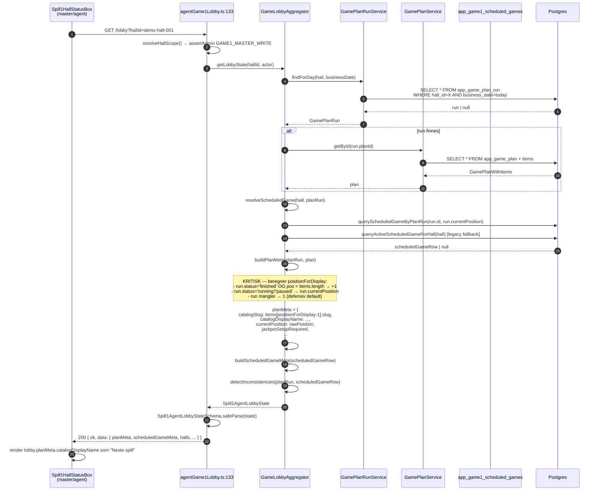
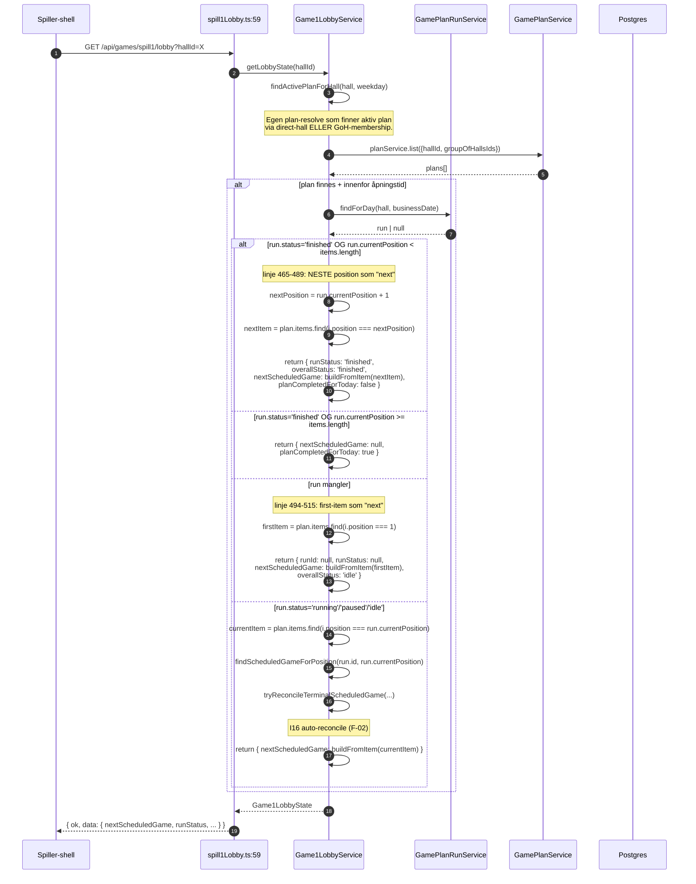
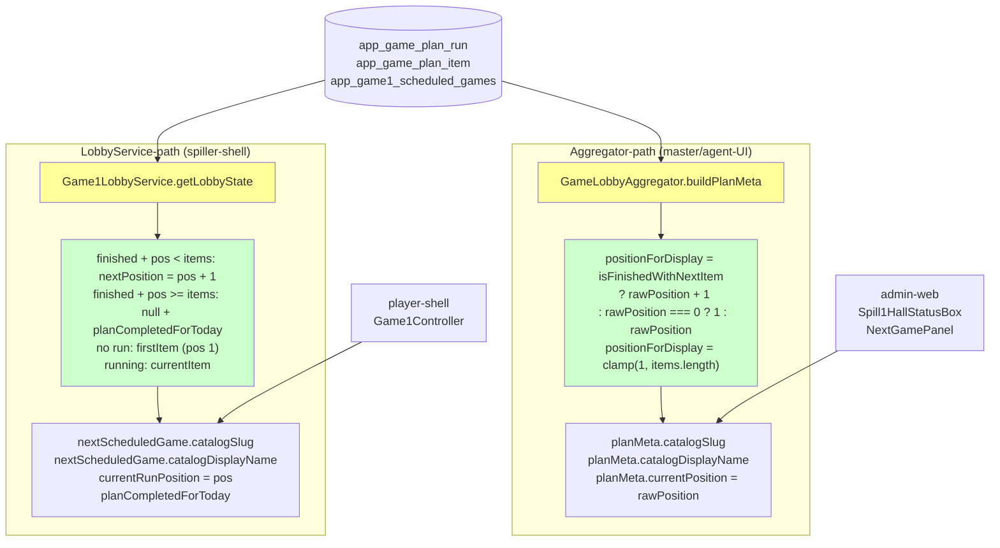

# Next Game Display — Agent B Research: Backend aggregator + lobby-API

**Agent:** B — Backend aggregator + lobby-API
**Sesjon:** 2026-05-14
**Branch:** `worktree-agent-ab50e457a113f5218` (research/next-game-display-b-aggregator-2026-05-14 var allerede tatt i annen worktree)
**Audit-skall:** [`docs/architecture/NEXT_GAME_DISPLAY_FUNDAMENT_AUDIT_2026-05-14.md`](../architecture/NEXT_GAME_DISPLAY_FUNDAMENT_AUDIT_2026-05-14.md)
**Status:** Data-innsamling fullført. Klar for konsolidering i Trinn 2.

---

## TL;DR

**Hovedfunn:** Det finnes **TO parallelle backend-paths** som beregner "neste spill"-data, og de **divergerer på vesentlige punkter**:

1. **`GameLobbyAggregator.getLobbyState`** (master/agent-UI) — kanonisk fra Bølge 1 (2026-05-08), eksponert via `GET /api/agent/game1/lobby?hallId=X`
2. **`Game1LobbyService.getLobbyState`** (spiller-shell) — eksponert via `GET /api/games/spill1/lobby?hallId=X`

I tillegg finnes en **tredje legacy-path** som ikke har "next"-logikk i det hele tatt:

3. **`agentGamePlan.ts /current`** — eksponert via `GET /api/agent/game-plan/current` — viser KUN `currentItem` på `run.currentPosition`. Ikke "next-aware".
4. **`agentGame1.ts /current-game`** — eksponert via `GET /api/agent/game1/current-game` — viser KUN scheduled-game-rad. Ikke plan-aware. Bruker `subGameName` direkte fra DB.

### Divergens-punkter

| Scenario | Aggregator returnerer | Game1LobbyService returnerer | agentGamePlan returnerer |
|---|---|---|---|
| **State 1: dev:nuke, ingen plan-run** | `planMeta.catalogSlug = "bingo"` (item 1) | `nextScheduledGame.catalogSlug = "bingo"` (item 1) | `currentItem = null` (run mangler) |
| **State 2: Bingo finished, position=1, < items.length** | `planMeta.catalogSlug = "1000-spill"` ✅ (advance) | `nextScheduledGame.catalogSlug = "1000-spill"` ✅ (advance) | `currentItem.position=1, slug=bingo` ❌ (clamped) |
| **State 3: Plan ferdig, position=13 av 13** | `planMeta.catalogSlug = "tv-extra"` (siste) | `nextScheduledGame = null`, `planCompletedForToday = true` | `currentItem.slug = "tv-extra"` |
| **State 4: Run idle, position=0** | `planMeta` med `currentPosition=0`, `catalogSlug` defaults to position=1 | `nextScheduledGame = firstItem (pos 1)` | `currentItem = null` |
| **State 5: Master har ikke startet, ingen plan-run** | `planMeta` populated fra plan + position=1 (defensiv default) | `nextScheduledGame = firstItem (pos 1)` | `currentItem = null` |

**Aggregator + Game1LobbyService er synkrone for States 1-3** etter PR #1422+#1431-fixene fra 2026-05-14. **Men agentGamePlan er IKKE.**

### Hvorfor buggen lever

Master-UI (`Spill1HallStatusBox.ts:761`) leser **kun fra `lobby.planMeta.catalogDisplayName`** (aggregator-output), så hovedpathen er fixet. Men:

1. **`Spill1HallStatusBox` poller også `/api/agent/game-plan/current`** (linje 1618) for `jackpotSetupRequired`. Denne returnerer feil `currentItem` etter finished — den koden er IKKE aware om PR #1431-fix.
2. **`NextGamePanel.ts` har egen merge-logikk** som muligens leser begge endpoints.
3. **Cache/timing-issues:** Aggregator har 5s cache-TTL ingensteds — men polling-intervaller (2s, 10s) mellom de tre endpoint-ene gir transient inconsistens.

**Foreslått fix:** Slett `agentGamePlan` og `agentGame1` `/current-*`-endpoints helt; konsolider til ÉN aggregator (Bølge 4 fra PLAN_SPILL_KOBLING-audit som aldri ble fullført).

---

## 1. File-list (alle backend-paths som beregner "next game")

### 1.1 Kanoniske services

| Fil | Linjer | Ansvar | Hvor "next" beregnes |
|---|---:|---|---|
| `apps/backend/src/game/GameLobbyAggregator.ts` | 1166 | **Kanonisk lobby-state for master/agent-UI (Bølge 1)** | `buildPlanMeta()` (linje 971-1070) |
| `apps/backend/src/game/Game1LobbyService.ts` | 979 | Lobby-state for spiller-shell | `getLobbyState()` (linje 410-680), spesielt linje 465-490 (finished-branch) og 494-515 (no-run-branch) |
| `apps/backend/src/game/GamePlanRunService.ts` | 1341 | Plan-run CRUD + auto-advance via `getOrCreateForToday` | linje 536-749 (auto-advance på DB-side) |

### 1.2 Routes (eksponering)

| Route | Fil:linje | Service brukt | Hvilken "next" |
|---|---|---|---|
| `GET /api/agent/game1/lobby` | `routes/agentGame1Lobby.ts:133` | `GameLobbyAggregator.getLobbyState` | **Kanonisk Bølge 1** |
| `GET /api/games/spill1/lobby` | `routes/spill1Lobby.ts:59` | `Game1LobbyService.getLobbyState` | Spiller-shell |
| `GET /api/agent/game-plan/current` | `routes/agentGamePlan.ts:343-438` | Plan-only — INGEN dedikert service for "next" | **Legacy — clamped, ingen advance** |
| `GET /api/agent/game1/current-game` | `routes/agentGame1.ts:384-549` | `findActiveOrUpcomingGameForHall` — KUN scheduled-game | **Legacy — leser `sub_game_name` fra DB-rad** |
| `GET /api/games/spill1/health` | `routes/publicGameHealth.ts` | Direct SQL — kun `nextScheduledStart` (ISO-tid, ikke navn) | Health-only |
| `GET /api/admin/game1/games/:id` | `routes/agentGame1Master.ts` (lest separat) | Scheduled-game-detalj | KUN scheduled-game-id, ikke "next" |

### 1.3 Helpers brukt i `buildPlanMeta`

- `computeIsMasterAgent` (aggregator, internal)
- `mapScheduledGameStatus` (Game1LobbyService linje 312-327 — egen kopi)
- `isPlanSchedStatusConsistent` (aggregator linje 145-181)
- `parseHallIdsArray` (aggregator linje 113-130, også i agentGame1.ts)

### 1.4 Tester relatert til "next game"

| Test-fil | LOC | Dekning |
|---|---:|---|
| `apps/backend/src/game/__tests__/GameLobbyAggregator.test.ts` | 1700+ | 19 navngitte test-states (linje 32) + dedikerte test-cases for finished mid-plan (linje 873, 968) |
| `apps/backend/src/game/Game1LobbyService.test.ts` | ~700 | 18 tester inkl. `finished på position=1 av 2`, `finished på position=7 av 13`, `finished på position=13 av 13` (linje 415-525) |
| `apps/backend/src/game/Game1LobbyService.survivors.test.ts` | ~600 | Mutation-testing survivor coverage |
| `apps/backend/src/game/__tests__/GamePlanRunService.autoAdvanceFromFinished.test.ts` | 10 tester | PR #1422 auto-advance |
| `apps/backend/src/__tests__/MasterActionService.integration.test.ts` | — | E2E via MasterActionService |

---

## 2. Kall-graf

### 2.1 `GET /api/agent/game1/lobby?hallId=X` — kanonisk Bølge 1



### 2.2 `GET /api/games/spill1/lobby?hallId=X` — spiller-shell



### 2.3 Begge er kanoniske — men har TO uavhengige beregninger



**Implikasjon:** Bug i én beregning forplanter seg ikke til den andre (positivt — krever ikke ettertenkt sync). MEN: hvis spiller-shell og master-shell viser ulike navn samtidig for samme hall, er det fordi de to beregningene har divergert. Det er en realistisk klasse av framtidige bugs.

---

## 3. State-overganger — Backend output-tabell

Hvert "Master-state" mapper til hva hver av de 4 API-ene returnerer (gitt 13-item demo-plan `demo-plan-pilot` med item 1=Bingo, 2=1000-spill, ...).

### 3.1 Tabell over alle states

| # | DB-state | Aggregator (`/api/agent/game1/lobby`) `planMeta` | Game1LobbyService (`/api/games/spill1/lobby`) `nextScheduledGame` | agentGamePlan (`/api/agent/game-plan/current`) `currentItem`/`nextItem` | agentGame1 (`/api/agent/game1/current-game`) |
|---:|---|---|---|---|---|
| **S1** | Post `dev:nuke`. Ingen plan-run, ingen scheduled-game. Plan eksisterer (demo-plan-pilot). Innenfor åpningstid. | `planMeta.catalogSlug = "bingo"`, `currentPosition = 0`, `planRunStatus = null` | `nextScheduledGame.catalogSlug = "bingo"`, `overallStatus = "idle"`, `runId = null` | `currentItem = null`, `nextItem = null`, `run = null` (loadCurrent returns null) | `currentGame = null`, `halls = fallback` |
| **S2** | Master har trykket "Start neste spill". `run.status='idle'`, `currentPosition=1`. Scheduled-game spawnet, status='scheduled'. | `planMeta.catalogSlug = "bingo"`, `currentPosition = 1`, `planRunStatus = "idle"` | `nextScheduledGame.catalogSlug = "bingo"`, `overallStatus = "idle"` | `currentItem.position = 1, slug = "bingo"`, `nextItem.position = 2` | `currentGame.subGameName = "Bingo"` (fra `app_game1_scheduled_games.sub_game_name`) |
| **S3** | Cron flippet til `purchase_open`. | `planMeta.catalogSlug = "bingo"`, `scheduledGameMeta.status = "purchase_open"` | `nextScheduledGame.catalogSlug = "bingo"`, `overallStatus = "purchase_open"` | `currentItem = bingo` | `currentGame.status = "purchase_open"` |
| **S4** | Master "Marker Klar". `scheduled_game.status = ready_to_start`. | Samme + `scheduledGameMeta.status = "ready_to_start"` | `overallStatus = "ready_to_start"` | `currentItem = bingo` | `currentGame.status = "ready_to_start"` |
| **S5** | Engine startet. `run.status='running'`, `scheduledGame.status='running'`. | Samme + `scheduledGameMeta.status = "running"` | `overallStatus = "running"` | `currentItem = bingo`, `run.status = "running"` | `currentGame.status = "running"` |
| **S6** | Engine kjørte ferdig. Vinner kåret. `scheduledGame.status='completed'` MEN `run.status='running'` (race før `MasterActionService.advance` eller `reconcileNaturalEndStuckRuns` cron). | Aggregator: `planMeta.catalogSlug = "bingo"`, `scheduledGameMeta.status = "completed"` + warning `PLAN_SCHED_STATUS_MISMATCH` | Game1LobbyService: `tryReconcileTerminalScheduledGame` triggrer + auto-finish + viser **NESTE position** | `currentItem.position = 1, slug = "bingo"` (no advance!) | `currentGame.status = "completed"` |
| **S7** | `reconcileNaturalEndStuckRuns` (PR #1407) finisher plan-run. `run.status='finished'`, `currentPosition=1`. `scheduledGame.status='completed'`. | **`planMeta.catalogSlug = "1000-spill"` ✅** (positionForDisplay = 1+1 = 2) | **`nextScheduledGame.catalogSlug = "1000-spill"` ✅** (nextPosition = 1+1 = 2) | **`currentItem.slug = "bingo"` ❌**, `nextItem.slug = "1000-spill"` | `currentGame = null` (no active SG for hall) eller forrige completed scheduled-game |
| **S8** | Master trykker "Start neste spill" igjen. `getOrCreateForToday` DELETE + INSERT med `current_position=2` (PR #1422 auto-advance). | `planMeta.catalogSlug = "1000-spill"`, `currentPosition = 2`, `planRunStatus = "idle"` | `nextScheduledGame.catalogSlug = "1000-spill"`, `overallStatus = "idle"` | `currentItem.position = 2, slug = "1000-spill"` | `currentGame = scheduledGame#2` |
| **S9** | Position 7 (Jackpot) finished, `currentPosition=7`. `run.status='finished'`. | `planMeta.catalogSlug = "kvikkis"` (position 8) | `nextScheduledGame.catalogSlug = "kvikkis"` | `currentItem.slug = "jackpot"` ❌ | (samme som S6/S7) |
| **S10** | Position 13 (TV-Extra) finished. `currentPosition=13`. `run.status='finished'`. **Plan helt ferdig.** | `planMeta.catalogSlug = "tv-extra"`, `currentPosition = 13`, `planRunStatus = "finished"` — fortsetter å vise siste (Math.min clamp) | `nextScheduledGame = null`, `planCompletedForToday = true`, `overallStatus = "finished"` | `currentItem.slug = "tv-extra"` | `currentGame = null` |
| **S11** | Stale plan-run fra i går (`business_date < today`). `run.status='running'`. | `planMeta` reflekterer gårsdagens posisjon + warning `STALE_PLAN_RUN` | `findForDay(hall, today)` returnerer null → no-run-path → `nextScheduledGame = firstItem (Bingo)` | `currentItem` reflekterer gårsdagens | `currentGame = null` |
| **S12** | Master pauset. `scheduledGame.status='paused'`, `run.status='paused'`. | `planMeta.catalogSlug = currentItem`, `scheduledGameMeta.status = "paused"` | `overallStatus = "paused"` | `currentItem = currentSlug` | `currentGame.status = "paused"` |
| **S13** | Master eksplisitt "stop" (manuell finish). `MasterActionService.stop` → `run.status='finished'`, `scheduledGame.status='cancelled'`. | `planMeta` advance til neste (samme som S7) | `nextScheduledGame.catalogSlug = neste` | `currentItem` = stopped item | `currentGame = null` |

### 3.2 KRITISKE divergens-punkter

**❌ DIVERGENS 1 — S7/S9 (finished + advance):** `agentGamePlan` viser `currentItem` på **gammel posisjon**, ikke ny. UI som leser denne får "Start neste spill — Bingo" i stedet for "1000-spill". **Hovedmistanke for tilbakevendende bug.**

**❌ DIVERGENS 2 — S10 (plan helt ferdig):** Aggregator viser fortsatt siste catalog-slug ("tv-extra") fordi `Math.min(rawPosition, items.length)` clamper. Game1LobbyService er korrekt med `nextScheduledGame=null`. Aggregator burde returnere `planCompletedForToday`-flag eller `catalogSlug=null` — det gjør det IKKE per i dag.

**❌ DIVERGENS 3 — S11 (stale plan-run i går):** Aggregator viser gårsdagens position (med warning) — kan vise "Start neste spill — Jackpot" hvis i går stoppet på posisjon 6. Game1LobbyService finner kun dagens, så viser "Bingo". Dette gir UI to forskjellige svar samtidig.

**❌ DIVERGENS 4 — S1 vs S2 (idle/no-run):** Aggregator setter `planMeta.currentPosition = 0` ved no-run + default to position=1. Game1LobbyService setter `currentRunPosition = 0` + `nextScheduledGame=firstItem`. **De er logisk like men shape-en av returdata er ulik.**

---

## 4. Identifiserte bugs / edge-cases

### 4.1 BUG-1: Aggregator-clamping ved plan-completed-state (HØYT)

**Lokasjon:** `GameLobbyAggregator.ts:1013-1016`

```typescript
const positionForDisplay = Math.max(
  1,
  Math.min(targetPosition, items.length),
);
```

**Symptom:** Når plan er HELT ferdig (S10), `targetPosition = currentPosition + 1 = items.length + 1` (eller `currentPosition >= items.length` uten advance). `Math.min` clamper til `items.length`, så `catalogSlug` peker fortsatt til SISTE item (eks. "tv-extra"). Det er feil — UI burde se "Plan fullført" eller `catalogSlug=null`.

**Sammenlign med Game1LobbyService:** Linje 466-487 — eksplisitt `planCompletedForToday = nextPosition > plan.items.length` → `nextScheduledGame = null` + flag.

**Fix:** Aggregator må returnere `planMeta = null` eller flag `planCompletedForToday: true` ved completed-state. Beste fix: utvid `Spill1PlanMeta`-shape med `planCompletedForToday: boolean` (analogt med Game1LobbyService).

### 4.2 BUG-2: `agentGamePlan /current` er ikke "next-aware" (HØYT)

**Lokasjon:** `agentGamePlan.ts:403-406`

```typescript
const currentItem = items.find((i) => i.position === run.currentPosition) ?? null;
const nextItem = items.find((i) => i.position === run.currentPosition + 1) ?? null;
```

**Symptom:** Etter Bingo finished (`run.currentPosition=1, status='finished'`):
- `currentItem.slug = "bingo"` ❌ (skulle vært "1000-spill")
- `nextItem.slug = "1000-spill"` (peker til neste etter current)

Frontend som leser `currentItem` viser "Bingo" som "Nåværende/Neste spill". Frontend som leser `nextItem` viser "1000-spill". **Avhenger 100% av frontend-kode hvilken bug-versjon brukeren ser.**

**Fix:** Enten:
- Slett endepoint helt; konsolider til `/api/agent/game1/lobby`
- ELLER replicate `Game1LobbyService.getLobbyState` finished-branch-logikk i agentGamePlan (duplisering)

### 4.3 BUG-3: Stale plan-run fra i går (MEDIUM)

**Lokasjon:** `GameLobbyAggregator.ts:378-391` (warning), `Game1LobbyService.ts:441-449` (findForDay only today)

**Symptom:** Aggregator viser gårsdagens position med warning `STALE_PLAN_RUN`. Game1LobbyService finner kun dagens (today's businessDate), så viser default for første item. **UI viser to forskjellige verdier samtidig for samme hall.**

**Fix:** Aggregator må også fall til "show first item as next" når plan-run.businessDate < today (matcher Game1LobbyService). Eller: hard-finish stale runs via `inlineCleanupHook` (allerede gjort i `getOrCreateForToday:553-562`).

### 4.4 BUG-4: `agentGame1 /current-game` shows scheduled-game-name only (LAV — kjent)

**Lokasjon:** `agentGame1.ts:399-420, 528-542`

**Symptom:** Returnerer KUN scheduled-game-rad-data. `subGameName` fra DB-kolonne. Når scheduled-game er `null` etter `MasterActionService.stop`, returnerer `currentGame=null`. **Frontend som hadde tidligere "currentGame.subGameName" og deretter får `null` faller tilbake til hardcoded "Bingo".**

**Mistanke:** En av frontend-rendererne har fallback til `"Bingo"` eller `plan.items[0]` når `currentGame=null`. Det ville forklare hvorfor "Neste spill: Bingo" vises selv etter S7.

**Fix:** Slett endepoint; bruk kun `/api/agent/game1/lobby`.

### 4.5 BUG-5: Cache/race mellom aggregator og legacy-paths (MEDIUM)

**Symptom:** `Spill1HallStatusBox` (master-UI) poller `/api/agent/game1/lobby` hvert 2s **og** `/api/agent/game-plan/current` for `jackpotSetupRequired`. Hvis aggregator-svaret arriverer FØR plan-current, og frontend rerendrer mellom svarene, vises kortvarig "1000-spill" og deretter "Bingo" (eller motsatt). Race.

**Fix:** Stopp parallel-fetching. La aggregator returnere `jackpotSetupRequired` (det gjør det allerede — `planMeta.jackpotSetupRequired`!). Slett `/api/agent/game-plan/current` fra frontend.

### 4.6 BUG-6: `findScheduledGameForPosition` cache-skew (LAV)

**Lokasjon:** `Game1LobbyService.ts:554-557`

**Detalj:** Etter `MasterActionService.advance` spawner ny scheduled-game-rad, men SQL-query kan returnere `null` i et lite vindu hvis (run.id, position) ble oppdatert men scheduled-game enda ikke insertet (DB-replikering). Resulterer i `engineStatus='idle'` + `nextScheduledGame.scheduledGameId=null` for et øyeblikk.

**Fix:** Akseptabel timing-vindu — UI vil refresh innen 2s polling. Ikke fix-kreven.

### 4.7 EDGE: `getOrCreateForToday` PLAN_COMPLETED_FOR_TODAY-feil (KJENT GUARD)

**Lokasjon:** `GamePlanRunService.ts:677-681`

```typescript
if (planItemCount > 0 && previousPosition >= planItemCount) {
  throw new DomainError("PLAN_COMPLETED_FOR_TODAY", ...);
}
```

**Hvorfor:** Tobias-direktiv 2026-05-14 — master kan IKKE starte ny plan-syklus før neste dag. Dette er en GUARD, ikke en bug — men det betyr at S10 (plan ferdig) returnerer feil hvis master klikker "Start neste spill". UI bør disable knappen FØR klikk basert på `planCompletedForToday`-flag.

**Implikasjon:** Aggregator MÅ rapportere `planCompletedForToday: true` slik at UI kan deaktivere "Start"-knappen. Dette er BUG-1 ovenfor.

---

## 5. Recommendations

### 5.1 ÉN kanonisk service for "neste spill"-display

**Beslutning:** Utvid `GameLobbyAggregator.getLobbyState` til å være single-source-of-truth. Inkluder:

```typescript
interface Spill1PlanMeta {
  // EKSISTERENDE
  planRunId: string | null;
  planId: string;
  planName: string;
  currentPosition: number;
  totalPositions: number;
  catalogSlug: string;        // ← Når plan-completed: null
  catalogDisplayName: string;  // ← Når plan-completed: null
  planRunStatus: ... | null;
  jackpotSetupRequired: boolean;
  pendingJackpotOverride: unknown | null;

  // NYE — match med Game1LobbyService
  planCompletedForToday: boolean;    // NEW — true når currentPosition >= items.length + finished
  nextDisplayMode: "next_in_sequence" | "plan_completed" | "first_item_no_run" | "stale_plan_run";  // NEW — explicit reason
}
```

### 5.2 Slett `/api/agent/game-plan/current` og `/api/agent/game1/current-game`

Dette er BUG-2 og BUG-4 i ett. Fix:

1. Migrér alle frontend-konsumenter til `/api/agent/game1/lobby`
2. Slett begge endpoints
3. Slett `agentGamePlan.ts` linje 343-438 og `agentGame1.ts` linje 384-549

Aggregator inkluderer allerede alt frontend trenger (`planMeta.jackpotSetupRequired`, `scheduledGameMeta`, `halls` med ready-status).

### 5.3 Stale plan-run hard-finish (FIX BUG-3)

`GamePlanRunCleanupService` (PR #1407) har allerede `reconcileNaturalEndStuckRuns`. Utvid med `reconcileStaleYesterdayRuns`:

```typescript
async reconcileStaleYesterdayRuns(): Promise<number> {
  return await pool.query(`
    UPDATE app_game_plan_run
    SET status='finished', finished_at=now()
    WHERE business_date < CURRENT_DATE
      AND status NOT IN ('finished', 'idle')
  `);
}
```

Kjør som del av `inlineCleanupHook` i `getOrCreateForToday` (eksisterer allerede — bare manglende implementasjon for stale yesterday's runs).

### 5.4 `nextScheduledGame` shape — entydig og null-safe

Foreslått wire-format for canonical aggregator-response:

```typescript
// I aggregator-output (Spill1AgentLobbyState):
nextGameDisplay: {
  reason: "next_in_sequence" | "plan_completed" | "first_item_no_run" | "stale_plan_run" | "closed";
  catalogSlug: string | null;       // null KUN ved "plan_completed" eller "closed"
  catalogDisplayName: string | null; // samme
  position: number | null;          // 1-basert; null KUN ved "plan_completed"
  isJackpotSetupRequired: boolean;
  hasPendingOverride: boolean;
}
```

Hver frontend-renderer bruker KUN `nextGameDisplay.catalogDisplayName` + `nextGameDisplay.reason` for å bestemme hva som vises. INGEN frontend-fallback til "Bingo" eller `plan_items[0]` lov.

### 5.5 Fjern fallback-logikk i frontend som maskerer bug-en

Frontend kode som er mistenkt for å skjule bug-en:

- `Spill1HallStatusBox.ts:761` — leser `lobby.planMeta.catalogDisplayName` ← OK
- `Spill1HallStatusBox.ts:~1618` — fetcher `/api/agent/game-plan/current` for jackpot ← BUG-5
- `NextGamePanel.ts` — sannsynligvis egen merge-logikk (Agent A undersøker dette)
- Eventuell `?? "Bingo"`-fallback i ANY renderer ← MÅ slettes (Agent A undersøker)

---

## 6. SKILL_UPDATE_PROPOSED

Foreslår å oppdatere [`.claude/skills/spill1-master-flow/SKILL.md`](../../.claude/skills/spill1-master-flow/SKILL.md) med ny seksjon:

```markdown
### "Next Game Display"-beregning (single-source-of-truth)

**Status (per 2026-05-14):** Det finnes TO parallelle backend-paths som beregner "neste spill":

1. **`GameLobbyAggregator.buildPlanMeta`** (kanonisk for master/agent-UI) — `apps/backend/src/game/GameLobbyAggregator.ts:971-1070`
2. **`Game1LobbyService.getLobbyState`** (spiller-shell) — `apps/backend/src/game/Game1LobbyService.ts:410-680`

I tillegg finnes legacy-endpoints som IKKE er next-aware:
- `GET /api/agent/game-plan/current` — viser `currentItem` på `run.currentPosition` UTEN finished-advance
- `GET /api/agent/game1/current-game` — viser KUN scheduled-game-rad uten plan-kontekst

**Hovedregel:** ALDRI legg til ny "next-game"-logikk uten å oppdatere BÅDE aggregator OG Game1LobbyService. Sjekk PITFALLS §3.13 (PR #1431-fix).

**Forventet adferd (S1-S13 i Agent B research-rapport):**
| Master-state | catalogSlug skal være |
|---|---|
| dev:nuke, ingen plan-run | "bingo" (item 1) |
| Bingo finished, pos=1 av 13 | "1000-spill" (item 2) |
| Position 7 (Jackpot) finished | "kvikkis" (item 8) |
| Position 13 (siste) finished | null + planCompletedForToday=true |

**Tester:**
- `apps/backend/src/game/__tests__/GameLobbyAggregator.test.ts` — finished mid-plan (linje 873, 968)
- `apps/backend/src/game/Game1LobbyService.test.ts` — finished position-cases (linje 415-525)

**Anti-mønstre:**
- ALDRI fall til `plan.items[0]` eller hardkode "Bingo" som fallback i frontend
- ALDRI clamp `positionForDisplay` til `Math.min(rawPosition, items.length)` uten å håndtere finished-state
- ALDRI returner `nextScheduledGame=null` ved finished-state uten å først sjekke `currentPosition < items.length`
```

---

## 7. Lessons learned (for AGENT_EXECUTION_LOG)

1. **`GameLobbyAggregator` og `Game1LobbyService` er parallelle pathways** — begge ble fixet for PR #1422+#1431, men koden er duplisert. Klassisk vedlikeholds-byrde.

2. **`agentGamePlan.ts /current` ble glemt i PR #1422+#1431** — den har sin egen "currentItem"-logikk fra opprinnelig design (Bølge 2 fra PLAN_SPILL_KOBLING_FUNDAMENT_AUDIT). Dette er en stor mistanke for hvorfor buggen "kommer tilbake" — fix-en var ufullstendig.

3. **Aggregator-clamp ved completed-state er en latent bug.** Etter S10 viser `catalogSlug = "tv-extra"` (siste item). UI har sannsynligvis fallback-logikk som ignorerer dette og viser noe annet. Men det er en arkitektonisk svakhet — aggregator bør være entydig.

4. **`getOrCreateForToday` har auto-advance, men endepoint-ene ovenfor er ikke synkron med den.** PR #1422-fix DB-side, PR #1431-fix lobby-API, men `agentGamePlan` ble ikke fixet.

5. **`tryReconcileTerminalScheduledGame` (Game1LobbyService) gjør write-side healing fra lobby-poll** — uvanlig for "pure read". Dette er fordi det ikke er noen master som driver advance i alle scenarier, så lobby-poll dobler som watchdog. Aggregator gjør IKKE dette — den er pure read. Det er konsistent men kan føre til divergens i state.

---

## 8. Filer berørt av denne research-en (ingen kode-endringer)

Kun research/dokumentasjon. Ingen kode er endret i denne PR-en.

- **Ny:** `docs/research/NEXT_GAME_DISPLAY_AGENT_B_AGGREGATOR_2026-05-14.md`
- **PITFALLS_LOG-entry:** Ingen NY fallgruve (alle relevante er allerede dokumentert i §3.10-§3.13). Eventuelt forsterking av §3.13 for å nevne `agentGamePlan` divergens.
- **AGENT_EXECUTION_LOG:** Ny entry (legges til som del av PR)

---

## 9. Referanser

- [NEXT_GAME_DISPLAY_FUNDAMENT_AUDIT_2026-05-14](../architecture/NEXT_GAME_DISPLAY_FUNDAMENT_AUDIT_2026-05-14.md) — koordinerings-skall
- [PLAN_SPILL_KOBLING_FUNDAMENT_AUDIT_2026-05-08](../architecture/PLAN_SPILL_KOBLING_FUNDAMENT_AUDIT_2026-05-08.md) — Bølge 1 (GameLobbyAggregator), Bølge 4 (slett legacy) UFULLFØRT
- [SPILL1_IMPLEMENTATION_STATUS_2026-05-08](../architecture/SPILL1_IMPLEMENTATION_STATUS_2026-05-08.md) §4.1 (GameLobbyAggregator)
- [PITFALLS_LOG §3.10-§3.13](../engineering/PITFALLS_LOG.md#3-spill-1-2-3-arkitektur)
- PR #1422 — `getOrCreateForToday` auto-advance fra finished
- PR #1431 — Lobby-API nextGame for finished plan-run (BÅDE aggregator + Game1LobbyService)
- PR #1407 — `GamePlanRunCleanupService.reconcileNaturalEndStuckRuns`
- PR #1370 — Plan-meta vises uansett status før plan-run opprettes

---

## Endringslogg

| Dato | Endring | Forfatter |
|---|---|---|
| 2026-05-14 | Initial — fullført research-leveranse fra Agent B for Next Game Display-bug audit. | Agent B (Claude Opus 4.7) |
