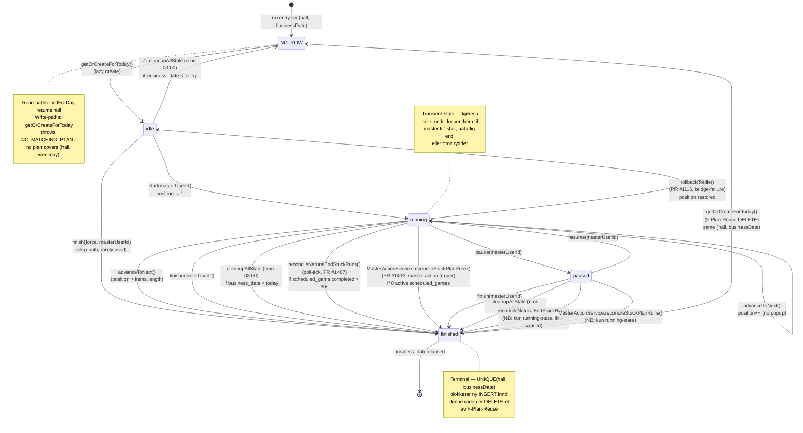

# Next Game Display — Agent C — Plan-run state-machine

**Status:** Trinn 1 data-collection (read-only research, NO code fixes).
**Branch:** `research/next-game-display-c-planrun-2026-05-14`
**Agent:** general-purpose (spawned by PM-AI 2026-05-14).
**Scope:** `GamePlanRunService`, `GamePlanRunCleanupService`, `MasterActionService`, `GamePlanEngineBridge` (callers fra plan-run-perspektiv), routes `agentGamePlan.ts` + `agentGame1Master.ts`, samt `StalePlanRunRecoveryService`.
**Sister docs:**
- `NEXT_GAME_DISPLAY_FUNDAMENT_AUDIT_2026-05-14.md` (skall, koordinerer 6 agenter)
- `PLAN_SPILL_KOBLING_FUNDAMENT_AUDIT_2026-05-08.md` (Bølge 1-3 fundament — Bølge 2 MasterActionService er FULLFØRT, men løste IKKE Next Game Display)

---

## 1. File-list med file:line-referanser

### 1.1 Backend services (plan-run state-machine)

| Fil | LOC | Ansvar | Hot-spot-funksjoner |
|---|---:|---|---|
| `apps/backend/src/game/GamePlanRunService.ts` | 1341 | Eier `app_game_plan_run` state-overganger | `getOrCreateForToday:536-749`, `start:753-794`, `advanceToNext:836-937`, `pause:796-803`, `resume:806-813`, `finish:816-826`, `setJackpotOverride:945-1023`, `findStuck:430-462`, `rollbackToIdle:1042-1127`, `rollbackPosition:1136-1238`, `changeStatus:1242-1286` (privat helper) |
| `apps/backend/src/game/GamePlanRunCleanupService.ts` | 654 | Auto-finish stale + naturlig-stuck plan-runs | `cleanupAllStale:243-262` (cron 03:00), `cleanupStaleRunsForHall:275-301` (inline self-heal), `reconcileNaturalEndStuckRuns:332-465` (poll-tick, PR #1407), `cleanupStaleRunsInternal:481-565` |
| `apps/backend/src/game/MasterActionService.ts` | 2231 | Eneste sekvensering plan → bridge → engine | `start:533-842`, `prepareScheduledGame:887-1053`, `advance:1055-1282`, `pause:1294-1391`, `resume:1396-1490`, `stop:1506-1576`, `setJackpot:1588-1681`, `reconcileStuckPlanRuns:1743-1827` (privat — kalt fra `start`/`advance`), `tryReconcileTerminalScheduledGame:1871-1925`, `tryRollbackPlanRun:2023-2075`, `tryRollbackPlanRunPosition:2083-2133` |
| `apps/backend/src/game/GamePlanService.ts` | 870 | Plan-template-CRUD (read-only fra plan-run-perspektiv) | `list:353-404` (RETURNERER `GamePlan[]` UTEN items!), `getById:406-421` (`GamePlanWithItems` — ENESTE måte å få items), `fetchItems:423-453` |
| `apps/backend/src/game/GamePlanEngineBridge.ts` | 1768 | Fabrikk plan-run → scheduled-game | `createScheduledGameForPlanRunPosition:900-1496`, `setOnScheduledGameCreated:815-819` (BUG-F2-hook for ticket-pris-binding), `getJackpotConfigForPosition:830-884` |
| `apps/backend/src/game/recovery/StalePlanRunRecoveryService.ts` | ~600 | Master-driven cleanup ved `BRIDGE_FAILED`/`DUAL_SCHEDULED_GAMES`-warnings | `recoverStaleForHall:294-...` (bypasser `MasterActionService.preValidate`) |

### 1.2 Backend routes

| Fil | LOC | Endpoints |
|---|---:|---|
| `apps/backend/src/routes/agentGamePlan.ts` | 789 | `GET /api/agent/game-plan/current` (lazy-create), `POST /start:443-523`, `POST /advance:527-616`, `POST /jackpot-setup:620-728`, `POST /pause:732-757`, `POST /resume:761-...` |
| `apps/backend/src/routes/agentGame1Master.ts` | 559 | Bølge 2: `POST /api/agent/game1/master/start:237-263`, `/advance:267-287`, `/pause:291-315`, `/resume:319-339`, `/stop:343-367`, `/jackpot-setup:371-397`, `/recover-stale:410-460`, `/heartbeat:474-538` |

### 1.3 Database schema

| Migration | Tabell | Constraint som påvirker state-machine |
|---|---|---|
| `20261210000000_app_game_catalog_and_plan.sql:171-190` | `app_game_plan_run` | `UNIQUE(hall_id, business_date)` — kritisk, blokkerer parallell INSERT for samme (hall, dato) |
| `20261210000000_app_game_catalog_and_plan.sql:177-178` | `app_game_plan_run.status` CHECK | `IN ('idle','running','paused','finished')` — KUN 4 statuser |
| `20261210000000_app_game_catalog_and_plan.sql:176` | `app_game_plan_run.current_position` CHECK | `>= 1` (1-indeksert!) |
| `20261216000000_app_hall_groups_cascade_fk.sql:124-126` | `app_game_plan_run.plan_id` FK | ON DELETE CASCADE (plan slettet → run slettet) |
| `20261222000000_game1_stuck_recovery.sql:33-48` | `app_game_plan_run.master_last_seen_at`, `master_last_seen_socket_id` | ADR-0022 Lag 4 — heartbeat for auto-resume-deteksjon |
| `20261210000000_*.sql:193-195` | INDEX | `idx_app_game_plan_run_active` på `(hall_id, business_date) WHERE status IN ('idle','running','paused')` — finished rader filtreres bort fra hot-path |

**KRITISK invariant fra schema:** `UNIQUE(hall_id, business_date)` — for én hall per dato kan det KUN finnes ÉN rad. Det er derfor `getOrCreateForToday` må DELETE finished-raden før den kan INSERT-e ny.

### 1.4 Audit-events skrevet fra state-machine

| Action | Service-laget | Hvor skrevet |
|---|---|---|
| `game_plan_run.create` | `GamePlanRunService.getOrCreateForToday` (første gang) | Linje 720-740 |
| `game_plan_run.recreate_after_finish` | `getOrCreateForToday` (etter F-Plan-Reuse DELETE+INSERT) | Linje 720-740 |
| `game_plan_run.start` | `start()` | Linje 786-792 |
| `game_plan_run.advance` | `advanceToNext()` (ikke-finished overgang) | Linje 923-934 |
| `game_plan_run.finish` | `advanceToNext()` (advance_past_end) | Linje 879-888 |
| `game_plan_run.finish` / `.pause` / `.resume` / `.running` | `changeStatus()` privat helper | Linje 1278-1284 |
| `game_plan_run.jackpot_set` | `setJackpotOverride()` | Linje 1009-1021 |
| `game_plan_run.rollback` | `rollbackToIdle()` | Linje 1111-1124 |
| `game_plan_run.position_rollback` | `rollbackPosition()` | Linje 1223-1235 |
| `game_plan_run.auto_cleanup` | `GamePlanRunCleanupService.cleanupStaleRunsInternal` (cron + inline) | Linje 600-633 |
| `plan_run.reconcile_natural_end` | `GamePlanRunCleanupService.reconcileNaturalEndStuckRuns` (PR #1407, poll-tick) | Linje 567-598 |
| `plan_run.reconcile_stuck` | `MasterActionService.reconcileStuckPlanRuns` (master-action-trigger, PR #1403) | Linje 1799-1811 |
| `spill1.master.start.bridge_failed_with_rollback` | `MasterActionService.start` etter rollback | Linje 733-744 |
| `spill1.master.advance.bridge_failed_with_rollback` | `MasterActionService.advance` etter rollback | Linje 1191-1203 |
| `spill1.master.auto_reconcile_terminal_scheduled_game` | `tryReconcileTerminalScheduledGame` (pause/resume reconcile) | Linje 1896-1910 |
| `spill1.master.start.auto_advance_terminal_position` | `MasterActionService.start` (terminal-current-position auto-advance) | Linje 658-668 |
| `spill1.master.prepare.auto_advance_terminal_position` | `prepareScheduledGame` (samme mønster) | Linje 980-991 |

---

## 2. Komplett state-machine

### 2.1 Tilstandsdiagram



### 2.2 Transitions-tabell med trigger, kode-path og audit-event

| From | To | Trigger | Pre-condition | Service-method | Audit-event | Kommentar |
|---|---|---|---|---|---|---|
| `NO_ROW` | `idle` | `getOrCreateForToday(hall, today)` | Plan dekker (hall, ukedag) | `GamePlanRunService.getOrCreateForToday:564-748` | `game_plan_run.create` | Lazy create; throws `NO_MATCHING_PLAN` hvis ingen plan |
| `idle` | `running` | `MasterActionService.start` eller `agentGamePlan.start` route eller `start(hall, today, userId)` | run.status='idle' | `GamePlanRunService.start:753-794` | `game_plan_run.start` | Setter `started_at`, `master_user_id`, `current_position=1` |
| `idle` | `finished` | `cleanupAllStale` (cron) | business_date < today AND status='idle' | `GamePlanRunCleanupService.cleanupStaleRunsInternal:481` | `game_plan_run.auto_cleanup` | Gårsdagens stale rader |
| `running` | `paused` | `master.pause` | run.status='running' | `GamePlanRunService.pause:796` → `changeStatus` | `game_plan_run.paused` | Best-effort fra `MasterActionService.pause` (kun hvis engine pause lykkes) |
| `running` | `running` | `master.advance` | run.status IN ('running','paused') AND newPosition ≤ items.length AND (NOT requiresJackpotSetup OR override exists) | `GamePlanRunService.advanceToNext:836-937` (gren A) | `game_plan_run.advance` | Inkrementerer `current_position` |
| `running` | `finished` | `master.advance` past-end | newPosition > items.length | `GamePlanRunService.advanceToNext:869-891` (gren B) | `game_plan_run.finish` (reason='advance_past_end') | NB: bruker `changeStatus`-helper IKKE — UPDATE direkte |
| `running` | `finished` | `master.stop` | run.status NOT IN ('finished') | `MasterActionService.stop` → `planRunService.finish` | `game_plan_run.finished` | Engine.stopGame først, deretter plan-run.finish |
| `running` | `finished` | `cleanupAllStale` (cron) | business_date < today AND status='running' | `cleanupStaleRunsInternal:481` | `game_plan_run.auto_cleanup` (reason='cron_nightly') | |
| `running` | `finished` | `reconcileNaturalEndStuckRuns` (poll-tick PR #1407) | run.status='running' AND latest scheduled_game.status='completed' AND ended_at > 30s ago AND 0 active scheduled_games | `GamePlanRunCleanupService.reconcileNaturalEndStuckRuns:332-465` | `plan_run.reconcile_natural_end` | KUN running-state — paused-state ikke dekket |
| `running` | `finished` | `MasterActionService.reconcileStuckPlanRuns` (PR #1403) | run.status='running' AND 0 aktive scheduled_games — KALT FØR start/advance | `MasterActionService.reconcileStuckPlanRuns:1743-1827` (privat) | `plan_run.reconcile_stuck` | Trigges KUN på master-action — ikke autonomt |
| `running` | `idle` | bridge-failure rollback | `MasterActionService.start` etter alle retries | `GamePlanRunService.rollbackToIdle:1042-1127` | `game_plan_run.rollback` | PR #1116 — gjør at master kan re-prøve |
| `paused` | `running` | `master.resume` | run.status='paused' | `GamePlanRunService.resume:806` → `changeStatus` | `game_plan_run.running` | |
| `paused` | `finished` | `master.stop` | run.status='paused' | `MasterActionService.stop` → `planRunService.finish` | `game_plan_run.finished` | |
| `paused` | `finished` | `cleanupAllStale` (cron) | business_date < today AND status='paused' | `cleanupStaleRunsInternal` | `game_plan_run.auto_cleanup` | |
| `finished` | `NO_ROW` | `getOrCreateForToday` F-Plan-Reuse | same (hall, businessDate) AND existing.status='finished' | `GamePlanRunService.getOrCreateForToday:594-611` (DELETE) | `game_plan_run.recreate_after_finish` (på etterfølgende INSERT) | DELETE FROM ... WHERE id = $1 AND status='finished' |
| `running` (pos N, terminal sched) | `running` (pos N+1) | `MasterActionService.start` (auto-advance terminal-current) | run.status='running' AND scheduledGame@N.status IN ('completed','cancelled') | `MasterActionService.start:607-672` | `spill1.master.start.auto_advance_terminal_position` | Implisitt: kall til `advanceToNext()` |

### 2.3 `getOrCreateForToday` — F-Plan-Reuse-flyten (DELETE+INSERT)

Dette er den mest komplekse delen av state-machinen og roten til BUG E (#1422).

```
getOrCreateForToday(hallId, businessDate)
  │
  ├─[0]─ inlineCleanupHook(hall) → cleanupStaleRunsForHall  (gårsdagens stale)
  │        Soft-fail: any error logged, continue
  │
  ├─[1]─ existing = findForDay(hall, dateStr)
  │
  ├─[2a]─ if existing AND existing.status !== 'finished':
  │        return existing  (idempotent return)
  │
  ├─[2b]─ if existing AND existing.status === 'finished':
  │        previousRunId = existing.id
  │        previousPosition = existing.currentPosition
  │
  │        DELETE FROM app_game_plan_run
  │         WHERE id = $1 AND status = 'finished'  (defensive WHERE-status)
  │
  │        if rowCount = 0:
  │          racy_resurrected = findForDay(...)
  │          if racy AND status !== 'finished': return racy
  │          // else fall through (unique violation handler vil ta over)
  │
  ├─[3]─ weekday = weekdayFromDateStr(dateStr)
  │       goHIds = findGoHIdsForHall(hall)  → SELECT m.group_id FROM ...
  │       candidates = planService.list({ hallId, groupOfHallsIds, isActive:true, limit:50 })
  │       matched = candidates.find(p => p.weekdays.includes(weekday))
  │       if !matched: throw NO_MATCHING_PLAN
  │
  ├─[4]─ BUG E AUTO-ADVANCE (PR #1422, 2026-05-14):
  │       nextPosition = 1
  │       autoAdvanced = false
  │       planItemCount = 0
  │       if previousPosition !== null:
  │         planWithItems = planService.getById(matched.id)  ← NB: extra round-trip
  │         planItemCount = planWithItems?.items?.length ?? 0
  │         if planItemCount > 0 AND previousPosition < planItemCount:
  │           nextPosition = previousPosition + 1
  │           autoAdvanced = true
  │         else if planItemCount > 0 AND previousPosition >= planItemCount:
  │           throw PLAN_COMPLETED_FOR_TODAY  ← KORRIGERT spec (Tobias 13:17)
  │
  ├─[5]─ INSERT INTO app_game_plan_run (id, plan_id, hall_id, business_date,
  │                                     current_position, status, jackpot_overrides_json)
  │      VALUES ($1, $2, $3, $4::date, $5, 'idle', '{}'::jsonb)
  │        ⚠️  catch isUniqueViolation(err):
  │              racy = findForDay(...)
  │              if racy: return racy
  │
  ├─[6]─ audit({
  │        action: previousRunId ? 'game_plan_run.recreate_after_finish' : 'game_plan_run.create',
  │        details: { previousPosition?, newPosition, autoAdvanced, planItemCount, ... }
  │      })
  │
  └─[7]─ created = findForDay(hall, dateStr)
         if !created: throw GAME_PLAN_RUN_NOT_FOUND (skal ikke kunne skje)
         return created
```

**Konsekvenser for Next Game Display:**
- Når Bingo (pos=1) er ferdig → run.status='finished', current_position=1
- Master refresher master-konsoll → `getOrCreateForToday` trigges via `loadCurrent` i `agentGamePlan.ts:307-326`
- F-Plan-Reuse DELETE'er finished-raden + INSERT'er ny rad med `current_position=2` (1000-spill)
- Master skal nå se "Neste spill: 1000-spill"

**Hvor det fortsatt kan glippe:**
- Steg [4] krever `planService.getById(matched.id)` for å få `planItemCount` — separat DB-roundtrip
- Hvis denne feiler (DB-feil, plan slettet) faller nextPosition tilbake til 1 → Bingo loops igjen
- Steg [4] PLAN_COMPLETED_FOR_TODAY-throwen blokkerer all videre lazy-create for dagen — neste dag er eneste vei ut

### 2.4 `reconcileNaturalEndStuckRuns` — CTE-flyt (PR #1407)

```sql
WITH active_sched_counts AS (
  SELECT plan_run_id, COUNT(*) AS active_count
  FROM app_game1_scheduled_games
  WHERE plan_run_id IS NOT NULL
    AND status IN ('scheduled','purchase_open','ready_to_start','running','paused')
  GROUP BY plan_run_id
),
completed_sched AS (
  SELECT plan_run_id,
         (ARRAY_AGG(id ORDER BY actual_end_time DESC NULLS LAST))[1] AS sched_id,
         MAX(actual_end_time) AS ended_at
  FROM app_game1_scheduled_games
  WHERE plan_run_id IS NOT NULL
    AND status = 'completed'        -- ⚠️ NB: cancelled IKKE inkludert
    AND actual_end_time IS NOT NULL
  GROUP BY plan_run_id
),
stuck AS (
  SELECT pr.*, cs.sched_id, cs.ended_at, EXTRACT(EPOCH FROM (now() - cs.ended_at)) AS stuck_for_seconds
  FROM app_game_plan_run pr
  INNER JOIN completed_sched cs ON cs.plan_run_id = pr.id
  LEFT JOIN active_sched_counts asc_t ON asc_t.plan_run_id = pr.id
  WHERE pr.status = 'running'        -- ⚠️ NB: paused IKKE dekket
    AND COALESCE(asc_t.active_count, 0) = 0
    AND cs.ended_at < now() - ($1::int * INTERVAL '1 millisecond')
  FOR UPDATE OF pr                   -- ⚠️ Lock for cross-instance konsistens
),
updated AS (
  UPDATE app_game_plan_run r
  SET status = 'finished', finished_at = COALESCE(r.finished_at, now()), updated_at = now()
  FROM stuck
  WHERE r.id = stuck.id
  RETURNING r.id
)
SELECT s.*, ... FROM stuck s INNER JOIN updated u ON u.id = s.id
```

**Default threshold:** 30 000 ms (konfigurerbar via `naturalEndStuckThresholdMs`-option).
**Soft-fail:** 42P01 (table missing) → no-op. Andre PG-feil bubbles til cron-tick.

---

## 3. Kall-graf per state-overgang

### 3.1 Master klikker "Start neste spill" — full kall-graf

```
[UI] POST /api/agent/game1/master/start  (body: { hallId? })
  │
  ├─[Route] agentGame1Master.ts:237-263 (start-route)
  │   ├─ requirePermission('GAME1_MASTER_WRITE')
  │   ├─ resolveHallScope(user, body.hallId) → hallId
  │   └─ masterActionService.start({ actor, hallId })
  │
  ├─[Service] MasterActionService.start:533-842
  │   ├─[1] preValidate(hallId, actor, 'start')
  │   │     └─ lobbyAggregator.getLobbyState(hallId, actor)
  │   │         └─ throws if !isMasterAgent OR blocking warnings (BRIDGE_FAILED, DUAL_SCHEDULED_GAMES)
  │   │
  │   ├─[2] businessDate = todayOsloKey(clock())
  │   │
  │   ├─[3] reconcileStuckPlanRuns({hallId, businessDate, actor, 'start'})  ← FIX-1 (2026-05-14)
  │   │     ├─ planRunService.findStuck({hallId, businessDate})
  │   │     │   └─ SELECT WHERE status='running' AND 0 active scheduled_games
  │   │     │
  │   │     └─ for each stuck:
  │   │         ├─ planRunService.finish(hallId, businessDate, actor.userId)
  │   │         └─ audit('plan_run.reconcile_stuck')
  │   │
  │   ├─[4] run = planRunService.getOrCreateForToday(hallId, businessDate)
  │   │     ├─ inlineCleanupHook(hall) → cleanupStaleRunsForHall (gårsdagens stale)
  │   │     ├─ existing = findForDay(hall, dateStr)
  │   │     │
  │   │     ├─[idempotent]─ if existing.status !== 'finished': return existing
  │   │     │
  │   │     └─[F-Plan-Reuse]─ if existing.status === 'finished':
  │   │         ├─ DELETE existing  (defensive WHERE-status='finished')
  │   │         ├─ matched = planService.list(...)  → findGoHIdsForHall + weekday-filter
  │   │         ├─ if previousPosition !== null:
  │   │         │   ├─ planWithItems = planService.getById(matched.id)
  │   │         │   └─ BUG E AUTO-ADVANCE:
  │   │         │       previousPosition < items.length → nextPosition = previousPosition + 1
  │   │         │       previousPosition >= items.length → throw PLAN_COMPLETED_FOR_TODAY
  │   │         ├─ INSERT app_game_plan_run (status='idle', current_position=nextPosition)
  │   │         └─ audit('game_plan_run.recreate_after_finish')
  │   │
  │   ├─[5] state-validation:
  │   │     if run.status === 'paused':  throw GAME_PLAN_RUN_INVALID_TRANSITION (bruk /resume)
  │   │     if run.status === 'finished': throw PLAN_RUN_FINISHED
  │   │
  │   ├─[6] if run.status === 'idle': started = planRunService.start(hallId, businessDate, actor.userId)
  │   │       ├─ UPDATE status='running', started_at=now(), current_position=1, master_user_id=$2
  │   │       └─ audit('game_plan_run.start')
  │   │
  │   ├─[7] if run.status === 'running': check terminal-scheduled-game ved current_position
  │   │     ├─ getPlanRunScheduledGameForPosition(started.id, started.currentPosition)
  │   │     ├─ if terminal (completed/cancelled):
  │   │     │   ├─ advanceResult = planRunService.advanceToNext(hallId, businessDate, actor.userId)
  │   │     │   │   ├─ if jackpotSetupRequired: throw JACKPOT_SETUP_REQUIRED
  │   │     │   │   ├─ if newPosition > items.length:
  │   │     │   │   │   ├─ UPDATE status='finished', finished_at=now()
  │   │     │   │   │   ├─ audit('game_plan_run.finish', reason='advance_past_end')
  │   │     │   │   │   └─ return {run: finished, nextGame: null, jackpotSetupRequired: false}
  │   │     │   │   ├─ nextItem = items.find(i => i.position === newPosition)
  │   │     │   │   ├─ if nextItem.catalogEntry.requiresJackpotSetup AND !hasOverride:
  │   │     │   │   │   └─ return {run, nextGame, jackpotSetupRequired: true}  ← Run IKKE oppdatert
  │   │     │   │   ├─ UPDATE current_position = newPosition
  │   │     │   │   └─ audit('game_plan_run.advance')
  │   │     │   ├─ if advanceResult.run.status === 'finished': return {scheduledGameId: null, ...}
  │   │     │   ├─ audit('spill1.master.start.auto_advance_terminal_position')
  │   │     │   └─ started = advanceResult.run
  │   │
  │   ├─[8] bridge-spawn med retry (3x, 100/500/2000ms):
  │   │     ├─ engineBridge.createScheduledGameForPlanRunPosition(started.id, started.currentPosition)
  │   │     │   ├─ SELECT app_game_plan_run WHERE id = $1
  │   │     │   ├─ idempotency check: SELECT existing AKTIV row WHERE plan_run_id=$1 AND plan_position=$2
  │   │     │   │   AND status NOT IN ('cancelled','completed')
  │   │     │   ├─ if existing: return {scheduledGameId, reused: true}
  │   │     │   ├─ planService.getById(plan_id)
  │   │     │   ├─ item = plan.items.find(i => i.position === position)
  │   │     │   ├─ jackpot-override-check (if requiresJackpotSetup)
  │   │     │   ├─ buildEngineTicketConfig + buildJackpotConfigFromOverride
  │   │     │   ├─ resolveGroupHallId(run.hall_id) → membershipQuery.findGroupForHall
  │   │     │   ├─ resolveGoHMasterHallId(groupHallId) → membershipQuery.getMasterHallId
  │   │     │   ├─ effectiveMasterHallId = goHMasterPin ?? run.hall_id
  │   │     │   ├─ resolveParticipatingHallIds → membershipQuery.getActiveMembers
  │   │     │   ├─ canonical room_code = getCanonicalRoomCode("bingo", effectiveMasterHallId, groupHallId)
  │   │     │   ├─ releaseStaleRoomCodeBindings (F-NEW-3 2026-05-12)
  │   │     │   ├─ INSERT app_game1_scheduled_games (status='ready_to_start', plan_run_id, plan_position, ...)
  │   │     │   │   ⚠️  catch 23505 (unique violation): retry release+INSERT en gang
  │   │     │   └─ trigger onScheduledGameCreated-hook (BUG-F2 ticket-pris-binding)
  │   │     │
  │   │     └─ if alle retries feiler:
  │   │         ├─ tryRollbackPlanRun: planRunService.rollbackToIdle(running→idle, position→1)
  │   │         ├─ audit('spill1.master.start.bridge_failed_with_rollback')
  │   │         └─ throw BRIDGE_FAILED
  │   │
  │   ├─[9] triggerArmedConversionHook (BUG-F2 ticket-purchase-konvertering)
  │   │     └─ Game1ArmedToPurchaseConversionService.convertArmedToPurchases (soft-fail)
  │   │
  │   ├─[10] engine.startGame:
  │   │      └─ masterControlService.startGame({ gameId: scheduledGameId, actor })
  │   │          ├─ Engine flytter status: 'ready_to_start' → 'running'
  │   │          └─ Trigger draw-engine
  │   │
  │   ├─[11] audit('spill1.master.start')
  │   ├─[12] fireLobbyBroadcast(hallId) → Spill1LobbyBroadcaster.broadcastForHall
  │   │      └─ emit 'lobby:state-update' to spill1:lobby:{hallId}-room
  │   └─[13] return MasterActionResult { scheduledGameId, planRunId, status, scheduledGameStatus, warnings }
  │
  └─[Route] apiSuccess(res, result)
```

### 3.2 Master klikker "Advance" — sammenligning

`MasterActionService.advance:1055-1282` har samme grunnstruktur som `start` men:
1. **Ingen `getOrCreateForToday`** — kaller `planRunService.advanceToNext` direkte
2. **Reconcile stuck FØR advance** (samme FIX-1-mønster)
3. **Catch JACKPOT_SETUP_REQUIRED FØR bridge-spawn** (advanceToNext returnerer flagget uten å mutere state)
4. **Rollback ved bridge-failure ruller `current_position` tilbake** (ikke status-rollback) via `rollbackPosition`

**Konsekvens:** `advance` kan IKKE auto-advance fra terminal state slik `start` kan (linje 607-672 i start). Hvis run.status='running' OG scheduledGame@current_position er terminal, må master ALLTID gå via `start` (som auto-advancer) — IKKE `advance` (som inkrementerer fra current).

### 3.3 Naturlig runde-end → `reconcileNaturalEndStuckRuns` (poll-tick, PR #1407)

```
[Cron] kjøres hvert 30s
  │
  └─ GamePlanRunCleanupService.reconcileNaturalEndStuckRuns(now)
       │
       ├─ kjør CTE (active_sched_counts + completed_sched + stuck + updated)
       │   ├─ FOR UPDATE OF pr  ← cross-instance lock
       │   └─ Filter: run.status='running' + 0 active + completed.ended_at < now - 30s
       │
       ├─ for each closed run:
       │   └─ audit('plan_run.reconcile_natural_end', actor='system', SYSTEM)
       │
       └─ return { cleanedCount, closedRuns[] }
```

**NB:** Denne kjører autonomt, uten master-interaksjon. Den triggrer IKKE bridge-spawn for neste runde — master må fortsatt klikke "Start neste spill" som da går via `F-Plan-Reuse + BUG E auto-advance`.

---

## 4. Identifiserte bugs / edge-cases

### 4.1 KRITISK — `getOrCreateForToday` kalles UTEN race-lock (P0 mulig)

**File:line:** `GamePlanRunService.ts:564, 596, 688`

**Beskrivelse:** Sekvensen er:
1. `findForDay` (SELECT) — line 564
2. `DELETE` (hvis finished) — line 596
3. `findGoHIdsForHall` + `planService.list` — line 620-626
4. `planService.getById` (for items count) — line 670 (KUN hvis previousPosition !== null)
5. `INSERT` — line 688

**Race-window:** Mellom steg 1 og 2 kan en annen prosess (annen master-instans, cleanup-cron) endre raden. Steg 2 har defensive `AND status='finished'` så DELETE matcher 0 rader hvis racy. Men:
- **Bug-mulighet:** Hvis cleanup-cron (linje 481) markerer finished mellom steg 1 og DELETE, og DELETE matcher 0 rader, faller flyten gjennom til line 605-611 som re-fetcher og evaluerer status — men `racy_resurrected` returneres KUN hvis ny status !== 'finished'. Hvis cron-en akkurat satte 'finished' (samme verdi som vi sjekket), faller vi gjennom til INSERT som vil feile med unique violation (23505), og caught på linje 696-698 returnerer raden uendret — men da har vi MISTET F-Plan-Reuse-logikken (auto-advance hopper aldri til neste posisjon).

**Symptom for Next Game Display:** Hvis cleanup-cron racer master-refresher mens forrige run sitter `finished`, kan ny plan-run aldri opprettes med advance-til-neste-posisjon — fordi DELETE feilet og INSERT havnet i unique-violation-catch som returnerer eksisterende rad uendret.

**Anbefaling:** Wrap hele `getOrCreateForToday` i `SELECT ... FOR UPDATE` på unique-key (hall_id, business_date), eller bruk advisory lock. Best-effort approach (PR #1422) er ikke race-safe.

### 4.2 KRITISK — `MasterActionService.reconcileStuckPlanRuns` blokkerer IKKE `advanceToNext` korrekt

**File:line:** `MasterActionService.ts:1070-1075, 1077-1081`

**Beskrivelse:** `advance()` kaller `reconcileStuckPlanRuns` FØR `planRunService.advanceToNext`. Reconcile finisher stuck plan-runs (status='running' + 0 active scheduled-games). MEN `advanceToNext` kalles uansett — det er ingen reload eller re-check etterpå.

```typescript
// MasterActionService.advance:1070-1081
await this.reconcileStuckPlanRuns({...});      // ← finisher stuck plan-run
const result = await this.planRunService.advanceToNext(...);  // ← throws GAME_PLAN_RUN_INVALID_TRANSITION
```

**Bug:** Etter reconcile har plan-run nå `status='finished'`. `advanceToNext` linje 853-858 sjekker `status !== 'running' && status !== 'paused'` → throws `GAME_PLAN_RUN_INVALID_TRANSITION`. Master får uventet feilmelding.

**Symptom for Next Game Display:** Master ser stuck plan-run (lobby viser status='running' fra cached state), klikker "Advance" — får 400-feil. UI ser ikke neste-spill-tekst.

**Bedre fix:** Master `advance`-handlingen bør behandle stuck som "kall start() i stedet" eller re-fetche plan-run-status etter reconcile før den kaller advanceToNext.

### 4.3 KRITISK — `reconcileNaturalEndStuckRuns` dekker IKKE `paused`-state

**File:line:** `GamePlanRunCleanupService.ts:380`

```sql
stuck AS (
  ...
  WHERE pr.status = 'running'   -- ← BARE running
    ...
)
```

**Beskrivelse:** Hvis master pauset runden midt i spillet (via `pause`-action) og deretter scheduled-game ble completed (kunne skje ved engine-auto-pause-recovery), plan-run sitter `paused` med terminal scheduled-game. CTE-en plukker ikke opp denne fordi den kun matcher `status='running'`.

**Symptom for Next Game Display:** Master har pauset runden → kommer tilbake neste dag (eller etter lengre fravær) → ser fortsatt `paused` plan-run med ferdig spill. Klikker resume → engine kaster `GAME_NOT_PAUSED` (scheduled-game er allerede `completed`). Plan-run kommer aldri til `finished`-state autonomt.

**Anbefaling:** Utvid `WHERE pr.status IN ('running', 'paused')`.

### 4.4 KRITISK — Bridge-spawn etter `advanceToNext` har race-window for dual scheduled-games

**File:line:** `MasterActionService.ts:1077-1156`, `GamePlanEngineBridge.ts:960-999`

**Beskrivelse:** Sekvens i `advance()`:
1. `planRunService.advanceToNext` (line 1077) — UPDATE `current_position = N+1`
2. `engineBridge.createScheduledGameForPlanRunPosition(run.id, N+1)` (line 1133) — INSERT new scheduled_game

**Race-window:** Mellom steg 1 og steg 2 har plan-run nå `current_position=N+1` men ingen scheduled-game eksisterer for posisjon N+1. Hvis lobby-API poll-er i mellomtiden, ser den:
- `plan_run.current_position = N+1`
- ingen scheduled-game for `(plan_run_id, plan_position = N+1)`
- forrige scheduled-game `(plan_run_id, plan_position = N)` er enten completed eller cancelled

Aggregator vil potensielt rapportere `BRIDGE_FAILED` warning (BLOCKING) — master kan ikke gjøre noe inntil bridge faktisk lykkes.

**Symptom for Next Game Display:** Næst-spill-tekst er momentant feil mellom plan-advance og bridge-spawn. Klient som refresher i dette vinduet ser inconsistent state.

**Bedre fix:** Wrap `advanceToNext + createScheduledGameForPlanRunPosition` i en DB-transaksjon, eller emit lobby-update KUN etter både plan-advance og bridge har lykkes (ikke før).

### 4.5 HØY — `MasterActionService.start` har 3 forskjellige måter å advance plan-position på

**File:line:** `MasterActionService.ts:600-672, 1063-1075`

`start()` håndterer flere ulike state-transitions:
1. **idle → running**: `planRunService.start` (line 595) — current_position=1
2. **running + terminal scheduled@current**: auto-advance via `planRunService.advanceToNext` (line 616) — current_position++
3. **F-Plan-Reuse fra finished**: `planRunService.getOrCreateForToday` DELETE+INSERT — current_position = previous+1 ELLER 1 (avhengig av planItemCount)

Plus:
4. **Reconcile stuck** før start (line 557) — finishe stuck running plan-run

Det er fire forskjellige mekanismer som kan endre `current_position` for samme bruker-handling. Hver har egen audit-event (recreate_after_finish, start, auto_advance_terminal_position, reconcile_stuck). Det er svært komplekst å rekonstruere "hvilken posisjon skal vises NÅ" basert på state.

**Symptom for Next Game Display:** Race mellom disse 4 mekanismer skaper kortvarige inconsistent states. Lobby-API kan se forskjellig state innen 1 sek, basert på hvilken som vant.

### 4.6 MEDIUM — `getOrCreateForToday` er ENESTE entry-point for finished → idle-overgangen, men kalles fra MANGE steder

**Files:**
- `MasterActionService.start:566` (line)
- `MasterActionService.prepareScheduledGame:900`
- `agentGamePlan.ts:loadCurrent:310` (lazy-create i GET /current)
- Indirectly: `agentGamePlan.ts:451` (POST /start)

`getOrCreateForToday` har MULTIPLE side-effects:
1. Kjør `inlineCleanupHook` for gårsdagens stale
2. DELETE + INSERT for F-Plan-Reuse (med auto-advance position-computation)
3. Audit `game_plan_run.create` ELLER `game_plan_run.recreate_after_finish`
4. Returnere finne+create-d row

**Bug:** Kald fra `loadCurrent` (lazy-create) skal være read-only fra UX-perspektiv ("vis dagens plan"). Men det kan mutere DB via F-Plan-Reuse hvis forrige run var finished. Master refresher master-konsoll → state-machine flytter seg uten at master har gjort noe. Det kan være riktig adferd, men det er IKKE eksplisitt opt-in.

**Symptom for Next Game Display:** Master poll-er GET /api/agent/game-plan/current periodisk (hver 5-10s). Mellom hver poll kan F-Plan-Reuse trigge, og master ser plutselig at "Neste spill"-tekst hopper fra Bingo til 1000-spill uten å klikke noe. Det er typeskifte i UX-modell (read vs write).

**Anbefaling:** Skill F-Plan-Reuse fra "lazy create idle row hvis ingen finnes". Lazy-create skal være helt read-only — kun INSERT NULL→idle hvis ingen rad. F-Plan-Reuse-mutasjon (DELETE+INSERT med ny posisjon) skal kun kjøres fra `MasterActionService.start` etter eksplisitt master-klikk.

### 4.7 MEDIUM — `agentGamePlan.ts:loadCurrent` kalles fra GET /current (lazy-create=true) OG fra POST /start (lazy-create=false)

**File:line:** `agentGamePlan.ts:307-339`

**Beskrivelse:** Read-path `GET /current` bruker `lazyCreate=true`. Write-path `POST /start` bruker `findForDay` direkte i `getOrCreateForToday` (lazy-create=true igjen — men allerede inne i state-mutering). Det er to forskjellige hver-trigge-stier som havner i samme F-Plan-Reuse-mutasjon.

**Symptom for Next Game Display:** Hvis admin har 2 nettleserfaner åpne, kan F-Plan-Reuse trigge dobbelt fra forskjellige tabs (en GET fra hver). UNIQUE-constraint blokkerer fordi en allerede vant — men handler-loggen viser TO `recreate_after_finish`-audit-events. Audit-trail ser konflikt-aktig ut for revisor.

### 4.8 LAV — `findStuck` er kun definert for `MasterActionService.reconcileStuckPlanRuns` — `cleanupAllStale` og `reconcileNaturalEndStuckRuns` har egne separate SQL-queries

**File:line:**
- `GamePlanRunService.findStuck:430-462` (definisjon)
- `GamePlanRunCleanupService.cleanupStaleRunsInternal:481-565` (egen SQL — `business_date < today`)
- `GamePlanRunCleanupService.reconcileNaturalEndStuckRuns:332-465` (egen SQL — `status='running' + 0 active + completed ended_at < threshold`)
- `MasterActionService.reconcileStuckPlanRuns:1755` (bruker `findStuck` — `status='running' + 0 active`)

3 forskjellige queries med subtile forskjeller:

| Query | business_date filter | status filter | Tids-threshold | Lock |
|---|---|---|---|---|
| `cleanupAllStale` | `< today` | `IN ('running','paused')` | — | FOR UPDATE |
| `reconcileNaturalEndStuckRuns` | (today + earlier) | `= 'running'` | `cs.ended_at < now - 30s` | FOR UPDATE OF pr |
| `findStuck` (master-action) | `= today` | `= 'running'` | — (instant) | — |

**Anbefaling:** Konsolider til ÉN finder-funksjon i `GamePlanRunService` (parametrisk på business_date, status, threshold, lock). Reduserer test-overflate og sikrer konsistens.

### 4.9 LAV — `setJackpotOverride` kan kjøres med run.status='paused' (ingen restriksjon)

**File:line:** `GamePlanRunService.setJackpotOverride:971-975`

**Beskrivelse:** Sjekker kun `run.status === 'finished'` (avvises). Tillater både `running` og `paused` (og teknisk `idle`). Det er sannsynligvis riktig (master kan submitte popup mens pauset), men det er ikke eksplisitt dokumentert som design-valg.

**Konsekvens for Next Game Display:** Hvis master setter jackpot mens runden er pauset, kan UI vise inkonsistente data fordi `jackpot_overrides_json` mutates uten å trigge state-overgang.

### 4.10 LAV — `MasterActionService.stop` kaller `planRunService.finish` selv hvis ingen scheduled-game eksisterer

**File:line:** `MasterActionService.stop:1535-1551`

**Beskrivelse:**
```typescript
const planRunId = lobby.planMeta?.planRunId ?? null;
if (planRunId) {
  try {
    await this.planRunService.finish(hallId, this.businessDate(), actor.userId);
  } catch (err) { /* log + continue */ }
}
```

`finish` is wrapped in try/catch — even if plan-run-status doesn't allow finish (e.g. already finished, idle), it logs but continues. The audit-event `spill1.master.stop` is written regardless.

**Bug-mulighet:** Hvis master klikker "Stop" på en finished plan-run (UI viser noe annet enn DB), `finish` kaster INVALID_TRANSITION (idle/finished → finished ikke tillatt av `changeStatus`). Men det fanges og loggges. Master får success-response. UI tror runden ble stopp.

**Anbefaling:** I `stop()` sjekk plan-run-status først og kast meaningful error hvis allerede finished.

---

## 5. Race-conditions og interaksjoner

### 5.1 Race: `reconcileNaturalEndStuckRuns` (poll-tick) vs `MasterActionService.start` (master-klikk)

**Scenario:**
1. T+0s: Spillet er ferdig. scheduled_game.status='completed', plan_run.status='running'.
2. T+25s: Master klikker "Start neste spill" → `MasterActionService.start`.
3. T+25s+ε: `start` kaller `reconcileStuckPlanRuns({hallId, businessDate})`.
4. T+25s+2ε: `start` kaller `planRunService.getOrCreateForToday`.
5. T+30s: `reconcileNaturalEndStuckRuns` cron-tick fyrer. CTE matcher den samme plan-run (men nå allerede finishet av master-action eller fortsatt i mellom). Hvis cron timing er feil:
   - Hvis cron-en starter SAMTIDIG som master-action: master finisher først, cron-en finner ingenting (rad er allerede finished). OK.
   - Hvis cron-en finisher først: master-action's `findStuck` finner 0 stuck (allerede finished), så `planRunService.finish` kalles ikke. `getOrCreateForToday` ser finished og DELETE+INSERT'er → OK.
   - Hvis BÅDE skjer i parallel: FOR UPDATE-lock i cron-en og DELETE-WHERE-status='finished' i master-action koordinerer det. Worst-case: dobbel-finish-audit, men ingen data-korrupsjon.

**Konklusjon:** Race-trygt fordi DB-locks koordinerer. Men audit-trail er rotete.

### 5.2 Race: Lobby-API `loadCurrent` (med lazyCreate=true) vs master-action `start`

**Scenario:**
1. Master har 2 tabs åpne, begge poll-er `GET /api/agent/game-plan/current` hvert 10s.
2. T+0s: Run finishet. status='finished', current_position=1.
3. T+1s: Tab 1 poll-er → `loadCurrent` kaller `getOrCreateForToday` → DELETE finished + INSERT (current_position=2).
4. T+1.1s: Tab 2 poll-er → `loadCurrent` kaller `getOrCreateForToday` → `findForDay` returnerer den nye raden (status='idle', current_position=2). Returneres uendret (idempotent).

Race-result: OK fordi UNIQUE-constraint sikrer atomicity. Tab 2 ser samme rad som Tab 1.

**MEN — race med `MasterActionService.start`:**
1. T+0s: Tab 1 (Lobby-API poll) starter `loadCurrent` → `getOrCreateForToday` → DELETE finished + INSERT idle.
2. T+0.05s: Master klikker "Start" → `MasterActionService.start` → `reconcileStuckPlanRuns` (ingen stuck) → `getOrCreateForToday`.
3. T+0.1s: Tab 1's INSERT (idle, pos=2) lykkes.
4. T+0.15s: Master's `getOrCreateForToday` finner den, returns idle-row.
5. T+0.2s: Master's `start` kaller `planRunService.start` → UPDATE status='running'.

OK, sluttilstand er konsistent. Men det er TO `recreate_after_finish`-audit-events fra steg 1 og steg 2 — eller bare en, hvis steg 2 finner row idle og returnerer uten DELETE.

**Anbefaling:** Audit-events skal være entydige. F-Plan-Reuse bør bare trigge fra eksplisitt master-action, ikke fra lazy-create.

### 5.3 Race: `reconcileNaturalEndStuckRuns` vs `MasterActionService.advance`

Allerede dekket i §4.2 — advance kaster INVALID_TRANSITION etter reconcile finisher.

---

## 6. Edge-cases

### 6.1 Plan med 0 items

`getOrCreateForToday` (line 668-684):
```typescript
let nextPosition = 1;
let autoAdvanced = false;
let planItemCount = 0;
if (previousPosition !== null) {
  const planWithItems = await this.planService.getById(matched.id);
  planItemCount = planWithItems?.items?.length ?? 0;
  if (planItemCount > 0 && previousPosition < planItemCount) {
    nextPosition = previousPosition + 1;
    autoAdvanced = true;
  } else if (planItemCount > 0 && previousPosition >= planItemCount) {
    throw PLAN_COMPLETED_FOR_TODAY;
  }
  // else: plan har 0 items → defensive fallback til nextPosition=1
}
```

**Bug:** Hvis planItemCount=0 og previousPosition=1 (eller noe), fall-through til nextPosition=1. Run opprettes idle med current_position=1. `advanceToNext` (line 869) sjekker `newPosition > items.length` → `2 > 0` → true → finish.

**Symptom for Next Game Display:** Hvis admin har glemt å legge til items i plan, F-Plan-Reuse-loopen kan finisha plan-run umiddelbart. UI viser ingenting.

### 6.2 Plan med items.length > 13 (vi har 13 i pilot)

Ikke teknisk problem — `advanceToNext` håndterer position dynamisk. Men `loadCurrent` i `agentGamePlan.ts:402-406` finner `items.find(i => i.position === run.currentPosition)` — hvis items er ute av rekkefølge (gap i positions) kan currentItem være null mens nextItem ikke er.

### 6.3 `currentPosition = items.length` (siste posisjon, ferdig spilt men ikke advance)

- Run.status='running'
- currentPosition = 13 (siste)
- Master spiller ferdig 13. ingen klikk på advance.
- `reconcileNaturalEndStuckRuns` fyrer etter 30s → run.status='finished', current_position=13.
- Master klikker "Start neste spill" → `getOrCreateForToday`:
  - `previousPosition = 13`, `planItemCount = 13`
  - `previousPosition >= planItemCount` → throws `PLAN_COMPLETED_FOR_TODAY`.

OK — riktig adferd. Tobias-direktiv 2026-05-14 10:17 er at "Spillet er over for denne dagen — vent til neste dag."

### 6.4 Business-date rollover (00:00 Oslo)

`businessDate()` i `MasterActionService.ts:1685-1687` bruker `todayOsloKey(clock())`. Hvis master klikker "Start" 23:59:59 Oslo og clock-call returnerer 2026-05-14, men `getOrCreateForToday` runner videre til 00:00:00 Oslo (2026-05-15):
- `findForDay(hall, '2026-05-14')` returnerer i går's rad (forrige dag's plan-run).
- Hvis i går's status='finished', F-Plan-Reuse trigges:
  - DELETE finished rad (i går's)
  - INSERT ny rad med business_date='2026-05-14' (i går!)
- Tobias åpner master-konsoll 2026-05-15 → `loadCurrent('2026-05-15')` finner ingen rad (`findForDay(today)` returnerer null) → lazy-create kaller `getOrCreateForToday('2026-05-15')` → ingen finished forrige dag → INSERT idle.

OK — race-trygt, men det betyr at master kan "stjele" i går's plan-run hvis han klikker akkurat på midnatts-grensen. Audit-events viser dette.

### 6.5 Bridge-spawn lykkes, engine.startGame feiler (CRIT-7 rollback ikke aktivert)

**File:line:** `MasterActionService.start:792-816`

```typescript
let engineResult;
try {
  engineResult = await this.masterControlService.startGame({...});
} catch (err) {
  logger.warn(...);
  wrapEngineError(err, "start.engine");  // throws ENGINE_FAILED
}
```

**Bug:** Plan-run er allerede `running` (steg [6]) og scheduled-game er INSERT-et med status='ready_to_start' (steg [8] bridge). Engine.startGame feilet — scheduled-game står `ready_to_start`, plan-run står `running`.

Neste aggregator-poll vil flagge: `PLAN_SCHED_STATUS_MISMATCH` (run.running, sched.ready_to_start) — NB, dette er IKKE i `BLOCKING_WARNING_CODES`, så master kan kalle `start` igjen. Den idempotent SELECT i bridgen finner eksisterende rad med status NOT IN ('cancelled','completed') → returnerer reused=true → engine.startGame retry-er.

OK i normalflyt. Men hvis engine kaster en spesifikk DomainError (ikke ENGINE_FAILED), den propageres uendret — master ser feilen, men plan-run-state og scheduled-game-state er i mismatch.

### 6.6 Items har gap i positions (eks: items=[{position:1},{position:3}])

`advanceToNext:893-899`:
```typescript
const nextItem = items.find((i) => i.position === newPosition);
if (!nextItem) {
  throw new DomainError(
    "GAME_PLAN_RUN_CORRUPT",
    `Plan-sekvens har ingen item på posisjon ${newPosition}.`,
  );
}
```

Hvis items har gap (pos 1 → pos 3), advance fra 1 til 2 kaster CORRUPT. Plan-run forblir i pos 1, status running.

**Symptom for Next Game Display:** Master ser GAME_PLAN_RUN_CORRUPT i UI. Lobby-API returnerer current_position=1 (Bingo), nextItem=null (eller pos=3 hvis aggregator har en annen lookup).

---

## 7. Recommendations

### 7.1 Konsolider plan-run state-mutations til ÉN service-metode

**Anbefaling:** Lag en ny metode `GamePlanRunService.transitionToPositionForToday(hallId, masterUserId)` som:
1. Findet existing run for (hall, today).
2. Hvis ingen → opprett idle på pos=1 (eller throws NO_MATCHING_PLAN).
3. Hvis idle → flytt til running, pos=1.
4. Hvis running → returner unchanged.
5. Hvis paused → returner unchanged med flagg `IS_PAUSED` for caller.
6. Hvis finished → F-Plan-Reuse (DELETE+INSERT med auto-advance position).

**Single audit-event per call:** `game_plan_run.transition` med før/etter-snapshot — istedenfor 4-5 separate events.

**Konsekvens:** Lazy-create-stien (`loadCurrent` i `agentGamePlan.ts`) skal IKKE kalle denne. Skal være read-only `findForDay`.

### 7.2 Gjør F-Plan-Reuse til en eksplisitt opt-in flag

```typescript
async getOrCreateForToday(
  hallId: string,
  businessDate: Date | string,
  options: { allowFinishedReplay?: boolean } = {},
): Promise<GamePlanRun>
```

- Default `allowFinishedReplay=false`: hvis run.status='finished', return finished row uendret. Read-paths bruker denne.
- `allowFinishedReplay=true`: kjør DELETE+INSERT auto-advance. KUN `MasterActionService.start` og `prepareScheduledGame` setter denne.

**Forhindrer:** Lazy-create-stien fra å mutere DB.

### 7.3 Wrap `reconcileNaturalEndStuckRuns` + `advanceToNext` i samme transaksjon

Per §4.4 — race-window mellom plan-advance og bridge-spawn. Wrap begge i samme transaksjon, eller bruk advisory lock per (hall_id, business_date).

### 7.4 Utvid `reconcileNaturalEndStuckRuns` til paused-state

Per §4.3 — endre `WHERE pr.status = 'running'` til `WHERE pr.status IN ('running', 'paused')`. Sammen med audit-event `plan_run.reconcile_natural_end` (samme), eller separat `plan_run.reconcile_paused_natural_end`.

### 7.5 Konsolider `findStuck` + `cleanupAllStale` + `reconcileNaturalEndStuckRuns` queries

Per §4.8 — én parametrisk finder-funksjon med flags:
- `includeYesterdaysStale`
- `requireCompletedScheduledGame`
- `naturalEndThresholdMs`
- `acquireForUpdateLock`

### 7.6 Lag eksplisitt event-sourced plan-run-state (post-pilot)

For en virkelig clean løsning på lang sikt:
- `app_game_plan_run` blir read-model.
- All state-overganger genererer events i `app_game_plan_run_events` (append-only).
- Projection-jobb rebuilder read-model fra events.
- `getOrCreateForToday`, `start`, `advanceToNext`, etc. emit'er event istedenfor å mutere.

**Fordel for Next Game Display:** Audit-trail er per definisjon konsistent. UI kan poll'e events siden last-seen og rendere "neste spill" uten å gjette state.

**Estimat:** 3-4 uker, post-pilot.

### 7.7 Kortidsfix for Next Game Display-bug

Basert på data-collection, antagelig årsak til bug-en:

1. **Race mellom `loadCurrent` (lazy-create) og `MasterActionService.start`**: To forskjellige paths kan trigge F-Plan-Reuse. Audit-events viser dette. Lobby-API kan returnere data fra den "feil" trigger.
2. **`getOrCreateForToday` har separat read- og write-trigger**: Resultatet er at master ser inkonsistent state mellom GET og POST.

**Quick fix:**
1. Fjern lazy-create fra `agentGamePlan.ts:loadCurrent` (linje 308-326). Sett `lazyCreate=false` som default. Hvis ingen run finnes, returner empty-state (samme som hvis NO_MATCHING_PLAN).
2. Returner `nextScheduledGame` fra `Game1LobbyService.getLobbyState` selv om ingen plan-run finnes — beregn fra `plan.items[0]` (pos 1, Bingo) når plan-run er null.
3. `MasterActionService.start` er fortsatt ENESTE entry-point for å mutere plan-run-state.

**Konsekvens for UX:** Etter `dev:nuke` (ingen rader) ser master "Start spill — Bingo" (item 1). Klikker → `MasterActionService.start` → `getOrCreateForToday` → opprett idle → start → bridge-spawn → engine. State-mutering er nå eksplisitt opt-in, ikke en bivirkning av lobby-poll.

---

## 8. SKILL_UPDATE_PROPOSED

(Utsettes til Trinn 2 etter konsolidert audit. Mottakelig skill: `.claude/skills/spill1-master-flow/SKILL.md` — utvid med "Plan-run state-machine"-seksjon.)

Foreslåtte oppdateringer:
1. Dokumenter de 4 state-overgangs-mekanismene (start/advance/reconcile/cleanup) i én diagram.
2. Forklar F-Plan-Reuse + BUG E auto-advance i detalj.
3. Beskriv race-windows mellom mekanismene.
4. Gi eksempel på riktig kall-rekkefølge for "master starter neste spill".

---

## 9. Referanser

- `docs/architecture/PLAN_SPILL_KOBLING_FUNDAMENT_AUDIT_2026-05-08.md` (Bølge 2 MasterActionService — ferdig, ikke fix-et Next Game Display)
- `docs/architecture/NEXT_GAME_DISPLAY_FUNDAMENT_AUDIT_2026-05-14.md` (skall — koordinerer 6 agenter)
- `docs/engineering/PITFALLS_LOG.md`:
  - §3.10 (PR #1407 — `reconcileNaturalEndStuckRuns`)
  - §3.12 (PR #1422 — BUG E auto-advance fra finished)
  - §3.13 (PR #1431 — lobby-API nextScheduledGame ved finished)
  - §4.2 (PR #-prev — `GamePlanRunCleanupService` cron 03:00)
- `docs/operations/PM_HANDOFF_2026-05-14.md` (problem-statement)
- `apps/backend/migrations/20261210000000_app_game_catalog_and_plan.sql` (schema)
- `apps/backend/migrations/20261222000000_game1_stuck_recovery.sql` (ADR-0022 Lag 4)
- `docs/adr/0022-stuck-game-recovery-multilayer.md` (recovery-mekanismer)

---

## 10. Endringslogg

| Dato | Endring | Forfatter |
|---|---|---|
| 2026-05-14 | Initial data-collection for plan-run state-machine. 4 KRITISKE + 3 HØYE bugs identifisert. | Agent C (PM-AI spawned, general-purpose) |
